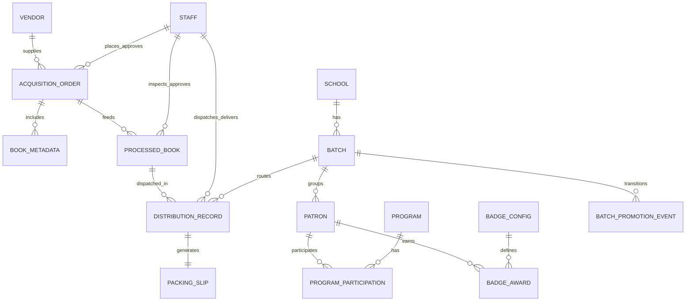

# Alpha Rabbit LMS Database Schema Guide

This document is the canonical schema reference for LLM-assisted database design.
It consolidates entities from acquisitions, processing, distribution, patron intelligence, governance, and Ghana-specific workflows.

## 1) Design Goals

- Support one codebase with two modes: Manager (offline standalone) and Enterprise (sync with CouchDB).
- Preserve offline-first durability and eventual sync.
- Enforce Ghana-specific constraints (curriculum tags, batch lifecycle, Ghana Card hashing).
- Keep auditability for sensitive operations (identity, overrides, approvals, deliveries).

## 2) Storage Model

- **Manager mode**: local PouchDB document stores.
- **Enterprise mode**: local PouchDB + CouchDB replication.
- Recommended per-domain databases/collections:
  - `books`
  - `vendors`
  - `orders`
  - `processing`
  - `distribution`
  - `patrons`
  - `programs`
  - `staff`
  - `users`
  - `audit_logs`
  - `config`

## 3) Shared Document Envelope (All Entities)

Every document should include:

- `_id`: string (globally unique)
- `type`: string (entity discriminator)
- `createdAt`: ISO-8601 datetime
- `updatedAt`: ISO-8601 datetime
- `_syncStatus`: `pending | synced | failed` (for offline queue tracking)
- `_schemaVersion`: integer (for migrations)

## 4) Entity Catalog

| Entity                     | `type`                  | Module              | Manager | Enterprise                  |
| -------------------------- | ----------------------- | ------------------- | ------- | --------------------------- |
| UserAccount                | `user`                  | Security            | ✅      | ✅                          |
| Staff                      | `staff`                 | Governance          | ✅      | ✅                          |
| AuditLog                   | `audit_log`             | Security            | ✅      | ✅                          |
| Vendor                     | `vendor`                | Acquisitions        | ✅      | ✅                          |
| AcquisitionOrder           | `acquisition_order`     | Acquisitions        | ✅      | ✅                          |
| AcquisitionOrderItem       | embedded                | Acquisitions        | ✅      | ✅                          |
| BookMetadata (draft/final) | `book_metadata`         | Acquisitions        | ✅      | ✅                          |
| ProcessedBook              | `processed_book`        | Processing          | ✅      | ✅                          |
| ProcessingEvent            | embedded                | Processing          | ✅      | ✅                          |
| DistributionRecord         | `distribution_record`   | Distribution        | ✅      | ✅                          |
| PackingSlip                | `packing_slip`          | Distribution        | ✅      | ✅                          |
| Patron                     | `patron`                | Patron Intelligence | ✅      | ✅                          |
| LostBookCase               | embedded                | Patron Intelligence | ✅      | ✅                          |
| Program                    | `program`               | Programs            | ✅      | ✅                          |
| ProgramSession             | embedded                | Programs            | ✅      | ✅                          |
| ProgramParticipation       | embedded                | Programs            | ✅      | ✅                          |
| BadgeConfig                | `badge_config`          | Programs/Patrons    | ✅      | ✅                          |
| BadgeAward                 | embedded                | Patron Intelligence | ✅      | ✅                          |
| School                     | `school`                | Ghana Context       | ✅      | ✅                          |
| Batch                      | `batch`                 | Ghana Context       | ✅      | ✅                          |
| BatchPromotionEvent        | `batch_promotion_event` | Ghana Context       | ✅      | ✅                          |
| BackupManifest             | `backup_manifest`       | Platform            | ✅      | ⚠️ (server-side equivalent) |

## 5) Core Schemas

## 5.1 UserAccount (`user`)

- `username`: string, unique
- `passwordHash`: string
- `role`: `admin | librarian | hod | staff | assistant | branch_manager`
- `department`: optional string
- `isActive`: boolean
- `lastLoginAt`: optional datetime

## 5.2 Staff (`staff`)

- `serviceNumber`: string, unique
- `role`: `super_admin | department_head | section_leader | librarian | assistant`
- `department`: string
- `supervisorId`: optional string (`staff._id`)
- `personalInfo`:
  - `ghanaCardIdHash`: string (**never plaintext**)
  - `firstName`, `lastName`, `rank`, `dateOfAppointment`
- `contactInfo`:
  - `email`, `phone`
  - `emergencyContact { name, relationship, phone }`
- `isActive`: boolean

## 5.3 AuditLog (`audit_log`)

- `actorId`: string (`user` or `staff`)
- `action`: string (`login`, `create_order`, `override_degradation`, etc.)
- `entityType`: string
- `entityId`: string
- `before`: optional object snapshot
- `after`: optional object snapshot
- `reason`: optional string (mandatory for overrides)
- `timestamp`: datetime

## 5.4 Vendor (`vendor`)

- `name`: string
- `ghanaCardIdHash`: string
- `businessRegistration`: optional string
- `contactPerson`, `phone`, `email`, `address`
- `city`, `region`, `country`
- `specialties`: string[]
- `contractStartDate`, `contractExpiryDate`
- `status`: `active | inactive | suspended`

## 5.5 AcquisitionOrder (`acquisition_order`)

- `status`: `draft | placed | received | cancelled | partially_received`
- `placedAt`, `expectedDeliveryDate`, `receivedAt`
- `vendor`: reference + denormalized display fields
- `budget`:
  - `code`
  - `allocatedAmount`, `spentAmount`, `remainingAmount`
- `items`: `AcquisitionOrderItem[]`
- `workflow`: `placedBy`, `approvedBy`, `receivedBy`, timestamps

### AcquisitionOrderItem (embedded)

- `bookMetadataId` or embedded `bookMetadata`
- `quantity`, `unitPrice`, `currency`, `subtotal`
- `expectedDeliveryDate`, `receivedQuantity`, `conditionOnReceipt`

## 5.6 BookMetadata (`book_metadata`)

- `title`: required string
- `subtitle`, `uniformTitle`, `titleStatement`
- `contributors[]`: `{ id, role, fullName, affiliation, orcid }`
- `isbn`, `isbn10`, `lccn`, `oclc`, `localId`
- `publisher`, `publicationPlace`, `publicationYear`, `editionStatement`
- `extent`, `illustrations`, `dimensions`, `binding`
- `language`, `subjects[]`, `summary`, `contents[]`, `notes[]`
- Ghana fields:
  - `ghanaCurriculumTag` (required)
  - `ghanaAuthors` (bool)
  - `localLanguage`
  - `culturalContext`
- `status`: `draft | cataloged | withdrawn`

## 5.7 ProcessedBook (`processed_book`)

- `acquisitionOrderId`: string
- `processingStatus`: `pending_inspection | inspected | approved | rejected | withdrawn`
- `inspectionDate`, `inspectedBy`
- `condition`:
  - `spine`, `cover`, `pages`, `edges` (1–5)
  - `spineCreases` (0–5)
  - `moldRisk`: `none | low | medium | high | critical`
  - `overallHealthScore` (0.0–5.0)
- `classification`:
  - `ghanaCurriculumTag` (required)
  - `deweyDecimal`
  - `sectionRouting`
  - `batchAssignment { schoolId, batchCode, expiryDate }`
- `barcode`, `barcodeType`, optional `rfidTag`
- `qualityControl`: `approved`, approver fields, notes, repair flags
- `climateAssessment`: humidity exposure + storage recommendation
- `processingHistory[]`

## 5.8 DistributionRecord (`distribution_record`)

- `status`: `draft | dispatched | delivered | partially_delivered | failed`
- `processedBookIds[]`
- `books[]`: denormalized dispatch snapshot (title, tag, barcode, condition)
- `routing`:
  - `source`
  - `destinationSection`
  - `destinationSchool { id, name, address, contactPerson, contactPhone }`
  - `batchGrouping[] { batchCode, bookIds[], learnerCount }`
  - `requiresSpecialHandling`, `specialHandlingNotes`
- `logistics`:
  - `packingSlipId`, `packingSlipPdfPath`
  - `dispatchedAt`, `expectedDeliveryDate`, `actualDeliveryDate`
  - `dispatchedBy`, `deliveredBy`
  - `deliveryMethod`
  - `ruralMode`, optional `gpsCoordinates`
  - `conditionOnDelivery`, `deliveryPhotos[]`
- `ghanaContext`:
  - `academicYear`
  - `rainySeasonAlert`
  - `communityLeaderNotified`, leader contact

## 5.9 PackingSlip (`packing_slip`)

- `distributionRecordId`
- `generationDate`
- `school { id, name, address }`
- `batches[] { batchCode, bookCount, curriculumTags[] }`
- `totalBooks`
- `qrCode` (payload or base64)
- `pdf417Barcode`
- `dispatchedBy`
- `notes`

## 5.10 Patron (`patron`)

- `patronType`: `CHILD | GENERAL | RESEARCHER`
- `basicInfo`:
  - `ghanaCardIdHash` (or guardian-linked for minors)
  - names, DOB, school/batch/grade, enrollment/expiry
- `readingMetrics`:
  - `lifetimeBooksRead`, `currentYearBooks`, `avgBooksPerMonth`
  - `interactionScore`
  - `degradationRate`, `degradationThreshold`
  - `borrowingStatus`
- `bookHistory[]`:
  - issue/return dates
  - condition at issue and return
  - `degradationScore`
- `lostBooks[]`
- `programParticipation[]`
- `badges[]`

## 5.11 Program (`program`)

- `title`, `description`, `targetAudience`, `maxParticipants`
- `startDate`, `endDate`
- `selectionRules` (query-based targeting)
- `sessions[]` with attendance settings
- `status`: `draft | active | completed | archived`

### ProgramParticipation (embedded in `patron` or `program`)

- `programId`, `patronId`, `status`
- `attendance[]` (boolean or date-status tuples)
- `appraisal { metrics, staffNotes, nextSteps, dateAppraised, appraisedBy }`

## 5.12 BadgeConfig (`badge_config`)

- `badges[]`:
  - `id`, `name`, `description`, `icon`
  - `criteria` object
  - optional `ghanaCulturalNote`
- `awardSchedule` (daily)
- `displayRules`

## 5.13 School (`school`)

- `schoolId`, `name`, `region`, `district`
- `address`, `contactPerson`, `contactPhone`
- `isRural`: boolean
- `supportedBatches[]`

## 5.14 Batch (`batch`)

- `schoolId`
- `batchCode` (e.g., `GRADE-4A`)
- `gradeLevel`
- `academicYear` (e.g., `2024-2025`)
- `expiryDate` (Aug 31 for GES-aligned cycles)
- `status`: `active | promoted | expired`

## 5.15 BatchPromotionEvent (`batch_promotion_event`)

- `fromBatchCode`, `toBatchCode`
- `schoolId`
- `promotionDate`
- `promotedCount`, `repeatCount`
- `initiatedBy`
- `notificationStatus`

## 6) Relationships (Conceptual)

## 7) Critical Validation and Constraints

- Ghana Card ID must pass format validation before hashing: `GHA-000000000-0`.
- No plaintext Ghana Card ID may be stored in any entity.
- `ghanaCurriculumTag` is required in Acquisitions and Processing records.
- Distribution dispatch requires a valid destination school and generated packing slip ID.
- Degradation override requires `reason` and audit log entry.
- Batch-aware routing must preserve distinctions (example: `GRADE-4A` != `GRADE-4B`).

## 8) Recommended Indexes

- `books`: `type`, `ghanaCurriculumTag`, `status`, `sectionRouting`, `updatedAt`
- `orders`: `type`, `status`, `placedAt`, `vendor.id`, `budget.code`
- `vendors`: `type`, `status`, `name`, `region`
- `processing`: `type`, `processingStatus`, `qualityControl.approved`, `inspectionDate`
- `distribution`: `type`, `status`, `routing.destinationSchool.id`, `logistics.dispatchedAt`
- `patrons`: `type`, `patronType`, `basicInfo.schoolId`, `basicInfo.batchCode`, `readingMetrics.degradationRate`
- `staff`: `type`, `role`, `department`, `isActive`
- `audit_logs`: `type`, `actorId`, `action`, `timestamp`

## 9) Sync and Conflict Strategy

- Add `updatedAt` to all writes for deterministic merge support.
- Default conflict policy: last-write-wins by timestamp for non-sensitive fields.
- Sensitive conflicts (identity, approvals, overrides, delivery confirmation) require manual resolution queue.

## 10) LLM Output Expectations (When Generating DB Artifacts)

When using this guide, the LLM should:

- Generate schema/types first, then validators, then indexes, then migration files.
- Keep Manager and Enterprise schemas identical where possible; isolate only operational differences.
- Include seed config for `badge_config`, curriculum tags, schools, and batch templates.
- Produce test fixtures for each core entity and one end-to-end lifecycle:
  - acquisition -> processing -> distribution -> patron outcome.
