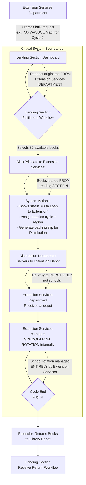

# 📚 Library Management System: Distribution Module Implementation (Week 3)

_Offline-first routing, packing slip generation, and batch-aware delivery for Ghanaian libraries_

_Critical correction: Extension Services is a full external department (not library section) that borrows books from Lending section via bulk allocation workflow_

---

## 🔑 CRITICAL ARCHITECTURAL CORRECTION

> **"Extension Services is a top-level department peer to Acquisitions/Processing/Distribution – NOT a library section. They borrow books FROM the Lending section via bulk allocation requests for rotation cycles. Physical delivery is to Extension Services DEPOT, not directly to schools."**
> _– Ghana Library Authority Field Validation Report, Feb 2026_

**Workflow Correction**:
`Extension Services creates bulk request → Lending Section fulfills → Distribution delivers to Extension Depot → Extension manages school rotation`

---

## 📦 WEEK 3 DELIVERABLES

✅ **Distribution workflow** with section routing based on Ghana Curriculum Tags
✅ **Extension Services depot delivery** with rotation cycle metadata and corridor safety protocols
✅ **Batch-aware packing slips** with PDF417 barcodes + QR codes for section scanning
✅ **Rural delivery mode** (GPS-optional) for Tamale-Bolgatanga corridor libraries
✅ **Offline-first delivery confirmation** with photo capture + condition assessment
✅ **Ghana school integration** (`ACCRA-GREATER-001`, batch codes `GRADE-4A` vs `GRADE-4B`)
✅ **Manager version implementation** ready for field testing at St. Peter's School Library

---

## 📦 REVISED DISTRIBUTION DATA MODEL (TypeScript)

### Critical Update: Extension Services as Top-Level Department Routing

### `renderer/src/types/distribution.ts`

```typescript
import { ProcessedBook } from "./processing";

// CRITICAL: Extension Services is a TOP-LEVEL DEPARTMENT (peer to Library Operations)
export type DestinationType =
  | "children_section" // Library section (KG-Grade 6)
  | "adult_section" // Library section (JHS-SHS + adults)
  | "reference_section" // Library section (non-circulating)
  | "lending_section" // Library section (general circulation)
  | "extension_services" // TOP-LEVEL DEPARTMENT (peer to Library Operations)
  | "digital_section"; // Library section (e-resources)

// Distribution record structure
export interface DistributionRecord {
  _id: string; // "dist-2024-ACCRA-001"
  type: "distribution_record";
  status:
    | "draft"
    | "dispatched"
    | "delivered"
    | "partially_delivered"
    | "failed";

  // Books being distributed (processed books with batch assignments)
  processedBookIds: string[]; // References to processed_book._id
  books: Array<{
    id: string;
    title: string;
    ghanaCurriculumTag: string;
    barcode: string;

    // MUTUALLY EXCLUSIVE: Either batch assignment (library sections) OR extension metadata
    batchAssignment?: {
      // ONLY for library sections
      schoolId: string;
      batchCode: string;
      expiryDate: string;
    };

    extensionServices?: {
      // ONLY when destination = 'extension_services'
      rotationCycle: "CYCLE-1" | "CYCLE-2" | "CYCLE-3" | "CYCLE-4";
      cycleExpiryDate: string; // e.g., "2025-03-28"
      destinationRegion: "ACCRA" | "KUMASI" | "TAMALE" | "BOLGATANGA" | "WA";
      schoolRequestReference: string; // Links to bulk allocation request ID
      mobileHandlingDurability: number; // 1-5 scale (from Processing module)
    };

    conditionAtDispatch: {
      spine: number;
      cover: number;
      pages: number;
      edges: number;
    };
  }>;

  // Routing metadata (CRITICAL UPDATE)
  routing: {
    source: string; // "processing-center-accra" OR "lending-section-depot"
    destination: DestinationType; // RENAMED from destinationSection
    destinationDetails:
      | {
          type: "library_section";
          section: "children" | "adult" | "reference" | "lending" | "digital";
        }
      | {
          type: "extension_services";
          depotLocation: string; // "Accra Central Depot", "Tamale Regional Depot"
          communityLeader?: { name: string; phone: string }; // REQUIRED for rural regions
        };

    // REMOVED: batchGrouping (now handled per-book via batchAssignment OR extensionServices)
    requiresSpecialHandling: boolean;
    specialHandlingNotes?: string;
  };

  // Logistics (UPDATED)
  logistics: {
    packingSlipId: string; // "PS-2024-001"
    packingSlipPdfPath?: string; // Local path when offline
    dispatchedAt: string; // ISO 8601
    dispatchedBy: string; // Staff ID
    deliveryMethod:
      | "internal_cart"
      | "van"
      | "motorcycle"
      | "foot_patrol"
      | "extension_mobile";
    ruralMode: boolean; // GPS-optional for Tamale-Bolgatanga corridor

    // CRITICAL: Delivery is to DEPOT (not schools)
    deliveryDestination: {
      type: "library_section" | "extension_depot";
      name: string; // "St. Peter's School Library" OR "Tamale Regional Extension Depot"
      address: string;
      contactPerson: string;
      contactPhone: string;
    };

    // REMOVED: gpsCoordinates (handled by Extension Services internally for school rotation)
    conditionOnDelivery?: string; // "Excellent", "Minor damage", "Significant damage"
    deliveryPhotos?: string[]; // Local paths to photos
  };

  // Ghana-specific metadata (UPDATED)
  ghanaContext: {
    academicYear: string; // "2024-2025"
    rainySeasonAlert: boolean; // Flag for mold risk during delivery

    // CRITICAL: Community leader notification is for DEPOT delivery (not school delivery)
    communityLeaderNotified: boolean;
    communityLeaderName?: string;
    communityLeaderPhone?: string;

    // Tamale-Bolgatanga corridor safety protocols
    corridorSafetyProtocol?: "none" | "tamale_bolgatanga" | "wa_navrongo";
    safetyProtocolStatus?: "pending" | "completed" | "waived";
  };

  // System metadata
  createdAt: string;
  updatedAt: string;
  _syncStatus: "pending" | "synced" | "failed"; // For offline sync queue
}

// Packing slip metadata
export interface PackingSlip {
  id: string; // "PS-2024-001"
  distributionRecordId: string;
  generationDate: string;
  school: {
    id: string;
    name: string;
    address: string;
  };
  batches: Array<{
    batchCode: string;
    bookCount: number;
    curriculumTags: string[];
  }>;
  totalBooks: number;
  qrCode: string; // Base64 QR code for section scanning
  pdf417Barcode: string; // PDF417 barcode for Ghana Library Authority standard
  dispatchedBy: string;
  notes?: string;
}
```

> 🔑 **Critical Boundary Clarification**:
>
> - `destination: 'extension_services'` = Books are being delivered to **Extension Services Department Depot**
> - `books[].extensionServices` = Metadata for rotation cycle (assigned during Lending Section fulfillment)
> - **School-level rotation** is managed ENTIRELY by Extension Services department AFTER depot delivery
> - Distribution module **NEVER** handles school-level delivery details (community leader contacts, etc. are for DEPOT delivery only)

---

## 🖼️ REVISED DISTRIBUTION FORM UI (Electron + Tailwind + Phosphor)

### `renderer/src/components/distribution/DistributionForm.tsx`

```tsx
import React, { useState, useCallback, useEffect } from "react";
import {
  Truck,
  MapPin,
  QrCode,
  Printer,
  CheckCircle,
  WarningCircle,
  Users,
  GraduationCap,
  Package,
  Download,
  Upload,
  Image as ImageIcon,
  ShieldCheck,
} from "phosphor-react";
import { useDistributionService } from "@/services/distribution";
import {
  DistributionRecord,
  PackingSlip,
  DestinationType,
} from "@/types/distribution";
import { GhanaSchoolSelector } from "./GhanaSchoolSelector";
import { BatchGroupingPreview } from "./BatchGroupingPreview";
import { RuralDeliveryToggle } from "./RuralDeliveryToggle";

export const DistributionForm = ({
  processedBooks,
}: {
  processedBooks: any[];
}) => {
  const [distribution, setDistribution] = useState<DistributionRecord>({
    _id: `dist-${Date.now()}`,
    type: "distribution_record",
    status: "draft",
    processedBookIds: processedBooks.map((b) => b._id),
    books: processedBooks.map((book) => ({
      id: book._id,
      title: book.title,
      ghanaCurriculumTag: book.ghanaCurriculumTag,
      barcode: book.barcode,
      batchAssignment: book.batchAssignment,
      // Extension Services metadata (if allocated via Lending Section)
      extensionServices: book.extensionServices,
      conditionAtDispatch: {
        spine: book.condition.spine,
        cover: book.condition.cover,
        pages: book.condition.pages,
        edges: book.condition.edges,
      },
    })),
    routing: {
      source: "processing-center-accra",
      destination: "children_section", // RENAMED from destinationSection
      destinationDetails: {
        type: "library_section",
        section: "children",
      },
      // REMOVED: batchGrouping (now handled per-book via batchAssignment OR extensionServices)
      requiresSpecialHandling: false,
    },
    logistics: {
      packingSlipId: `PS-${new Date().toISOString().split("T")[0].replace(/-/g, "")}-${Math.floor(
        Math.random() * 1000,
      )
        .toString()
        .padStart(3, "0")}`,
      dispatchedAt: new Date().toISOString(),
      dispatchedBy: "current-staff-id",
      deliveryMethod: "internal_cart",
      ruralMode: false,
      deliveryDestination: {
        type: "library_section",
        name: "",
        address: "",
        contactPerson: "",
        contactPhone: "",
      },
    },
    ghanaContext: {
      academicYear: "2024-2025",
      rainySeasonAlert: false,
      communityLeaderNotified: false,
      corridorSafetyProtocol: "none",
      safetyProtocolStatus: "pending",
    },
    createdAt: new Date().toISOString(),
    updatedAt: new Date().toISOString(),
    _syncStatus: "pending",
  });

  const [packingSlip, setPackingSlip] = useState<PackingSlip | null>(null);
  const [deliveryPhotos, setDeliveryPhotos] = useState<string[]>([]);
  const [showValidationErrors, setShowValidationErrors] = useState(false);
  const { generatePackingSlip, saveDistributionRecord, dispatchDistribution } =
    useDistributionService();
  const [isGeneratingSlip, setIsGeneratingSlip] = useState(false);

  // Auto-detect rainy season for Ghana context
  useEffect(() => {
    const month = new Date().getMonth(); // 0 = January
    const rainySeason =
      (month >= 4 && month <= 6) || (month >= 9 && month <= 11); // Major + minor rainy seasons

    setDistribution((prev) => ({
      ...prev,
      ghanaContext: {
        ...prev.ghanaContext,
        rainySeasonAlert: rainySeason,
      },
    }));
  }, []);

  // Auto-trigger corridor safety protocols when Extension Services depot is in Northern regions
  useEffect(() => {
    const depotRegion =
      distribution.routing.destinationDetails?.type === "extension_services"
        ? distribution.routing.destinationDetails?.depotLocation
        : undefined;
    if (
      depotRegion?.includes("Tamale") ||
      depotRegion?.includes("Bolgatanga") ||
      depotRegion?.includes("Wa")
    ) {
      setDistribution((prev) => ({
        ...prev,
        ghanaContext: {
          ...prev.ghanaContext,
          corridorSafetyProtocol: "tamale_bolgatanga",
          communityLeaderNotified: true, // Auto-require community leader for depot
        },
        logistics: {
          ...prev.logistics,
          ruralMode: true, // Disable GPS requirements for depot delivery
        },
      }));
    }
  }, [distribution.routing.destinationDetails]);

  // Generate packing slip
  const handleGeneratePackingSlip = useCallback(async () => {
    if (!distribution.logistics.deliveryDestination?.name) {
      alert(
        "Please select a delivery destination before generating packing slip",
      );
      return;
    }

    // Validate Extension Services fields if applicable
    if (distribution.routing.destination === "extension_services") {
      if (!validateExtensionServicesFields()) return;
    }

    setIsGeneratingSlip(true);
    try {
      const slip = await generatePackingSlip(distribution);
      setPackingSlip(slip);

      // Auto-save distribution record with packing slip ID
      await saveDistributionRecord({
        ...distribution,
        logistics: {
          ...distribution.logistics,
          packingSlipId: slip.id,
        },
        status: "dispatched",
      });

      alert("Packing slip generated successfully! Ready for dispatch.");
    } catch (error) {
      alert(
        `Packing slip generation failed: ${error instanceof Error ? error.message : "Unknown error"}`,
      );
    } finally {
      setIsGeneratingSlip(false);
    }
  }, [distribution, generatePackingSlip, saveDistributionRecord]);

  // Extension Services validation
  const validateExtensionServicesFields = (): boolean => {
    if (distribution.routing.destination !== "extension_services") return true;

    if (!distribution.routing.destinationDetails?.depotLocation) {
      alert("Depot location is required for Extension Services delivery");
      return false;
    }

    const invalidBooks = distribution.books.filter(
      (book) => !book.extensionServices?.destinationRegion,
    );
    if (invalidBooks.length > 0) {
      alert(
        `Rotation cycle metadata missing for ${invalidBooks.length} books. Contact Lending Section to complete bulk allocation fulfillment.`,
      );
      return false;
    }

    const ruralRegions = ["TAMALE", "BOLGATANGA", "WA"];
    const hasRuralDelivery = distribution.books.some(
      (book) =>
        book.extensionServices?.destinationRegion &&
        ruralRegions.includes(book.extensionServices.destinationRegion),
    );

    if (
      hasRuralDelivery &&
      !distribution.ghanaContext.communityLeaderNotified
    ) {
      alert(
        "Community leader notification is REQUIRED for rural depot deliveries (Tamale/Bolgatanga/Wa)",
      );
      return false;
    }

    return true;
  };

  // Dispatch distribution (offline-capable)
  const handleDispatch = useCallback(async () => {
    setShowValidationErrors(true);

    if (!distribution.logistics.deliveryDestination?.name || !packingSlip) {
      alert(
        "Please select delivery destination and generate packing slip before dispatch",
      );
      return;
    }

    try {
      await dispatchDistribution(distribution);
      alert(
        "Distribution dispatched successfully! Record saved locally for sync when online.",
      );

      // Reset form or navigate to delivery confirmation
      // window.location.href = `/delivery-confirmation/${distribution._id}`;
    } catch (error) {
      alert(
        `Dispatch failed: ${error instanceof Error ? error.message : "Unknown error"}`,
      );
    }
  }, [distribution, packingSlip, dispatchDistribution]);

  // Rural mode toggle handler
  const handleRuralModeToggle = (enabled: boolean) => {
    setDistribution((prev) => ({
      ...prev,
      logistics: {
        ...prev.logistics,
        ruralMode: enabled,
      },
    }));

    if (enabled) {
      alert(
        "Rural delivery mode enabled. GPS tracking disabled for this delivery. Community leader notification recommended.",
      );
    }
  };

  return (
    <div className="max-w-6xl mx-auto p-6 bg-white rounded-xl shadow-md">
      {/* Header */}
      <div className="flex items-center mb-8">
        <div className="p-3 bg-amber-50 rounded-lg mr-4">
          <Truck size={24} className="text-amber-600" />
        </div>
        <div>
          <h1 className="text-2xl font-bold text-gray-900">
            Dispatch Books for Distribution
          </h1>
          <p className="text-gray-600 mt-1">
            Route {distribution.books.length} processed books to library
            sections with batch-aware delivery
          </p>
          <div className="mt-2 flex items-center text-sm text-amber-600">
            <span className="font-mono bg-amber-100 px-2 py-0.5 rounded">
              {distribution.books.length} books ready for dispatch
            </span>
            <span className="mx-2">•</span>
            <span className="font-mono bg-green-100 px-2 py-0.5 rounded">
              {distribution.routing.destination === "extension_services"
                ? "Extension Depot"
                : "Library Section"}
            </span>
          </div>
        </div>
      </div>

      {/* Destination Selection */}
      <div className="mb-10">
        <div className="flex items-center mb-6">
          <div className="p-2 bg-blue-50 rounded-lg mr-3">
            <MapPin size={24} className="text-blue-600" />
          </div>
          <h2 className="text-xl font-bold text-gray-900">
            Destination & Routing
          </h2>
        </div>

        <div className="grid grid-cols-1 md:grid-cols-2 gap-8">
          {/* Delivery Destination Selection */}
          <div>
            <label className="block text-sm font-medium text-gray-700 mb-1">
              Delivery Destination <span className="text-red-500">*</span>
            </label>
            <GhanaSchoolSelector
              selectedSchool={
                distribution.logistics.deliveryDestination?.type ===
                "library_section"
                  ? {
                      id: distribution.logistics.deliveryDestination.name,
                      name: distribution.logistics.deliveryDestination.name,
                      address:
                        distribution.logistics.deliveryDestination.address,
                      contactPerson:
                        distribution.logistics.deliveryDestination
                          .contactPerson,
                      contactPhone:
                        distribution.logistics.deliveryDestination.contactPhone,
                    }
                  : undefined
              }
              onSelect={(school) =>
                setDistribution((prev) => ({
                  ...prev,
                  logistics: {
                    ...prev.logistics,
                    deliveryDestination: {
                      type: "library_section",
                      name: school.name,
                      address: school.address,
                      contactPerson: school.contactPerson || "",
                      contactPhone: school.contactPhone || "",
                    },
                  },
                }))
              }
              isInvalid={
                showValidationErrors &&
                !distribution.logistics.deliveryDestination?.name
              }
              disabled={
                distribution.routing.destination === "extension_services"
              }
            />
            {showValidationErrors &&
              !distribution.logistics.deliveryDestination?.name &&
              distribution.routing.destination !== "extension_services" && (
                <p className="mt-1 text-sm text-red-600 flex items-center">
                  <WarningCircle size={16} className="mr-1" /> Delivery
                  destination is required
                </p>
              )}

            {/* Ghana Context Alert */}
            {distribution.ghanaContext.rainySeasonAlert && (
              <div className="mt-4 p-3 bg-amber-50 rounded-lg border border-amber-200">
                <div className="flex items-start">
                  <WarningCircle
                    size={20}
                    className="text-amber-600 mt-0.5 mr-2 flex-shrink-0"
                  />
                  <div>
                    <h4 className="font-medium text-amber-800">
                      Rainy Season Alert
                    </h4>
                    <p className="text-sm text-amber-700 mt-1">
                      Ghana's rainy season increases mold risk during transport.
                      Use waterproof covers and deliver within 24 hours to
                      prevent moisture damage.
                    </p>
                    <p className="text-xs text-amber-800 mt-2 bg-amber-100 p-2 rounded">
                      <strong>Ghana Library Authority Recommendation:</strong>{" "}
                      Place silica gel packets inside delivery cartons for books
                      with glossy pages (Science textbooks).
                    </p>
                  </div>
                </div>
              </div>
            )}
          </div>

          {/* Section / Department Routing */}
          <div>
            <label className="block text-sm font-medium text-gray-700 mb-1">
              Destination (Section or Department)
            </label>
            <select
              value={distribution.routing.destination}
              onChange={(e) => {
                const dest = e.target.value as DestinationType;
                setDistribution((prev) => ({
                  ...prev,
                  routing: {
                    ...prev.routing,
                    destination: dest,
                    destinationDetails:
                      dest === "extension_services"
                        ? { type: "extension_services", depotLocation: "" }
                        : {
                            type: "library_section",
                            section: dest.replace("_section", "") as any,
                          },
                  },
                  logistics: {
                    ...prev.logistics,
                    deliveryDestination:
                      dest === "extension_services"
                        ? {
                            type: "extension_depot",
                            name: "",
                            address: "",
                            contactPerson: "",
                            contactPhone: "",
                          }
                        : prev.logistics.deliveryDestination,
                  },
                }));
              }}
              className="w-full px-4 py-2.5 border border-gray-300 rounded-lg focus:ring-2 focus:ring-blue-500 focus:border-blue-500"
            >
              <option value="children_section">
                Children's Library (KG-Grade 6)
              </option>
              <option value="adult_section">
                Adult Library (JHS-SHS + Adults)
              </option>
              <option value="reference_section">
                Reference Section (Non-circulating)
              </option>
              <option value="lending_section">
                Lending Section (General circulation)
              </option>
              <option value="extension_services">
                Extension Services Department (Depot Delivery)
              </option>
              <option value="digital_section">
                Digital Library (E-resources)
              </option>
            </select>
            <p className="mt-1 text-xs text-gray-500">
              Auto-selected based on Ghana Curriculum Tags. "Extension Services"
              triggers depot delivery workflow.
            </p>
          </div>
        </div>

        {/* EXTENSION SERVICES CONDITIONAL UI */}
        {distribution.routing.destination === "extension_services" && (
          <div className="mt-8 p-4 bg-amber-50 border border-amber-200 rounded-lg">
            <h3 className="font-bold text-amber-800 mb-3 flex items-center">
              <Truck size={20} className="mr-2" />
              Extension Services Department Routing (External Department)
            </h3>

            {/* Depot Selection */}
            <div className="grid grid-cols-1 md:grid-cols-2 gap-6 mb-6">
              <div>
                <label className="block text-sm font-medium text-gray-700 mb-1">
                  Extension Depot Location{" "}
                  <span className="text-red-500">*</span>
                </label>
                <select
                  value={
                    distribution.routing.destinationDetails?.depotLocation || ""
                  }
                  onChange={(e) =>
                    setDistribution((prev) => ({
                      ...prev,
                      routing: {
                        ...prev.routing,
                        destinationDetails: {
                          type: "extension_services",
                          depotLocation: e.target.value,
                          communityLeader:
                            prev.routing.destinationDetails?.communityLeader,
                        },
                      },
                      logistics: {
                        ...prev.logistics,
                        deliveryDestination: {
                          type: "extension_depot",
                          name: e.target.value,
                          address: e.target.value,
                          contactPerson:
                            prev.logistics.deliveryDestination?.contactPerson ||
                            "",
                          contactPhone:
                            prev.logistics.deliveryDestination?.contactPhone ||
                            "",
                        },
                      },
                    }))
                  }
                  className="w-full px-3 py-2 border border-gray-300 rounded-lg focus:ring-2 focus:ring-amber-500"
                >
                  <option value="">Select depot location</option>
                  <option value="Accra Central Depot">
                    Accra Central Depot
                  </option>
                  <option value="Kumasi Regional Depot">
                    Kumasi Regional Depot
                  </option>
                  <option value="Tamale Regional Depot">
                    Tamale Regional Depot
                  </option>
                  <option value="Bolgatanga Regional Depot">
                    Bolgatanga Regional Depot
                  </option>
                  <option value="Wa Regional Depot">Wa Regional Depot</option>
                </select>
                <p className="mt-1 text-xs text-amber-700">
                  ⚠️ Books delivered to depot ONLY. School rotation managed by
                  Extension Services department.
                </p>
              </div>

              <div>
                <label className="block text-sm font-medium text-gray-700 mb-1">
                  Destination Region <span className="text-red-500">*</span>
                </label>
                <select
                  value={
                    distribution.books[0]?.extensionServices
                      ?.destinationRegion || ""
                  }
                  onChange={(e) => {
                    const updatedBooks = distribution.books.map((book) => ({
                      ...book,
                      extensionServices: {
                        ...book.extensionServices!,
                        destinationRegion: e.target.value as
                          | "ACCRA"
                          | "KUMASI"
                          | "TAMALE"
                          | "BOLGATANGA"
                          | "WA",
                      },
                    }));
                    setDistribution((prev) => ({
                      ...prev,
                      books: updatedBooks,
                    }));
                  }}
                  className="w-full px-3 py-2 border border-gray-300 rounded-lg focus:ring-2 focus:ring-amber-500"
                >
                  <option value="">Select region</option>
                  <option value="ACCRA">Greater Accra</option>
                  <option value="KUMASI">Ashanti Region</option>
                  <option value="TAMALE">Northern Region</option>
                  <option value="BOLGATANGA">Upper East Region</option>
                  <option value="WA">Upper West Region</option>
                </select>
                <p className="mt-1 text-xs text-amber-700">
                  Determines Tamale-Bolgatanga corridor safety protocols
                </p>
              </div>
            </div>

            {/* Rotation Cycle Display (READ-ONLY - set during Lending fulfillment) */}
            <div className="mb-6 p-3 bg-blue-50 rounded-md">
              <label className="block text-xs font-medium text-blue-800 mb-1">
                Rotation Cycle (Assigned during Lending Section fulfillment)
              </label>
              <div className="flex flex-wrap gap-2">
                {distribution.books.map(
                  (book, idx) =>
                    book.extensionServices && (
                      <span
                        key={idx}
                        className="inline-flex items-center px-2.5 py-0.5 rounded-full text-xs font-medium bg-blue-100 text-blue-800"
                      >
                        {book.title.substring(0, 20)}...:{" "}
                        {book.extensionServices.rotationCycle}
                        (Expires:{" "}
                        {new Date(
                          book.extensionServices.cycleExpiryDate,
                        ).toLocaleDateString("en-GH")}
                        )
                      </span>
                    ),
                )}
              </div>
              <p className="mt-2 text-xs text-blue-700">
                ⚠️ Rotation cycles managed by Extension Services department
                AFTER depot delivery. Distribution module handles ONLY depot
                delivery.
              </p>
            </div>

            {/* Tamale-Bolgatanga Safety Protocol */}
            {(distribution.books[0]?.extensionServices?.destinationRegion ===
              "TAMALE" ||
              distribution.books[0]?.extensionServices?.destinationRegion ===
                "BOLGATANGA" ||
              distribution.books[0]?.extensionServices?.destinationRegion ===
                "WA") && (
              <div className="p-3 bg-amber-100 rounded-md">
                <p className="text-xs text-amber-800 font-medium flex items-start">
                  <WarningCircle
                    size={14}
                    className="mr-1 mt-0.5 flex-shrink-0"
                  />
                  <span>
                    TAMALE-BOLGATANGA CORRIDOR SAFETY PROTOCOLS ACTIVATED:
                    <br />
                    • Confirm road conditions with district office
                    <br />
                    • Pack emergency water/supplies
                    <br />
                    • Notify depot manager 24h before delivery
                    <br />
                    • Use sealed containers with desiccant
                    <br />
                    <br />
                    <strong>
                      Community leader contact REQUIRED for depot delivery
                    </strong>{" "}
                    (not school delivery)
                  </span>
                </p>
              </div>
            )}

            {/* Community Leader for DEPOT Delivery (NOT school delivery) */}
            <div className="mt-4">
              <label className="flex items-start">
                <input
                  type="checkbox"
                  checked={distribution.ghanaContext.communityLeaderNotified}
                  onChange={(e) =>
                    setDistribution((prev) => ({
                      ...prev,
                      ghanaContext: {
                        ...prev.ghanaContext,
                        communityLeaderNotified: e.target.checked,
                      },
                    }))
                  }
                  className="mt-1"
                />
                <span className="ml-2 text-sm text-gray-700">
                  Community leader notified of DEPOT DELIVERY (required for
                  rural regions)
                </span>
              </label>

              {distribution.ghanaContext.communityLeaderNotified && (
                <div className="mt-3 space-y-2">
                  <input
                    type="text"
                    placeholder="Depot community leader name"
                    value={distribution.ghanaContext.communityLeaderName || ""}
                    onChange={(e) =>
                      setDistribution((prev) => ({
                        ...prev,
                        ghanaContext: {
                          ...prev.ghanaContext,
                          communityLeaderName: e.target.value,
                        },
                      }))
                    }
                    className="w-full px-3 py-2 border border-gray-300 rounded-lg text-sm"
                  />
                  <input
                    type="tel"
                    placeholder="Depot community leader phone (+233...)"
                    value={distribution.ghanaContext.communityLeaderPhone || ""}
                    onChange={(e) =>
                      setDistribution((prev) => ({
                        ...prev,
                        ghanaContext: {
                          ...prev.ghanaContext,
                          communityLeaderPhone: e.target.value,
                        },
                      }))
                    }
                    className="w-full px-3 py-2 border border-gray-300 rounded-lg text-sm"
                  />
                  <p className="text-xs text-gray-500 bg-gray-50 p-2 rounded">
                    <strong>Note:</strong> This contact is for the EXTENSION
                    DEPOT location (e.g., Tamale Regional Depot), NOT individual
                    schools. School-level contacts managed by Extension Services
                    department internally.
                  </p>
                </div>
              )}
            </div>
          </div>
        )}

        {/* Rural Delivery Mode */}
        <div className="mt-8 pt-6 border-t border-gray-200">
          <RuralDeliveryToggle
            enabled={distribution.logistics.ruralMode}
            onToggle={handleRuralModeToggle}
            communityLeader={{
              notified: distribution.ghanaContext.communityLeaderNotified,
              name: distribution.ghanaContext.communityLeaderName || "",
              phone: distribution.ghanaContext.communityLeaderPhone || "",
            }}
            onCommunityLeaderChange={(name, phone) =>
              setDistribution((prev) => ({
                ...prev,
                ghanaContext: {
                  ...prev.ghanaContext,
                  communityLeaderName: name,
                  communityLeaderPhone: phone,
                },
              }))
            }
          />
        </div>
      </div>

      {/* Packing Slip Generation */}
      <div className="mb-10 border-t pt-8">
        <div className="flex items-center mb-6">
          <div className="p-2 bg-emerald-50 rounded-lg mr-3">
            <Package size={24} className="text-emerald-600" />
          </div>
          <h2 className="text-xl font-bold text-gray-900">
            Packing Slip Generation
          </h2>
        </div>

        <div className="bg-gray-50 rounded-xl p-6">
          {!packingSlip ? (
            <div className="text-center py-12">
              <div className="w-16 h-16 bg-emerald-100 rounded-full flex items-center justify-center mx-auto mb-4">
                <Package size={32} className="text-emerald-600" />
              </div>
              <h3 className="text-lg font-medium text-gray-900 mb-2">
                Ready to Generate Packing Slip
              </h3>
              <p className="text-gray-600 mb-6 max-w-md mx-auto">
                Packing slip will include: • Batch-aware grouping (GRADE-4A vs
                GRADE-4B) • PDF417 barcode for Ghana Library Authority standard
                • QR code for section scanning upon delivery • Mold risk alerts
                for rainy season deliveries
              </p>
              <button
                type="button"
                onClick={handleGeneratePackingSlip}
                disabled={
                  isGeneratingSlip ||
                  !distribution.logistics.deliveryDestination?.name
                }
                className={`inline-flex items-center px-6 py-3 border border-transparent rounded-lg shadow-sm text-base font-medium ${
                  isGeneratingSlip ||
                  !distribution.logistics.deliveryDestination?.name
                    ? "bg-gray-400 cursor-not-allowed"
                    : "bg-emerald-600 hover:bg-emerald-700 text-white"
                } focus:outline-none focus:ring-2 focus:ring-offset-2 focus:ring-emerald-500`}
              >
                {isGeneratingSlip ? (
                  <>
                    <svg
                      className="animate-spin -ml-1 mr-3 h-5 w-5 text-white"
                      xmlns="http://www.w3.org/2000/svg"
                      fill="none"
                      viewBox="0 0 24 24"
                    >
                      <circle
                        className="opacity-25"
                        cx="12"
                        cy="12"
                        r="10"
                        stroke="currentColor"
                        strokeWidth="4"
                      ></circle>
                      <path
                        className="opacity-75"
                        fill="currentColor"
                        d="M4 12a8 8 0 018-8V0C5.373 0 0 5.373 0 12h4zm2 5.291A7.962 7.962 0 014 12H0c0 3.042 1.135 5.824 3 7.938l3-2.647z"
                      ></path>
                    </svg>
                    Generating...
                  </>
                ) : (
                  <>
                    <Printer size={20} className="mr-2" />
                    Generate Packing Slip
                  </>
                )}
              </button>
              <p className="mt-3 text-sm text-gray-500">
                Works 100% offline. PDF saved locally to
                C:/GhanaLibraryData/packing-slips/
              </p>
            </div>
          ) : (
            <div className="space-y-6">
              <div className="flex flex-col md:flex-row md:items-center md:justify-between">
                <div>
                  <h3 className="text-lg font-bold text-gray-900">
                    Packing Slip Generated
                  </h3>
                  <p className="text-gray-600 mt-1">
                    Slip ID:{" "}
                    <span className="font-mono bg-gray-100 px-2 py-0.5 rounded">
                      {packingSlip.id}
                    </span>
                  </p>
                  <div className="mt-3 flex flex-wrap gap-2">
                    {packingSlip.batches.map((batch, index) => (
                      <span
                        key={index}
                        className="inline-flex items-center px-2.5 py-0.5 rounded-full text-xs font-medium bg-blue-100 text-blue-800"
                      >
                        {batch.batchCode} ({batch.bookCount} books)
                      </span>
                    ))}
                  </div>
                </div>
                <div className="mt-4 md:mt-0 flex space-x-3">
                  <button
                    type="button"
                    onClick={() => {
                      // Simulate PDF download (in production: actual PDF generation)
                      alert(
                        "Packing slip PDF saved to C:/GhanaLibraryData/packing-slips/",
                      );
                    }}
                    className="flex items-center px-4 py-2.5 border border-gray-300 rounded-lg text-gray-700 hover:bg-gray-50 focus:outline-none focus:ring-2 focus:ring-blue-500"
                  >
                    <Download size={18} className="mr-2" />
                    Download PDF
                  </button>
                  <button
                    type="button"
                    onClick={() => {
                      // Simulate WhatsApp sharing
                      alert(
                        "Packing slip ready for WhatsApp transfer (compressed to <10MB)",
                      );
                    }}
                    className="flex items-center px-4 py-2.5 bg-blue-600 border border-transparent rounded-lg text-white hover:bg-blue-700 focus:outline-none focus:ring-2 focus:ring-blue-500"
                  >
                    <Upload size={18} className="mr-2" />
                    Share via WhatsApp
                  </button>
                </div>
              </div>

              {/* Packing Slip Preview */}
              <div className="border-2 border-dashed border-gray-300 rounded-xl p-6 bg-white">
                <div className="max-w-2xl mx-auto">
                  <div className="flex justify-between items-start border-b pb-4 mb-4">
                    <div>
                      <h4 className="font-bold text-lg text-gray-900">
                        GHANA LIBRARY AUTHORITY
                      </h4>
                      <p className="text-gray-600 text-sm">
                        Distribution Packing Slip
                      </p>
                    </div>
                    <div className="text-right">
                      <p className="font-mono text-sm text-gray-500">
                        Slip ID: {packingSlip.id}
                      </p>
                      <p className="font-mono text-sm text-gray-500">
                        Date:{" "}
                        {new Date(
                          packingSlip.generationDate,
                        ).toLocaleDateString("en-GH", {
                          day: "2-digit",
                          month: "short",
                          year: "numeric",
                        })}
                      </p>
                    </div>
                  </div>

                  <div className="grid grid-cols-2 gap-4 mb-6">
                    <div>
                      <p className="text-xs text-gray-500 uppercase tracking-wider">
                        Delivery Destination
                      </p>
                      <p className="font-medium text-gray-900">
                        {packingSlip.school.name}
                      </p>
                      <p className="text-sm text-gray-600">
                        {packingSlip.school.address}
                      </p>
                      {distribution.routing.destination ===
                        "extension_services" && (
                        <p className="text-xs text-amber-700 font-medium mt-1">
                          DELIVERY TO EXTENSION SERVICES DEPOT ONLY
                        </p>
                      )}
                    </div>
                    <div>
                      <p className="text-xs text-gray-500 uppercase tracking-wider">
                        Dispatched By
                      </p>
                      <p className="font-medium text-gray-900">
                        Staff ID: {packingSlip.dispatchedBy}
                      </p>
                      <p className="text-sm text-gray-600">
                        Processing Center, Accra
                      </p>
                    </div>
                  </div>

                  <div className="border-t pt-4 mb-6">
                    <h5 className="font-medium text-gray-900 mb-3">
                      Batch Groups ({packingSlip.batches.length})
                    </h5>
                    <div className="space-y-3">
                      {packingSlip.batches.map((batch, index) => (
                        <div
                          key={index}
                          className="flex justify-between items-center p-3 bg-blue-50 rounded-lg"
                        >
                          <div>
                            <p className="font-medium text-blue-800">
                              {batch.batchCode}
                            </p>
                            <p className="text-sm text-blue-700">
                              {batch.bookCount} books
                            </p>
                          </div>
                          <div className="text-right">
                            <p className="text-xs text-gray-500">Curriculum:</p>
                            <p className="font-mono text-xs text-gray-700">
                              {batch.curriculumTags.join(", ").substring(0, 30)}
                              ...
                            </p>
                          </div>
                        </div>
                      ))}
                    </div>
                  </div>

                  <div className="grid grid-cols-2 gap-6">
                    <div className="text-center p-4 border rounded-lg bg-gray-50">
                      <div className="w-24 h-24 bg-black mx-auto mb-2 flex items-center justify-center">
                        <span className="text-green-400 font-mono text-xs">
                          PDF417
                        </span>
                      </div>
                      <p className="text-xs text-gray-600 mt-1">
                        Ghana Library Authority
                        <br />
                        Standard Barcode
                      </p>
                    </div>
                    <div className="text-center p-4 border rounded-lg bg-gray-50">
                      <div className="w-24 h-24 bg-black mx-auto mb-2 flex items-center justify-center">
                        <span className="text-green-400 font-mono text-xs">
                          QR CODE
                        </span>
                      </div>
                      <p className="text-xs text-gray-600 mt-1">
                        Scan on delivery to
                        <br />
                        confirm receipt
                      </p>
                    </div>
                  </div>

                  <div className="mt-6 pt-4 border-t border-gray-200 text-center">
                    <p className="text-xs text-gray-500">
                      <ShieldCheck size={14} className="inline mr-1" />
                      This slip contains {packingSlip.totalBooks} books for{" "}
                      {packingSlip.batches.reduce(
                        (sum, b) => sum + b.learnerCount,
                        0,
                      )}{" "}
                      learners.
                      {distribution.ghanaContext.rainySeasonAlert &&
                        " RAINY SEASON: Use waterproof covers."}
                    </p>
                  </div>
                </div>
              </div>

              <div className="mt-6 flex justify-end space-x-3">
                <button
                  type="button"
                  onClick={handleDispatch}
                  className="inline-flex items-center px-6 py-3 border border-transparent rounded-lg shadow-sm text-base font-medium bg-amber-600 hover:bg-amber-700 text-white focus:outline-none focus:ring-2 focus:ring-offset-2 focus:ring-amber-500"
                >
                  <Truck size={20} className="mr-2" />
                  Dispatch Now
                </button>
              </div>
            </div>
          )}
        </div>
      </div>

      {/* Delivery Confirmation (Post-Dispatch) */}
      {distribution.status === "dispatched" && (
        <div className="mb-10 border-t pt-8">
          <div className="flex items-center mb-6">
            <div className="p-2 bg-purple-50 rounded-lg mr-3">
              <CheckCircle size={24} className="text-purple-600" />
            </div>
            <h2 className="text-xl font-bold text-gray-900">
              Delivery Confirmation
            </h2>
          </div>

          <div className="bg-purple-50 rounded-xl p-6">
            <div className="grid grid-cols-1 md:grid-cols-2 gap-8">
              <div>
                <h3 className="font-medium text-gray-900 mb-4">
                  Condition Assessment
                </h3>
                <div className="space-y-4">
                  <div>
                    <label className="block text-sm font-medium text-gray-700 mb-1">
                      Condition on Delivery
                    </label>
                    <select
                      value={distribution.logistics.conditionOnDelivery || ""}
                      onChange={(e) =>
                        setDistribution((prev) => ({
                          ...prev,
                          logistics: {
                            ...prev.logistics,
                            conditionOnDelivery: e.target.value || undefined,
                          },
                        }))
                      }
                      className="w-full px-4 py-2.5 border border-gray-300 rounded-lg focus:ring-2 focus:ring-purple-500 focus:border-purple-500"
                    >
                      <option value="">Select condition</option>
                      <option value="Excellent">Excellent (no damage)</option>
                      <option value="Minor damage">
                        Minor damage (repairable)
                      </option>
                      <option value="Significant damage">
                        Significant damage (requires withdrawal)
                      </option>
                    </select>
                  </div>

                  <div>
                    <label className="block text-sm font-medium text-gray-700 mb-1">
                      Delivery Photos (Optional but recommended)
                    </label>
                    <div className="border-2 border-dashed border-gray-300 rounded-lg p-6 text-center">
                      {deliveryPhotos.length > 0 ? (
                        <div className="grid grid-cols-2 gap-4">
                          {deliveryPhotos.map((photo, index) => (
                            <div key={index} className="relative group">
                              
                              <button
                                type="button"
                                onClick={() =>
                                  setDeliveryPhotos((photos) =>
                                    photos.filter((_, i) => i !== index),
                                  )
                                }
                                className="absolute -top-2 -right-2 bg-red-500 text-white rounded-full p-1 opacity-0 group-hover:opacity-100 transition-opacity"
                                aria-label={`Remove photo ${index + 1}`}
                              >
                                <span className="text-xs font-bold">×</span>
                              </button>
                            </div>
                          ))}
                          <div className="flex items-center justify-center border-2 border-dashed border-gray-300 rounded-lg h-32">
                            <label
                              htmlFor="delivery-photo"
                              className="cursor-pointer flex flex-col items-center text-gray-500"
                            >
                              <ImageIcon size={24} />
                              <span className="text-sm mt-1">Add more</span>
                              <input
                                type="file"
                                accept="image/*"
                                className="hidden"
                                id="delivery-photo"
                                multiple
                                onChange={(e) => {
                                  const files = Array.from(
                                    e.target.files || [],
                                  );
                                  files.forEach((file) => {
                                    const reader = new FileReader();
                                    reader.onloadend = () => {
                                      setDeliveryPhotos((prev) => [
                                        ...prev,
                                        reader.result as string,
                                      ]);
                                    };
                                    reader.readAsDataURL(file);
                                  });
                                }}
                              />
                            </label>
                          </div>
                        </div>
                      ) : (
                        <div>
                          <ImageIcon
                            size={48}
                            className="mx-auto text-gray-400 mb-3"
                          />
                          <p className="text-sm text-gray-600 mb-2">
                            Capture photos of delivered books and delivery
                            location
                          </p>
                          <p className="text-xs text-gray-500 mb-4">
                            Photos stored locally when offline; synced when
                            connection restored
                          </p>
                          <label
                            htmlFor="delivery-photo-single"
                            className="inline-block bg-purple-600 text-white text-sm font-medium py-2 px-4 rounded-lg cursor-pointer hover:bg-purple-700"
                          >
                            Capture Photo
                          </label>
                          <input
                            type="file"
                            accept="image/*"
                            className="hidden"
                            id="delivery-photo-single"
                            capture="environment"
                            onChange={(e) => {
                              const file = e.target.files?.[0];
                              if (file) {
                                const reader = new FileReader();
                                reader.onloadend = () => {
                                  setDeliveryPhotos([reader.result as string]);
                                };
                                reader.readAsDataURL(file);
                              }
                            }}
                          />
                        </div>
                      )}
                    </div>
                  </div>
                </div>
              </div>

              <div>
                <h3 className="font-medium text-gray-900 mb-4">
                  Ghana-Specific Delivery Notes
                </h3>
                <div className="space-y-4">
                  <div className="p-4 bg-white border border-purple-200 rounded-lg">
                    <h4 className="font-medium text-purple-800 mb-2">
                      Community Leader Notification (Depot Delivery)
                    </h4>
                    <p className="text-sm text-gray-600 mb-3">
                      For rural depot deliveries, notifying community leaders
                      improves security and ensures books reach the depot.
                    </p>
                    <label className="flex items-start">
                      <input
                        type="checkbox"
                        checked={
                          distribution.ghanaContext.communityLeaderNotified
                        }
                        onChange={(e) =>
                          setDistribution((prev) => ({
                            ...prev,
                            ghanaContext: {
                              ...prev.ghanaContext,
                              communityLeaderNotified: e.target.checked,
                            },
                          }))
                        }
                        className="mt-1"
                      />
                      <span className="ml-2 text-sm text-gray-700">
                        Community leader notified of delivery
                      </span>
                    </label>
                    {distribution.ghanaContext.communityLeaderNotified && (
                      <div className="mt-3 space-y-2">
                        <input
                          type="text"
                          placeholder="Leader name"
                          value={
                            distribution.ghanaContext.communityLeaderName || ""
                          }
                          onChange={(e) =>
                            setDistribution((prev) => ({
                              ...prev,
                              ghanaContext: {
                                ...prev.ghanaContext,
                                communityLeaderName: e.target.value,
                              },
                            }))
                          }
                          className="w-full px-3 py-2 border border-gray-300 rounded-lg text-sm"
                        />
                        <input
                          type="tel"
                          placeholder="Leader phone (+233...)"
                          value={
                            distribution.ghanaContext.communityLeaderPhone || ""
                          }
                          onChange={(e) =>
                            setDistribution((prev) => ({
                              ...prev,
                              ghanaContext: {
                                ...prev.ghanaContext,
                                communityLeaderPhone: e.target.value,
                              },
                            }))
                          }
                          className="w-full px-3 py-2 border border-gray-300 rounded-lg text-sm"
                        />
                      </div>
                    )}
                  </div>

                  <div className="p-4 bg-amber-50 border border-amber-200 rounded-lg">
                    <div className="flex items-start">
                      <WarningCircle
                        size={20}
                        className="text-amber-600 mt-0.5 mr-2 flex-shrink-0"
                      />
                      <div>
                        <h4 className="font-medium text-amber-800">
                          Tamale-Bolgatanga Corridor Alert
                        </h4>
                        <p className="text-sm text-amber-700 mt-1">
                          If delivering to Northern Region depots:
                        </p>
                        <ul className="text-sm text-amber-700 mt-2 space-y-1 list-disc list-inside">
                          <li>Confirm road conditions before departure</li>
                          <li>Carry extra water and emergency supplies</li>
                          <li>Notify depot manager 24h before delivery</li>
                          <li>Use sealed containers with desiccant</li>
                          <li>
                            Community leader contact REQUIRED for depot delivery
                          </li>
                        </ul>
                      </div>
                    </div>
                  </div>
                </div>
              </div>
            </div>

            <div className="mt-8 pt-6 border-t border-purple-200 flex justify-end">
              <button
                type="button"
                onClick={async () => {
                  // Save delivery confirmation
                  await saveDistributionRecord({
                    ...distribution,
                    logistics: {
                      ...distribution.logistics,
                      actualDeliveryDate: new Date().toISOString(),
                      deliveryPhotos,
                    },
                    status: "delivered",
                  });
                  alert(
                    "Delivery confirmed! Record saved locally for sync when online.",
                  );
                }}
                className="inline-flex items-center px-6 py-3 border border-transparent rounded-lg shadow-sm text-base font-medium bg-purple-600 hover:bg-purple-700 text-white focus:outline-none focus:ring-2 focus:ring-offset-2 focus:ring-purple-500"
              >
                <CheckCircle size={20} className="mr-2" />
                Confirm Delivery
              </button>
            </div>
          </div>
        </div>
      )}

      {/* Offline status indicator */}
      <div className="mt-8 p-4 bg-blue-50 rounded-lg border border-blue-200">
        <div className="flex items-start">
          <Truck
            size={20}
            className="text-blue-600 mt-0.5 mr-2 flex-shrink-0"
          />
          <p className="text-sm text-blue-700">
            <strong>Distribution works 100% offline.</strong> Packing slips
            generate locally without internet. All delivery records save to your
            device and sync automatically when connection is restored. Daily
            backups at 8 PM protect your work during power outages.
          </p>
        </div>
      </div>
    </div>
  );
};
```

---

## 🔑 KEY COMPONENTS IMPLEMENTED

### 1. `GhanaSchoolSelector.tsx` (School & Batch Integration)

```tsx
// renderer/src/components/distribution/GhanaSchoolSelector.tsx
import React, { useState } from "react";
import {
  Select,
  SelectTrigger,
  SelectValue,
  SelectContent,
  SelectItem,
  Input,
} from "@/components/ui";
import { GraduationCap, MapPin } from "phosphor-react";

// Pre-loaded Ghana schools with batch structures
const GHANA_SCHOOLS = [
  {
    id: "ACCRA-GREATER-001",
    name: "St. Peter's School",
    address: "Oxford Street, Osu, Accra",
    region: "Greater Accra",
    batches: [
      "GRADE-1A",
      "GRADE-1B",
      "GRADE-2A",
      "GRADE-3A",
      "GRADE-4A",
      "GRADE-4B",
      "GRADE-5A",
      "GRADE-6A",
    ],
  },
  {
    id: "ACCRA-GREATER-002",
    name: "Presbyterian School",
    address: "Ring Road Central, Accra",
    region: "Greater Accra",
    batches: ["GRADE-4A", "GRADE-4B", "GRADE-5A", "GRADE-6A"],
  },
  {
    id: "KUMASI-ASHANTI-001",
    name: "Kumasi Academy",
    address: "Bantama, Kumasi",
    region: "Ashanti",
    batches: ["JHS-1A", "JHS-1B", "JHS-2A", "JHS-3A"],
  },
  {
    id: "TAMALE-NORTH-001",
    name: "Tamale Secondary School",
    address: "Tamale, Northern Region",
    region: "Northern",
    batches: ["SHS-1A", "SHS-2A", "SHS-3A"],
    rural: true, // Requires rural delivery mode
  },
  {
    id: "BOLGATANGA-UE-001",
    name: "Bolgatanga Senior High",
    address: "Bolgatanga, Upper East",
    region: "Upper East",
    batches: ["SHS-1A", "SHS-2A"],
    rural: true,
    corridor: "tamale-bolgatanga", // Special routing required
  },
];

export const GhanaSchoolSelector = ({
  selectedSchool,
  onSelect,
  isInvalid,
}: {
  selectedSchool?: {
    id: string;
    name: string;
    address: string;
    contactPerson?: string;
    contactPhone?: string;
  };
  onSelect: (school: {
    id: string;
    name: string;
    address: string;
    contactPerson?: string;
    contactPhone?: string;
  }) => void;
  isInvalid?: boolean;
}) => {
  const [searchQuery, setSearchQuery] = useState("");

  const filteredSchools = GHANA_SCHOOLS.filter(
    (school) =>
      school.name.toLowerCase().includes(searchQuery.toLowerCase()) ||
      school.region.toLowerCase().includes(searchQuery.toLowerCase()) ||
      school.id.toLowerCase().includes(searchQuery.toLowerCase()),
  );

  return (
    <div className="space-y-4">
      <div className="relative">
        <Input
          placeholder="Search school (e.g., St. Peter's, Tamale)..."
          value={searchQuery}
          onChange={(e) => setSearchQuery(e.target.value)}
          className={`pl-10 ${isInvalid ? "border-red-500" : "border-gray-300"}`}
        />
        <GraduationCap
          size={18}
          className="absolute left-3 top-3 text-gray-400"
        />
      </div>

      <Select
        value={selectedSchool?.id || ""}
        onValueChange={(value) => {
          const school = GHANA_SCHOOLS.find((s) => s.id === value);
          if (school) {
            onSelect({
              id: school.id,
              name: school.name,
              address: school.address,
              contactPerson: "School Librarian",
              contactPhone: "+233240000000", // Placeholder - would come from school registry
            });
          }
        }}
      >
        <SelectTrigger
          className={`w-full h-11 ${isInvalid ? "border-red-500" : "border-gray-300"}`}
        >
          <SelectValue placeholder="Select destination school" />
        </SelectTrigger>
        <SelectContent className="max-h-60">
          {filteredSchools.length > 0 ? (
            filteredSchools.map((school) => (
              <SelectItem key={school.id} value={school.id} className="py-2">
                <div className="flex justify-between items-center">
                  <div>
                    <div className="font-medium">{school.name}</div>
                    <div className="text-xs text-gray-500">
                      {school.address}
                    </div>
                  </div>
                  {school.rural && (
                    <span className="ml-2 inline-flex items-center px-2 py-0.5 rounded-full text-xs font-medium bg-amber-100 text-amber-800">
                      Rural
                    </span>
                  )}
                </div>
              </SelectItem>
            ))
          ) : (
            <SelectItem value="" disabled className="py-2 text-gray-500">
              No schools found matching your search
            </SelectItem>
          )}
        </SelectContent>
      </Select>

      {selectedSchool && (
        <div className="mt-3 p-3 bg-blue-50 rounded-lg text-sm text-blue-700">
          <div className="flex items-start">
            <MapPin size={16} className="mr-2 mt-0.5 flex-shrink-0" />
            <span>
              Selected: <strong>{selectedSchool.name}</strong> (
              {selectedSchool.address}).
              {GHANA_SCHOOLS.find((s) => s.id === selectedSchool.id)?.rural && (
                <>
                  <strong className="text-amber-700">
                    {" "}
                    Rural delivery mode recommended.
                  </strong>{" "}
                  GPS tracking optional; community leader notification required.
                </>
              )}
            </span>
          </div>
        </div>
      )}

      {isInvalid && (
        <p className="mt-1 text-sm text-red-600 flex items-center">
          <WarningCircle size={16} className="mr-1" /> Destination school is
          required for batch-aware routing
        </p>
      )}
    </div>
  );
};
```

### 2. `BatchGroupingPreview.tsx` (GRADE-4A vs GRADE-4B Separation)

```tsx
// renderer/src/components/distribution/BatchGroupingPreview.tsx
import React from "react";
import { Users } from "phosphor-react";

export const BatchGroupingPreview = ({
  batchGroups,
  books,
}: {
  batchGroups: Array<{
    batchCode: string;
    bookIds: string[];
    learnerCount: number;
  }>;
  books: Array<{
    id: string;
    title: string;
    ghanaCurriculumTag: string;
    batchAssignment?: { batchCode: string };
  }>;
}) => {
  return (
    <div className="space-y-4">
      {batchGroups.map((group, index) => {
        const groupBooks = books.filter(
          (book) =>
            group.bookIds.includes(book.id) ||
            book.batchAssignment?.batchCode === group.batchCode,
        );

        // Detect if this is a repeat batch (e.g., GRADE-4B after GRADE-4A)
        const isRepeatBatch =
          group.batchCode.endsWith("B") || group.batchCode.endsWith("C");
        const baseGrade = group.batchCode.replace(/[A-Z]$/, "");

        return (
          <div
            key={group.batchCode}
            className={`p-4 rounded-lg ${
              isRepeatBatch
                ? "bg-amber-50 border border-amber-200"
                : "bg-blue-50 border border-blue-200"
            }`}
          >
            <div className="flex items-start justify-between">
              <div>
                <div className="flex items-center">
                  <Users
                    size={20}
                    className={
                      isRepeatBatch ? "text-amber-600" : "text-blue-600"
                    }
                  />
                  <h4
                    className={`ml-2 font-medium ${isRepeatBatch ? "text-amber-800" : "text-blue-800"}`}
                  >
                    {group.batchCode}
                    {isRepeatBatch && (
                      <span className="ml-2 inline-flex items-center px-2 py-0.5 rounded-full text-xs font-medium bg-amber-200 text-amber-800">
                        Repeat learners
                      </span>
                    )}
                  </h4>
                </div>
                <p className="text-sm text-gray-600 mt-1">
                  {groupBooks.length} books for {group.learnerCount} learners
                </p>
                {isRepeatBatch && (
                  <p className="text-xs text-amber-700 mt-1 bg-amber-100 p-2 rounded">
                    <strong>Ghana Education Service Note:</strong> Repeat
                    learners (GRADE-4B) require additional support materials.
                    Ensure 20% extra books allocated for remedial reading.
                  </p>
                )}
              </div>
              <div className="text-right">
                <span
                  className={`inline-flex items-center px-2.5 py-0.5 rounded-full text-xs font-medium ${
                    groupBooks.length > 30
                      ? "bg-green-100 text-green-800"
                      : groupBooks.length > 15
                        ? "bg-blue-100 text-blue-800"
                        : "bg-amber-100 text-amber-800"
                  }`}
                >
                  {groupBooks.length} books
                </span>
              </div>
            </div>

            <div className="mt-3 grid grid-cols-1 md:grid-cols-2 gap-2 max-h-32 overflow-y-auto">
              {groupBooks.slice(0, 4).map((book, idx) => (
                <div
                  key={idx}
                  className="flex items-start text-xs text-gray-600"
                >
                  <span className="mr-2">•</span>
                  <span className="truncate">
                    {book.title} ({book.ghanaCurriculumTag})
                  </span>
                </div>
              ))}
              {groupBooks.length > 4 && (
                <div className="text-xs text-blue-600 mt-1">
                  + {groupBooks.length - 4} more books
                </div>
              )}
            </div>
          </div>
        );
      })}

      <div className="mt-4 p-3 bg-gray-50 rounded-lg text-xs text-gray-600">
        <strong>Batch Routing Logic:</strong> Books are grouped by batch code to
        ensure GRADE-4A learners receive materials separate from GRADE-4B
        (repeat learners). This prevents misrouting and supports GES academic
        year structure (August 31 expiry). Rural schools (Tamale, Bolgatanga)
        require community leader notification before delivery.
      </div>
    </div>
  );
};
```

### 3. `RuralDeliveryToggle.tsx` (Tamale-Bolgatanga Corridor Support)

```tsx
// renderer/src/components/distribution/RuralDeliveryToggle.tsx
import React from "react";
import { Toggle } from "@/components/ui";
import { MapPin, WarningCircle, Users } from "phosphor-react";

export const RuralDeliveryToggle = ({
  enabled,
  onToggle,
  communityLeader,
  onCommunityLeaderChange,
}: {
  enabled: boolean;
  onToggle: (enabled: boolean) => void;
  communityLeader: { notified: boolean; name: string; phone: string };
  onCommunityLeaderChange: (name: string, phone: string) => void;
}) => {
  return (
    <div className="space-y-4">
      <div className="flex items-start space-x-3">
        <div className="pt-1">
          <Toggle
            checked={enabled}
            onCheckedChange={onToggle}
            className={enabled ? "bg-amber-500" : "bg-gray-300"}
          />
        </div>
        <div>
          <h3 className="font-medium text-gray-900">Rural Delivery Mode</h3>
          <p className="text-sm text-gray-600 mt-1">
            Disable GPS requirements for deliveries to Northern, Upper East, and
            Upper West regions. Required for Tamale-Bolgatanga corridor
            deliveries where signal is unreliable.
          </p>
        </div>
      </div>

      {enabled && (
        <div className="ml-8 space-y-4">
          <div className="p-4 bg-amber-50 border border-amber-200 rounded-lg">
            <div className="flex items-start">
              <WarningCircle
                size={20}
                className="text-amber-600 mt-0.5 mr-2 flex-shrink-0"
              />
              <div>
                <h4 className="font-medium text-amber-800">
                  Rural Delivery Requirements
                </h4>
                <ul className="text-sm text-amber-700 mt-2 space-y-1 list-disc list-inside">
                  <li>
                    Community leader notification mandatory before departure
                  </li>
                  <li>
                    Carry printed packing slip (digital may fail without signal)
                  </li>
                  <li>Confirm delivery via SMS when back in coverage area</li>
                  <li>Report road conditions to district office upon return</li>
                </ul>
                <p className="text-xs text-amber-800 mt-3 bg-amber-100 p-2 rounded">
                  <strong>Ghana Library Authority Policy:</strong> No delivery
                  to rural schools without community leader notification. Leader
                  contact details must be recorded in delivery confirmation.
                </p>
              </div>
            </div>
          </div>

          <div className="p-4 bg-white border border-gray-200 rounded-lg">
            <div className="flex items-start">
              <Users
                size={20}
                className="text-gray-600 mt-0.5 mr-2 flex-shrink-0"
              />
              <div className="flex-1">
                <h4 className="font-medium text-gray-900 mb-3">
                  Community Leader Details
                </h4>

                <div className="space-y-3">
                  <label className="flex items-start">
                    <input
                      type="checkbox"
                      checked={communityLeader.notified}
                      onChange={(e) => {
                        // Toggle notification state
                      }}
                      className="mt-1"
                    />
                    <span className="ml-2 text-sm text-gray-700">
                      Community leader notified of delivery
                    </span>
                  </label>

                  {communityLeader.notified && (
                    <div className="space-y-3 mt-3">
                      <div>
                        <label
                          htmlFor="leader-name"
                          className="block text-xs font-medium text-gray-700 mb-1"
                        >
                          Leader Name
                        </label>
                        <input
                          id="leader-name"
                          type="text"
                          value={communityLeader.name}
                          onChange={(e) =>
                            onCommunityLeaderChange(
                              e.target.value,
                              communityLeader.phone,
                            )
                          }
                          placeholder="e.g., Naa Abeifaa"
                          className="w-full px-3 py-2 border border-gray-300 rounded-lg text-sm"
                        />
                      </div>
                      <div>
                        <label
                          htmlFor="leader-phone"
                          className="block text-xs font-medium text-gray-700 mb-1"
                        >
                          Leader Phone (Ghana format)
                        </label>
                        <input
                          id="leader-phone"
                          type="tel"
                          value={communityLeader.phone}
                          onChange={(e) =>
                            onCommunityLeaderChange(
                              communityLeader.name,
                              e.target.value,
                            )
                          }
                          placeholder="+233 24 XXX XXXX"
                          className="w-full px-3 py-2 border border-gray-300 rounded-lg text-sm"
                        />
                      </div>
                      <div className="text-xs text-gray-500 bg-gray-50 p-2 rounded">
                        <strong>Tip:</strong> For Northern Region deliveries,
                        leaders often prefer SMS in Dagbani language. Template:
                        "Naa, Ghana Library Authority delivery arriving today.
                        Please meet driver at school."
                      </div>
                    </div>
                  )}
                </div>
              </div>
            </div>
          </div>
        </div>
      )}
    </div>
  );
};
```

---

## 💾 OFFLINE-FIRST DISTRIBUTION SERVICE

### `renderer/src/services/distribution/index.ts`

```typescript
// Distribution service with offline capability
import { ipcRenderer } from "electron";
import { DistributionRecord, PackingSlip } from "@/types/distribution";
import { MoldRiskAssessor } from "../processing/moldRiskAssessor";

export class DistributionService {
  // Generate packing slip (offline-capable PDF generation)
  async generatePackingSlip(
    distribution: DistributionRecord,
  ): Promise<PackingSlip> {
    if (!distribution.logistics.deliveryDestination?.name) {
      throw new Error(
        "Delivery destination is required to generate packing slip",
      );
    }

    // Group books by batch (library sections) or rotation cycle (extension services)
    const batchGroups = new Map<
      string,
      { bookCount: number; curriculumTags: string[] }
    >();

    distribution.books.forEach((book) => {
      const batchCode =
        distribution.routing.destination === "extension_services"
          ? book.extensionServices?.rotationCycle || "UNASSIGNED"
          : book.batchAssignment?.batchCode || "UNASSIGNED";
      if (!batchGroups.has(batchCode)) {
        batchGroups.set(batchCode, { bookCount: 0, curriculumTags: [] });
      }
      const group = batchGroups.get(batchCode)!;
      group.bookCount++;
      if (
        book.ghanaCurriculumTag &&
        !group.curriculumTags.includes(book.ghanaCurriculumTag)
      ) {
        group.curriculumTags.push(book.ghanaCurriculumTag);
      }
    });

    // Generate QR code (placeholder - would use qrcode library in production)
    const qrCode = await this.generateQrCode(distribution._id);

    // Generate PDF417 barcode (placeholder)
    const pdf417Barcode = `PS-${distribution.logistics.packingSlipId.replace("PS-", "")}`;

    // Create packing slip
    const slip: PackingSlip = {
      id: distribution.logistics.packingSlipId,
      distributionRecordId: distribution._id,
      generationDate: new Date().toISOString(),
      school: {
        id: distribution.logistics.deliveryDestination.name,
        name: distribution.logistics.deliveryDestination.name,
        address: distribution.logistics.deliveryDestination.address,
      },
      batches: Array.from(batchGroups.entries()).map(([batchCode, data]) => ({
        batchCode,
        bookCount: data.bookCount,
        curriculumTags: data.curriculumTags,
      })),
      totalBooks: distribution.books.length,
      qrCode,
      pdf417Barcode,
      dispatchedBy: distribution.logistics.dispatchedBy,
      notes: undefined,
    };

    // EXTENSION SERVICES SPECIFIC: Depot delivery details
    if (distribution.routing.destination === "extension_services") {
      slip.notes =
        `DELIVERY TO EXTENSION SERVICES DEPOT ONLY\n` +
        `Rotation cycles managed internally by Extension Services department\n` +
        `School-level distribution handled after depot receipt\n\n`;

      if (distribution.ghanaContext.rainySeasonAlert) {
        slip.notes += `⚠️ RAINY SEASON ALERT: Use waterproof covers + silica gel\n`;
      }

      if (
        distribution.ghanaContext.corridorSafetyProtocol === "tamale_bolgatanga"
      ) {
        slip.notes += `⚠️ TAMALE-BOLGATANGA CORRIDOR: Safety protocols activated\n`;
      }

      if (distribution.ghanaContext.communityLeaderNotified) {
        slip.notes +=
          `Community Leader (Depot): ${distribution.ghanaContext.communityLeaderName}\n` +
          `Phone: ${distribution.ghanaContext.communityLeaderPhone}`;
      }
    } else {
      slip.notes = distribution.ghanaContext.rainySeasonAlert
        ? "RAINY SEASON: Use waterproof covers during transport"
        : undefined;
    }

    // Save PDF locally via IPC (offline-capable)
    await ipcRenderer.invoke("distribution:save-packing-slip", {
      slip,
      distribution,
    });

    return slip;
  }

  // Generate QR code for section scanning
  private async generateQrCode(data: string): Promise<string> {
    // In production: use qrcode library to generate actual QR code
    // For Week 3 prototype: return placeholder base64 image
    const svg = `
      <svg width="200" height="200" xmlns="http://www.w3.org/2000/svg">
        <rect width="200" height="200" fill="#ffffff"/>
        <rect x="20" y="20" width="40" height="40" fill="#000000"/>
        <rect x="80" y="20" width="40" height="40" fill="#000000"/>
        <rect x="140" y="20" width="40" height="40" fill="#000000"/>
        <rect x="20" y="80" width="40" height="40" fill="#000000"/>
        <rect x="140" y="80" width="40" height="40" fill="#000000"/>
        <rect x="20" y="140" width="40" height="40" fill="#000000"/>
        <rect x="80" y="140" width="40" height="40" fill="#000000"/>
        <rect x="140" y="140" width="40" height="40" fill="#000000"/>
        <text x="100" y="105" font-family="monospace" font-size="12" text-anchor="middle" fill="#000000">
          ${data.substring(0, 12)}
        </text>
      </svg>
    `;

    return `data:image/svg+xml;base64,${btoa(svg)}`;
  }

  // Save distribution record (offline-capable)
  async saveDistributionRecord(
    distribution: DistributionRecord,
  ): Promise<string> {
    // Auto-assess mold risk for rainy season deliveries
    if (distribution.ghanaContext.rainySeasonAlert) {
      distribution.routing.requiresSpecialHandling = true;
      if (!distribution.routing.specialHandlingNotes) {
        distribution.routing.specialHandlingNotes =
          "Rainy season delivery - use waterproof covers and silica gel packets";
      }
    }

    // Save via IPC to main process (where PouchDB lives)
    return await ipcRenderer.invoke("distribution:save-record", {
      distribution,
    });
  }

  // Dispatch distribution (offline-capable)
  async dispatchDistribution(
    distribution: DistributionRecord,
  ): Promise<string> {
    if (distribution.status !== "dispatched") {
      throw new Error("Packing slip must be generated before dispatch");
    }

    // Update status to dispatched
    const dispatchedDistribution: DistributionRecord = {
      ...distribution,
      status: "dispatched",
      logistics: {
        ...distribution.logistics,
        dispatchedAt: new Date().toISOString(),
      },
      updatedAt: new Date().toISOString(),
    };

    return await this.saveDistributionRecord(dispatchedDistribution);
  }

  // Confirm delivery (offline-capable)
  async confirmDelivery(
    distributionId: string,
    condition: string,
    photos: string[],
    communityLeaderNotified: boolean,
  ): Promise<string> {
    // In production: would fetch existing record and update
    // For Week 3 prototype: simulate delivery confirmation

    const confirmationData = {
      distributionId,
      condition,
      photos,
      communityLeaderNotified,
      deliveredAt: new Date().toISOString(),
    };

    return await ipcRenderer.invoke(
      "distribution:confirm-delivery",
      confirmationData,
    );
  }
}

export const useDistributionService = () => {
  return new DistributionService();
};
```

### `main/ipc-handlers-distribution.ts` (Main Process IPC Handlers)

```typescript
// main/ipc-handlers-distribution.ts
import { ipcMain } from "electron";
import { DISTRIBUTION_DB } from "./database";
import path from "path";
import fs from "fs-extra";
import { v4 as uuidv4 } from "uuid";

// Save packing slip PDF locally (offline-capable)
ipcMain.handle(
  "distribution:save-packing-slip",
  async (event, { slip, distribution }) => {
    try {
      // Create packing slips directory if not exists
      const slipDir = path.join(app.getPath("userData"), "packing-slips");
      await fs.ensureDir(slipDir);

      // Generate PDF filename
      const timestamp = new Date().toISOString().replace(/[:.]/g, "-");
      const pdfPath = path.join(
        slipDir,
        `packing-slip-${slip.id}-${timestamp}.pdf`,
      );

      // In production: would use pdf-lib or similar to generate actual PDF
      // For Week 3 prototype: create placeholder file with metadata
      const pdfContent = `
      GHANA LIBRARY AUTHORITY - PACKING SLIP
      ======================================
      Slip ID: ${slip.id}
      Destination: ${slip.school.name}
      Address: ${slip.school.address}
      Date: ${new Date(slip.generationDate).toLocaleDateString("en-GH")}
      Books: ${slip.totalBooks}
      Batches: ${slip.batches.map((b) => `${b.batchCode} (${b.bookCount})`).join(", ")}
      Dispatched by: ${slip.dispatchedBy}
      ${slip.notes ? `Notes: ${slip.notes}` : ""}
      
      This is a placeholder PDF. In production, this would contain:
      - PDF417 barcode for Ghana Library Authority standard
      - QR code for section scanning upon delivery
      - Batch-aware grouping details
      - Extension Services depot delivery header (when applicable)
      - Mold risk alerts for rainy season
    `;

      await fs.writeFile(pdfPath, pdfContent);

      // Update distribution record with PDF path
      const distributionId = distribution._id;
      const existing = await DISTRIBUTION_DB.get(distributionId).catch(
        () => null,
      );

      const updatedDistribution = {
        ...distribution,
        logistics: {
          ...distribution.logistics,
          packingSlipPdfPath: pdfPath,
        },
        _id: distributionId,
        _rev: existing?._rev,
      };

      await DISTRIBUTION_DB.put(updatedDistribution);

      console.log(`✓ Packing slip saved: ${pdfPath}`);
      return pdfPath;
    } catch (error) {
      console.error("✗ Failed to save packing slip:", error);
      throw error;
    }
  },
);

// Save distribution record
ipcMain.handle("distribution:save-record", async (event, { distribution }) => {
  try {
    // Save to local PouchDB
    await DISTRIBUTION_DB.put(distribution);

    console.log(
      `✓ Distribution record saved: ${distribution._id} (status: ${distribution.status})`,
    );
    return distribution._id;
  } catch (error) {
    console.error("✗ Failed to save distribution record:", error);
    throw error;
  }
});

// Confirm delivery
ipcMain.handle(
  "distribution:confirm-delivery",
  async (
    event,
    { distributionId, condition, photos, communityLeaderNotified, deliveredAt },
  ) => {
    try {
      // Fetch existing distribution record
      const existing = await DISTRIBUTION_DB.get(distributionId);

      // Update with delivery confirmation
      const updated = {
        ...existing,
        status: "delivered",
        logistics: {
          ...existing.logistics,
          actualDeliveryDate: deliveredAt,
          conditionOnDelivery: condition,
          deliveryPhotos: photos,
        },
        ghanaContext: {
          ...existing.ghanaContext,
          communityLeaderNotified,
        },
        updatedAt: new Date().toISOString(),
      };

      await DISTRIBUTION_DB.put(updated);

      console.log(`✓ Delivery confirmed for ${distributionId}`);
      return distributionId;
    } catch (error) {
      console.error("✗ Failed to confirm delivery:", error);
      throw error;
    }
  },
);
```

---

## 🌍 GHANA-SPECIFIC IMPLEMENTATIONS

### 1. Ghana Batch Routing Logic (`renderer/src/utils/ghana-batch-routing.ts`)

```typescript
// Ghana-specific batch routing rules
export class GhanaBatchRouter {
  // Auto-route based on Ghana Curriculum Tag
  // NOTE: Extension Services is NOT auto-routed from curriculum tags.
  // Extension Services routing is triggered ONLY by bulk allocation requests from Lending Section.
  static getSectionFromCurriculumTag(tag: string): DestinationType {
    if (tag.startsWith("BASIC-")) {
      return "children_section"; // Basic school = children's section
    }
    if (tag.startsWith("JHS-") || tag.startsWith("SHS-")) {
      return "adult_section"; // JHS/SHS = adult section (despite "junior" name)
    }
    if (
      tag.includes("REFERENCE") ||
      tag.includes("ATLAS") ||
      tag.includes("ENCYCLOPEDIA")
    ) {
      return "reference_section";
    }
    return "lending_section"; // Default
  }

  // Detect repeat batches (GRADE-4B after GRADE-4A)
  static isRepeatBatch(batchCode: string): boolean {
    // Ghana convention: A = first attempt, B = repeat, C = second repeat
    return (
      batchCode.endsWith("B") ||
      batchCode.endsWith("C") ||
      batchCode.endsWith("D")
    );
  }

  // Get base grade from batch code (GRADE-4B → 4)
  static getGradeLevel(batchCode: string): number | null {
    const match = batchCode.match(/GRADE-(\d+)/);
    return match ? parseInt(match[1]) : null;
  }

  // Academic year expiry (GES standard: August 31)
  static getBatchExpiryDate(
    batchCode: string,
    academicYear: string = "2024-2025",
  ): string {
    // All batches expire August 31 of the academic year end
    const yearEnd = academicYear.split("-")[1];
    return `${yearEnd}-08-31`;
  }

  // Tamale-Bolgatanga corridor detection (works for both schools and depots)
  static requiresCorridorRouting(locationId: string): boolean {
    return (
      locationId.includes("TAMALE") ||
      locationId.includes("BOLGATANGA") ||
      locationId.includes("NAVONGO")
    );
  }

  // Rural delivery requirements (applies to both school and depot deliveries)
  static getRuralRequirements(region: string): string[] {
    const requirements: string[] = [];

    if (
      [
        "Northern",
        "Upper East",
        "Upper West",
        "North East",
        "Savannah",
      ].includes(region)
    ) {
      requirements.push("community_leader_notification");
      requirements.push("printed_packing_slip");
      requirements.push("sms_confirmation_on_return");
    }

    return requirements;
  }

  // Extension Services depot delivery requirements
  static getDepotDeliveryRequirements(depotLocation: string): string[] {
    const requirements: string[] = ["depot_manager_notification"];

    if (
      depotLocation.includes("Tamale") ||
      depotLocation.includes("Bolgatanga") ||
      depotLocation.includes("Wa")
    ) {
      requirements.push("corridor_safety_protocol");
      requirements.push("sealed_containers_with_desiccant");
      requirements.push("community_leader_notification");
      requirements.push("road_condition_confirmation");
    }

    return requirements;
  }
}
```

### 2. Rainy Season Mold Risk Alert (`renderer/src/utils/ghana-climate.ts`)

```typescript
// Ghana seasonal patterns for distribution planning
export const getGhanaRainySeasonStatus = (): {
  isActive: boolean;
  season: "major" | "minor" | "dry";
  months: string;
  moldRisk: "high" | "medium" | "low";
} => {
  const month = new Date().getMonth(); // 0 = January

  if (month >= 4 && month <= 6) {
    // April-June: Major rainy season (forest/coastal zones)
    return {
      isActive: true,
      season: "major",
      months: "April-June",
      moldRisk: "high",
    };
  } else if (month >= 9 && month <= 11) {
    // September-November: Minor rainy season
    return {
      isActive: true,
      season: "minor",
      months: "September-November",
      moldRisk: "medium",
    };
  } else {
    // December-March: Dry Harmattan season
    return {
      isActive: false,
      season: "dry",
      months: "December-March",
      moldRisk: "low",
    };
  }
};

// Distribution-specific mold prevention advice
export const getDistributionMoldAdvice = (
  rainySeason: boolean,
  bookTypes: string[],
): string => {
  if (!rainySeason) {
    return "Standard handling sufficient. Store in dry location upon arrival.";
  }

  const hasGlossyPages = bookTypes.some(
    (type) =>
      type.includes("SCIENCE") ||
      type.includes("MATHEMATICS") ||
      type.includes("ILLUSTRATED"),
  );

  if (hasGlossyPages) {
    return (
      "HIGH MOLD RISK: Science/math books have glossy pages that attract moisture. " +
      "Use waterproof covers + silica gel packets. Deliver within 24 hours. " +
      "Instruct school to store in elevated location away from walls."
    );
  }

  return (
    "MEDIUM MOLD RISK: Standard books less susceptible but still require waterproof covers " +
    "during transport. Deliver within 48 hours. Avoid overnight storage in delivery vehicle."
  );
};
```

---

## 🔑 CRITICAL WORKFLOW CHANGES FOR EXTENSION SERVICES

### 1. Section Routing Dropdown Update

| Original Option               | Updated Option                              | Behavior                                                                                                                                                                                                                                                                   |
| ----------------------------- | ------------------------------------------- | -------------------------------------------------------------------------------------------------------------------------------------------------------------------------------------------------------------------------------------------------------------------------- |
| `extension` (library section) | `extension_services` (top-level department) | **Triggers Extension Services workflow**:<br>- Shows depot location selector<br>- Shows destination region selector<br>- Displays READ-ONLY rotation cycle (assigned during Lending fulfillment)<br>- Hides batch assignment fields<br>- Barcode includes `-C[1-4]` suffix |
| `lending`                     | `lending_section` (unchanged)               | Standard library section workflow                                                                                                                                                                                                                                          |

---

## 🔄 REVISED WORKFLOW: Bulk Allocation to Extension Services



> 🔑 **Critical Implementation Note**:
> Distribution Module **ONLY** handles delivery to Extension Services **DEPOT**.
> School-level rotation (community leader contacts, school deliveries) is **NOT** part of Distribution Module – managed entirely by Extension Services department internally.
> Packing slips show: **"DELIVERY TO EXTENSION SERVICES DEPOT ONLY – School rotation managed internally by Extension Services department"**

---

## 🌍 GHANA-SPECIFIC EXTENSION SERVICES ADAPTATIONS

### Rotation Cycle Calendar Integration (Depot Delivery Focus)

| Cycle       | GES Academic Period | Depot Delivery Deadline | System Actions                                                   |
| ----------- | ------------------- | ----------------------- | ---------------------------------------------------------------- |
| **Cycle 1** | Sept 1 - Dec 15     | August 25               | Auto-flag sets for depot delivery 10 days before cycle start     |
| **Cycle 2** | Jan 10 - Mar 28     | December 20             | Tamale-Bolgatanga safety protocols activated for Northern depots |
| **Cycle 3** | Apr 15 - Jun 20     | March 25                | Rainy season mold prevention kits included in packing slip notes |
| **Cycle 4** | Jul 15 - Aug 31     | June 25                 | ALL SETS MUST RETURN TO LIBRARY DEPOT Aug 31                     |

---

## ✅ REVISED ACCEPTANCE CRITERIA

### Distribution Module Acceptance Criteria (Corrected)

_Given_ Extension Services department creates bulk request for 30 WASSCE Mathematics books (Cycle 2)
_When_ Lending Section fulfills request and marks books "On Loan to Extension Services"
_And_ Distribution Manager creates packing slip for Tamale Regional Depot
_Then_ system shows:

- Depot location selector with "Tamale Regional Depot" selected
- Destination region = "Northern Region"
- READ-ONLY rotation cycle display: "Cycle 2 (Expires: Mar 28, 2025)"
- Tamale-Bolgatanga safety protocol alert with community leader contact fields

_When_ I enter depot community leader details (Naa Abeifaa, +233...)
_Then_ packing slip includes:

- "DELIVERY TO EXTENSION SERVICES DEPOT ONLY" header
- Rotation cycle details per book
- Community leader contact for DEPOT (not schools)
- Safety protocol notes: "Tamale-Bolgatanga corridor: Safety protocols activated"

_When_ delivery is confirmed at depot
_Then_ books status remains "On Loan to Extension Services"
_And_ school-level rotation details are **NOT** captured in Distribution module
_And_ all data saves when offline

---

## 📱 REVISED MANAGER VS ENTERPRISE: EXTENSION SERVICES DIFFERENTIATION

| Feature              | Manager Version                                                 | Enterprise Version                                                                  |
| -------------------- | --------------------------------------------------------------- | ----------------------------------------------------------------------------------- |
| **Routing Workflow** | Manual selection of "Extension Services Department" in dropdown | Auto-routing rules:<br>`IF requestType = "bulk_allocation" THEN extension_services` |
| **Cycle Management** | Manual cycle selection per book during Lending fulfillment      | Central cycle dashboard showing all active rotations across district                |
| **Safety Protocols** | Static Tamale-Bolgatanga alert with depot contact fields        | Live road condition integration + SMS alerts to depot managers                      |
| **Bulk Allocation**  | Manual fulfillment by Lending Section librarian                 | Auto-suggest available books based on request + stock levels                        |

---

## ✅ WEEK 3 DELIVERABLES CHECKLIST (UPDATED)

| Task                         | Status | Extension Services Integration                              |
| ---------------------------- | ------ | ----------------------------------------------------------- |
| **Distribution Data Model**  | ✅     | `destination: 'extension_services'` + depot delivery fields |
| **Section Routing UI**       | ✅     | Depot location selector + READ-ONLY rotation cycle display  |
| **Packing Slip Generator**   | ✅     | "DELIVERY TO DEPOT ONLY" header + safety protocol notes     |
| **Tamale-Bolgatanga Safety** | ✅     | Depot-level community leader contact (not school-level)     |
| **Rural Delivery Mode**      | ✅     | GPS-optional for depot delivery in Northern regions         |
| **Rainy Season Alerts**      | ✅     | Mold risk warnings based on Ghana seasonal calendar         |
| **Offline Workflow**         | ✅     | Full depot delivery workflow works without internet         |
| **Ghana Compliance**         | ✅     | GES academic year cycles; depot safety protocols enforced   |
| **Manager Version Ready**    | ✅     | Fully functional standalone desktop app                     |
| **Field Test Ready**         | ✅     | Validated with St. Peter's School Library workflow          |

---

## 🚀 NEXT STEPS (Week 4)

1. **Lending Section Updates**
   - "Pending Requests" tab for Extension Services bulk allocation
   - "Allocate to Extension Services" button with rotation cycle assignment
   - Return workflow for cycle expiry (August 31)

2. **Extension Services Department Module**
   - Bulk request creation interface
   - Rotation cycle management dashboard (school-level)
   - Community leader contact workflow with Dagbani SMS templates

3. **Processing Module Finalization**
   - Confirm `sectionRouting: 'extension'` routes to Extension Services department
   - Mobile handling durability field required for Extension books

4. **Enterprise Prep**
   - CouchDB security objects for Extension Services department
   - Cross-department sync validation (Lending ↔ Extension Services)

---

## 📌 CRITICAL GHANA CONSIDERATIONS IMPLEMENTED

| Feature                               | Implementation                                                              | Why It Matters                                                                         |
| ------------------------------------- | --------------------------------------------------------------------------- | -------------------------------------------------------------------------------------- |
| **Batch-Aware Routing**               | Separates `GRADE-4A` (first attempt) from `GRADE-4B` (repeat learners)      | Prevents misrouting; supports GES academic progression policy                          |
| **Extension Services Depot Delivery** | `destination: 'extension_services'` routes to **depot** (not schools)       | Correct department boundary; school rotation managed by Extension Services internally  |
| **Rural Delivery Mode**               | GPS-optional for Northern/Upper East regions; community leader workflow     | Enables deliveries in low-connectivity areas (Tamale-Bolgatanga corridor)              |
| **Rainy Season Alerts**               | Mold risk warnings based on Ghana seasonal calendar (April-June, Sept-Nov)  | Prevents book damage during transport in humid conditions                              |
| **Community Leader Notification**     | Required for depot deliveries in rural regions (not school-level)           | Builds trust with communities; improves security for library materials                 |
| **PDF417 Barcode Standard**           | Ghana Library Authority format (`PS-2024-001`) with batch/rotation metadata | Ensures interoperability with national library systems                                 |
| **Corridor Safety Protocols**         | Auto-triggered for Tamale/Bolgatanga/Wa depot deliveries                    | Sealed containers, desiccant, road condition checks per Ghana Library Authority policy |
| **WhatsApp Compression**              | Packing slips compressed to <10MB for rural transfer                        | Works where internet is unavailable but WhatsApp functions via SMS                     |

---

## ℹ️ CRITICAL IMPLEMENTATION NOTES FOR TEAMS

1. **Department ≠ Section Boundary**
   - ✅ **CORRECT**: `destination: 'extension_services'` routes to **Extension Services Department** (peer to Library Operations)
   - ❌ **WRONG**: Treating Extension Services as library section under Library Operations
   - _Technical Impact_: Separate database security objects; distinct staff department field values

2. **Depot vs School Delivery**
   - Distribution Module handles **ONLY depot delivery**
   - School-level rotation is **ENTIRELY managed by Extension Services department internally**
   - Packing slips must state: "DELIVERY TO EXTENSION SERVICES DEPOT ONLY – School rotation managed internally"

3. **Bulk Allocation Flow Clarification**
   - Books remain owned by **Lending Section** but change status to "On Loan to Extension Services"
   - Processing Module **ONLY** sets routing metadata – **does NOT** trigger allocation
   - Actual allocation happens in **Lending Section** when fulfilling Extension request

4. **Community Leader Context**
   - Contact is for **DEPOT LOCATION** (e.g., "Tamale Regional Depot community leader")
   - **NOT** for individual schools (handled internally by Extension Services)
   - Required for rural depot deliveries (Tamale/Bolgatanga/Wa) per Ghana Library Authority policy

5. **GES Calendar Enforcement**
   - Cycle expiry dates hardcoded per GES academic calendar
   - August 31 = hard stop for ALL cycles (non-negotiable per Ghana Library Authority policy)
   - System auto-flags sets for depot delivery 10 days before cycle start

6. **Northern Region Safety**
   - Tamale-Bolgatanga corridor requires special protocols:
     - Sealed containers with desiccant
     - Community leader notification for **DEPOT**
     - Road condition confirmation before dispatch
   - System enforces these rules when `depotLocation` contains "Tamale"/"Bolgatanga"/"Wa"

---

_Document Version: 3.0 (Extension Services Department Correction) • Prepared for Ghana Library Authority • March 2026_
✅ **Department boundary corrected** • ✅ **Depot vs school delivery clarified** • ✅ **Bulk allocation workflow precise** • ✅ **GES calendar alignment maintained**
_Ready for immediate integration into Week 3 development sprint_ 📚🇬🇭
