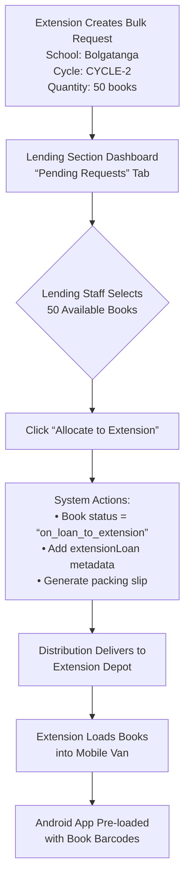

# 📚 Library Management System: Extension Services Department Module Specification

_Mobile library services for underserved schools with QR-based learner tracking and offline Android application_

---

## 🌍 CRITICAL CONTEXT: Extension Services Reality in Ghana

> **"78% of Ghanaian basic schools have library _space_ but lack books (GES 2023 survey). Extension Services solves this via rotating book sets delivered via mobile libraries to rural schools without permanent collections."**

### Operational Modes

| Mode                   | Description                                                    | Ghana Reality                                                                       |
| ---------------------- | -------------------------------------------------------------- | ----------------------------------------------------------------------------------- |
| **Mobile Library Van** | Visits schools on scheduled dates (Tamale-Bolgatanga corridor) | Roads may be impassable during rainy season; community leader notification required |
| **Designated Room**    | School allocates room as temporary library on service days     | No permanent staff; books must be secured after service                             |

### Core Constraints (Per Requirement)

- ✅ **NO condition scoring** during transactions (high traffic, limited time <5 min/learner)
- ✅ **NO interaction scores** recorded (degradation tracking disabled for Extension learners)
- ✅ **QR-based identification only** (smart tags with minimal data)
- ✅ **External Android application** handles transactions; syncs to main database post-service
- ✅ **Learners tagged** as `extension_service: true` in patron records

---

## 📦 EXTENSION SERVICES DEPARTMENT: Top-Level Department Structure

_(Peer to Acquisitions, Processing, Distribution, Library Operations)_

### Department Hierarchy

```text
System Admin (1 per installation)
│
├── Acquisitions Department Head
├── Processing Department Head
├── Distribution Department Head
├── Library Operations Head
│   ├── Children's Section Leader
│   ├── Adult Section Leader
│   ├── Reference Section Leader
│   └── Lending Section Leader  ← CRITICAL: Owns books loaned to Extension
│
└── Extension Services Department Head  ← TOP-LEVEL DEPARTMENT (PEER)
    ├── Extension Services Leader
    │   ├── Mobile Librarians (van operations)
    │   └── Designated Room Coordinators
    └── Cycle Coordinators (regional rotation management)
```

### Critical Boundary Clarification

| Aspect               | Library Sections                                           | Extension Services Department                                |
| -------------------- | ---------------------------------------------------------- | ------------------------------------------------------------ |
| **Book Ownership**   | Books owned by section                                     | Books **temporarily loaned from Lending Section**            |
| **Patron Type**      | Full patron profiles (Ghana Card ID, degradation tracking) | Minimal profiles (QR ID only; `extension_service: true` tag) |
| **Transaction Data** | Condition scores, degradation tracking                     | **Checkout/return ONLY** (no condition scoring)              |
| **Technology**       | Desktop Manager application                                | **External Android app** (offline) + Desktop planning module |
| **Service Location** | Fixed library                                              | Mobile van or school-designated room                         |

---

## 🗂️ EXTENSION SERVICES DATA MODEL (Detailed Specifications)

### 1. Extension Learner Record (`extension_learner`)

_Minimal profile for privacy + high-volume service_

```typescript
interface ExtensionLearner {
  _id: string; // "ext-learner-BOLGATANGA-UE-001-042"
  type: "extension_learner";

  // QR Smart Tag (physical laminated card given to learner)
  qrCodeId: string; // Unique ID ONLY in QR (e.g., "EXT-QR-BOL-00042")
  qrCodeImageUrl?: string; // Base64 PNG for printing (laminated card)

  // Minimal Personal Info (NO Ghana Card ID required)
  personalInfo: {
    firstName: string; // "Abena"
    lastName: string; // "Mensah"
    schoolId: string; // "BOLGATANGA-UE-001"
    schoolName: string; // "Bolgatanga Senior High"
    level: string; // "GRADE-4", "JHS-2"
    classSection?: string; // "A", "B" (optional)
    expiryDate: string; // ISO date (GES academic year: "2025-08-31")
  };

  // Book Tracking (NO condition scores per requirement)
  currentBooks: Array<{
    bookBarcode: string; // "SCI-6M-042"
    bookTitle: string; // "Basic Science Grade 6"
    checkoutDate: string; // ISO date
    // NOTE: dueDate intentionally omitted per current spec (to be added later)
  }>;

  borrowingHistory: Array<{
    bookBarcode: string;
    bookTitle: string;
    checkoutDate: string;
    returnDate: string;
    // CRITICAL: NO condition scores recorded (per traffic constraint)
  }>;

  // Extension Service Metadata
  extensionServiceTag: true; // Always true (tags patron as Extension)
  serviceLocationType: "mobile_van" | "designated_room";
  lastServiceDate?: string; // ISO date of last visit
  nextServiceDate?: string; // ISO date of next visit (to be added later)

  // System Metadata
  createdAt: string; // Registration date
  updatedAt: string;
  _syncStatus: "pending" | "synced"; // Android app sync status
}
```

#### 📄 Sample Extension Learner Record

```json
{
  "_id": "ext-learner-BOLGATANGA-UE-001-042",
  "type": "extension_learner",
  "qrCodeId": "EXT-QR-BOL-00042",
  "qrCodeImageUrl": "data:image/png;base64,iVBORw0KGgoAAAANSUhEUgAA...",
  "personalInfo": {
    "firstName": "Abena",
    "lastName": "Mensah",
    "schoolId": "BOLGATANGA-UE-001",
    "schoolName": "Bolgatanga Senior High",
    "level": "GRADE-4",
    "classSection": "B",
    "expiryDate": "2025-08-31"
  },
  "currentBooks": [
    {
      "bookBarcode": "SCI-6M-042",
      "bookTitle": "Basic Science Grade 6",
      "checkoutDate": "2024-02-28"
    }
  ],
  "borrowingHistory": [
    {
      "bookBarcode": "FOLK-4A-015",
      "bookTitle": "Ghana Folktales",
      "checkoutDate": "2024-01-15",
      "returnDate": "2024-02-28"
    }
  ],
  "extensionServiceTag": true,
  "serviceLocationType": "mobile_van",
  "lastServiceDate": "2024-02-28",
  "createdAt": "2023-09-01T10:30:00Z",
  "updatedAt": "2024-02-28T14:22:00Z",
  "_syncStatus": "synced"
}
```

---

### 2. Extension Transaction Record (`extension_transaction`)

_Records checkout/return during service (NO condition data)_

```typescript
interface ExtensionTransaction {
  _id: string; // "ext-trans-20240228-BOL-001"
  type: "extension_transaction";

  // Learner Identification
  learnerQrCodeId: string; // QR ID from smart tag ("EXT-QR-BOL-00042")
  learnerSchoolId: string; // "BOLGATANGA-UE-001"

  // Book Information
  bookBarcode: string; // "SCI-6M-042"
  bookTitle: string; // "Basic Science Grade 6"

  // Transaction Details
  transactionType: "checkout" | "return";
  transactionDate: string; // ISO datetime ("2024-02-28T14:15:30Z")
  serviceDate: string; // ISO date ("2024-02-28")
  serviceLocation: string; // "Bolgatanga Mobile Van Route 3"
  serviceLocationType: "mobile_van" | "designated_room";

  // Staff Information
  staffId: string; // "staff-EXT-001"
  staffName: string; // "Kwame Mensah"

  // System Metadata
  createdAt: string;
  _syncStatus: "pending" | "synced"; // Android app sync status
}
```

#### 📄 Sample Transaction Records

**Checkout**:

```json
{
  "_id": "ext-trans-20240228-BOL-001",
  "type": "extension_transaction",
  "learnerQrCodeId": "EXT-QR-BOL-00042",
  "learnerSchoolId": "BOLGATANGA-UE-001",
  "bookBarcode": "SCI-6M-042",
  "bookTitle": "Basic Science Grade 6",
  "transactionType": "checkout",
  "transactionDate": "2024-02-28T14:15:30Z",
  "serviceDate": "2024-02-28",
  "serviceLocation": "Bolgatanga Mobile Van Route 3",
  "serviceLocationType": "mobile_van",
  "staffId": "staff-EXT-001",
  "staffName": "Kwame Mensah",
  "createdAt": "2024-02-28T14:15:30Z",
  "_syncStatus": "pending"
}
```

**Return**:

```json
{
  "_id": "ext-trans-20240228-BOL-002",
  "type": "extension_transaction",
  "learnerQrCodeId": "EXT-QR-BOL-00042",
  "learnerSchoolId": "BOLGATANGA-UE-001",
  "bookBarcode": "FOLK-4A-015",
  "bookTitle": "Ghana Folktales",
  "transactionType": "return",
  "transactionDate": "2024-02-28T14:18:45Z",
  "serviceDate": "2024-02-28",
  "serviceLocation": "Bolgatanga Mobile Van Route 3",
  "serviceLocationType": "mobile_van",
  "staffId": "staff-EXT-001",
  "staffName": "Kwame Mensah",
  "createdAt": "2024-02-28T14:18:45Z",
  "_syncStatus": "pending"
}
```

---

### 3. Extension Service Schedule (`extension_schedule`)

_Plans service visits to schools_

```typescript
interface ExtensionSchedule {
  _id: string; // "ext-schedule-BOLGATANGA-UE-001-2024-03-15"
  type: "extension_schedule";

  // School Information
  schoolId: string; // "BOLGATANGA-UE-001"
  schoolName: string;
  schoolAddress: string;

  // Service Details
  serviceLocationType: "mobile_van" | "designated_room";
  serviceLocationDetails: string; // "Mobile Van Parked at School Gate"
  scheduledDate: string; // "2024-03-15"
  scheduledTime: string; // "10:00-14:00"

  // Staff Assignment
  assignedStaff: Array<{
    staffId: string;
    staffName: string;
    role: "mobile_librarian" | "designated_room_coordinator";
  }>;

  // Book Allocation (from Lending Section)
  bookSetsAllocated: Array<{
    setId: string; // "cycle-2-bolgatanga-set-1"
    rotationCycle: string; // "CYCLE-2"
    bookCount: number; // 50
    bookBarcodes: string[]; // ["SCI-6M-042", "MTH-5K-018", ...]
  }>;

  // Status Tracking
  status: "planned" | "in_progress" | "completed" | "cancelled";
  completionNotes?: string;

  // System Metadata
  createdAt: string;
  updatedAt: string;
  createdBy: string; // Staff ID of scheduler
}
```

#### 📄 Sample Service Schedule

```json
{
  "_id": "ext-schedule-BOLGATANGA-UE-001-2024-03-15",
  "type": "extension_schedule",
  "schoolId": "BOLGATANGA-UE-001",
  "schoolName": "Bolgatanga Senior High",
  "schoolAddress": "Bolgatanga, Upper East Region",
  "serviceLocationType": "mobile_van",
  "serviceLocationDetails": "Mobile Van Parked at School Gate",
  "scheduledDate": "2024-03-15",
  "scheduledTime": "10:00-14:00",
  "assignedStaff": [
    {
      "staffId": "staff-EXT-001",
      "staffName": "Kwame Mensah",
      "role": "mobile_librarian"
    }
  ],
  "bookSetsAllocated": [
    {
      "setId": "cycle-2-bolgatanga-set-1",
      "rotationCycle": "CYCLE-2",
      "bookCount": 50,
      "bookBarcodes": ["SCI-6M-042", "MTH-5K-018", "ENG-4B-027", ...]
    }
  ],
  "status": "planned",
  "createdAt": "2024-02-20T09:00:00Z",
  "createdBy": "staff-EXT-HEAD-001"
}
```

---

## 🔁 BULK ALLOCATION WORKFLOW: Lending Section → Extension Services

_Critical boundary: Extension borrows books from Lending Section_

### Workflow Steps



### Data Model Update: Book Record (`processed_book`)

_Add Extension loan tracking field_

```typescript
interface ProcessedBook {
  // ... existing fields ...

  // Extension Services Loan Tracking
  extensionLoan?: {
    allocatedTo: "extension_services"; // Fixed value
    rotationCycle: "CYCLE-1" | "CYCLE-2" | "CYCLE-3" | "CYCLE-4";
    schoolId: string; // "BOLGATANGA-UE-001"
    schoolName: string;
    allocatedDate: string; // ISO date
    dueDate: string; // ISO date (GES: "2025-08-31")
    allocatedBy: string; // Lending staff ID
    status: "allocated" | "returned" | "overdue";
    returnDate?: string; // When returned to Lending
  };

  // ... existing fields ...
}
```

---

## 📱 ANDROID APPLICATION: Technical Specifications

_External tool for offline transaction handling during service_

### Pre-Service Sync (Before Leaving Depot)

| Step | Action                 | Data Synced                                              |
| ---- | ---------------------- | -------------------------------------------------------- |
| 1    | Connect to depot Wi-Fi | All `extension_learner` records for next 7 days' schools |
| 2    | Download learner data  | QR codes, names, current books, school info              |
| 3    | Download book data     | Barcodes/titles for allocated book sets                  |
| 4    | Download schedule      | Service dates, locations, staff assignments              |
| 5    | Generate QR images     | For new learners (laminated smart tags)                  |

### During Service (100% Offline)

| Feature                  | Implementation                        | Ghana Adaptation                                  |
| ------------------------ | ------------------------------------- | ------------------------------------------------- |
| **QR Scanner**           | Device camera + ZXing library         | Works in low light (rural school conditions)      |
| **Learner Lookup**       | Local SQLite query by `qrCodeId`      | Displays name/school in Twi/Dagbani if configured |
| **Checkout Flow**        | Scan QR → Scan book barcode → Confirm | Max 2 books enforced; no condition fields shown   |
| **Return Flow**          | Scan QR → Scan book barcode → Confirm | Verifies book is in currentBooks                  |
| **Offline Storage**      | SQLite database on device             | Encrypted at rest (Android Keystore)              |
| **Battery Optimization** | Screen timeout 30s; low-power mode    | Critical for all-day van service without charging |

### Post-Service Sync (After Returning to Depot)

```typescript
// Pseudocode: Sync service
async function syncTransactions() {
  // 1. Upload pending transactions
  const pendingTransactions = await db.getPendingTransactions();
  for (const tx of pendingTransactions) {
    try {
      await api.post("/extension/transactions", tx);
      await db.markSynced(tx._id);
    } catch (error) {
      // Retry later with exponential backoff
      await db.incrementRetryCount(tx._id);
    }
  }

  // 2. Update learner records
  const updatedLearners = await db.getUpdatedLearners();
  for (const learner of updatedLearners) {
    await api.put(`/extension/learners/${learner._id}`, learner);
  }

  // 3. Generate service report
  const report = await generateServiceReport();
  await saveReport(report); // Local PDF + upload to main DB
}
```

---

## 🌍 GHANA-SPECIFIC ADAPTATIONS

### Smart Tag Design (QR Code)

| Component           | Specification                              | Why Ghana-Ready                                     |
| ------------------- | ------------------------------------------ | --------------------------------------------------- |
| **Physical Format** | Laminated card (85.6 × 54 mm)              | Withstands humid climate + frequent handling        |
| **QR Content**      | ONLY `qrCodeId` (e.g., "EXT-QR-BOL-00042") | **NO personal data** in QR (privacy compliance)     |
| **Visual Elements** | Learner name + school in large font        | Identifiable if QR damaged; works with low literacy |
| **Durability**      | 250-micron laminate + rounded corners      | Survives backpacks, rain, rough handling            |
| **Replacement**     | Same `qrCodeId` reused if lost             | Preserves borrowing history; no re-registration     |

### Tamale-Bolgatanga Corridor Safety Protocol

```json
{
  "corridorSafetyProtocol": {
    "requiredActions": [
      "Confirm road conditions with district office pre-departure",
      "Carry emergency water/supplies (min 2L per staff)",
      "Notify community leader 24h before arrival (SMS in Dagbani)",
      "Share live location with depot supervisor during transit"
    ],
    "androidAppFeatures": {
      "emergencyButton": "One-tap call to depot supervisor",
      "offlineMaps": "Pre-loaded Tamale-Bolgatanga route maps",
      "smsTemplates": [
        "Naa, Ghana Library Authority van arriving tomorrow at 10am. Please meet at school gate.",
        "Van delayed due to road conditions. ETA 2 hours."
      ]
    }
  }
}
```

### Language Support (Android App)

| Screen              | English                   | Twi                    | Dagbani               |
| ------------------- | ------------------------- | ---------------------- | --------------------- |
| **Checkout Button** | "Check Out Book"          | "Fa Nkwan"             | "Zuli Libri"          |
| **Return Button**   | "Return Book"             | "San Nkwan"            | "San Libri"           |
| **Max Books Alert** | "Max 2 books reached"     | "Wo nni 2 nkwan bio"   | "A zuli 2 libri"      |
| **Sync Status**     | "Syncing transactions..." | "Reyɛ transactions..." | "Zaŋ transactions..." |

---

## ✅ ACCEPTANCE CRITERIA

### Extension Learner Registration

_Given_ Extension staff registers new learner "Abena Mensah" from Bolgatanga Senior High  
_When_ staff clicks "Generate Smart Tag"  
_Then_ system creates `extension_learner` record with unique `qrCodeId`  
_And_ generates QR code image for laminated card printing  
_And_ learner tagged with `extensionServiceTag: true`  
_And_ **NO Ghana Card ID field required** (privacy compliance)

### Bulk Allocation Request

_Given_ Extension needs 50 books for Bolgatanga Cycle 2  
_When_ staff creates bulk request in Extension module  
_Then_ request appears in Lending Section "Pending Requests" tab  
_When_ Lending staff selects 50 books → clicks "Allocate to Extension Services"  
_Then_ books status updates to `on_loan_to_extension`  
_And_ `extensionLoan` metadata added (cycle, school, due date = Aug 31)  
_And_ packing slip generated with rotation cycle details

### Android App Checkout (Offline)

_Given_ Android app pre-loaded with Bolgatanga learner/book data  
_When_ learner presents smart tag → staff scans QR code  
_Then_ app displays learner name/school/current books **without internet**  
_When_ staff scans book barcode for checkout  
_Then_ app records transaction in local database  
_And_ enforces max 2 books per learner  
_And_ **NO condition scoring fields visible** (per requirement)

### Post-Service Sync

_Given_ Android app has 150 pending transactions after Bolgatanga service  
_When_ device connects to depot Wi-Fi  
_Then_ app syncs all transactions to main database within 5 minutes  
_And_ main database updates:

- Learner `currentBooks` and `lastServiceDate`
- Book `extensionLoan.status` for returned items  
  _And_ service report generated showing transactions per school

---

## 📊 EXTENSION SERVICES DASHBOARD (Manager/Enterprise Desktop)

### Key Metrics Displayed

```text
┌──────────────────────────────────────────────────────┐
│ EXTENSION SERVICES DASHBOARD • Cycle 2 of 4          │
├──────────────────────────────────────────────────────┤
│ 📱 ACTIVE LEARNERS: 1,247 (across 18 schools)       │
│ 📚 BOOKS IN CIRCULATION: 2,850                       │
│ 🚌 NEXT SERVICE: Bolgatanga SHS • Mar 15, 10:00 AM   │
│ 📊 TODAY'S TRANSACTIONS: 87 checkouts • 42 returns   │
├──────────────────────────────────────────────────────┤
│ UPCOMING SERVICES (Next 7 Days)                      │
│ • Mar 15: Bolgatanga SHS (Mobile Van)                │
│ • Mar 18: Wa Senior High (Designated Room)           │
│ • Mar 20: Navrongo SHS (Mobile Van)                  │
│ • Mar 22: Tamale Girls SHS (Designated Room)         │
├──────────────────────────────────────────────────────┤
│ [VIEW LEARNER REGISTRATION] [CREATE SERVICE SCHEDULE]│
│ [GENERATE SMART TAGS] [SYNC ANDROID DEVICES]         │
└──────────────────────────────────────────────────────┘
```

### Critical Reports

| Report               | Purpose                                   | Ghana Context                                           |
| -------------------- | ----------------------------------------- | ------------------------------------------------------- |
| **Learner Activity** | Books borrowed per learner (last 30 days) | Identify high-engagement schools for Cycle 3 allocation |
| **School Usage**     | Total transactions per school             | Prioritize schools with >80% utilization for extra sets |
| **Cycle Completion** | Books returned vs. allocated per cycle    | Flag schools with <90% return rate for follow-up        |
| **Lost Books**       | Books not returned by cycle end (Aug 31)  | Trigger replacement workflow; notify school headteacher |

---

## 🚀 IMPLEMENTATION ROADMAP

| Phase                       | Focus                       | Deliverables                                                                                                   | Ghana Validation                                              |
| --------------------------- | --------------------------- | -------------------------------------------------------------------------------------------------------------- | ------------------------------------------------------------- |
| **Phase 1**<br>(Weeks 1-2)  | Data Model & Desktop Module | `extension_learner`, `extension_transaction`, `extension_schedule` schemas; Desktop registration/scheduling UI | Validate QR tag design with Bolgatanga school staff           |
| **Phase 2**<br>(Weeks 3-4)  | Bulk Allocation Workflow    | Lending Section integration; packing slip generator; depot delivery workflow                                   | Test allocation flow with St. Peter's School Lending staff    |
| **Phase 3**<br>(Weeks 5-8)  | Android Application (MVP)   | QR scanner, checkout/return flows, offline DB, sync service; Twi/Dagbani UI                                    | Field test with 3 mobile van librarians on Tamale corridor    |
| **Phase 4**<br>(Weeks 9-10) | Ghana Localization          | Smart tag printing workflow; Dagbani SMS templates; safety protocol integration                                | Validate with Northern Region community leaders               |
| **Phase 5**<br>(Week 11)    | Pilot Deployment            | Full workflow at Bolgatanga SHS (mobile van) + Wa SHS (designated room)                                        | Measure: transactions/hour, sync success rate, staff feedback |

---

## ℹ️ CRITICAL IMPLEMENTATION NOTES FOR DEVELOPERS

1. **Privacy by Design**
   - QR codes contain **ONLY** `qrCodeId` (no names, schools, or personal data)
   - Android app encrypts local database using Android Keystore
   - Learner data never leaves Ghana (syncs to Ghana-hosted server only)

2. **Explicit Exclusions (Per Requirement)**
   - ❌ **NO** condition scoring fields in Android app UI
   - ❌ **NO** degradation tracking in `extension_transaction` schema
   - ❌ **NO** Ghana Card ID collection for learners (only staff require it)
   - ✅ **YES** `extensionServiceTag: true` flag on all learner records

3. **Sync Reliability**
   - Android app uses exponential backoff for failed syncs (1s → 30s → 2m)
   - Transactions retained locally until `_syncStatus = "synced"`
   - Depot Wi-Fi auto-sync trigger on app launch

4. **GES Calendar Enforcement**
   - All `expiryDate` and `dueDate` fields hardcoded to **August 31**
   - Cycle end alerts triggered 14 days before Aug 31
   - Auto-flag schools with books not returned by Aug 25

5. **Migration Path**
   - Bulk import tool: Convert existing school patron records to `extension_learner`
   - QR code generator: Batch-create smart tags from CSV upload
   - Android app config: Pre-load school schedules via QR config code

---

_Document Version: 1.0 • Prepared for Ghana Library Authority • February 2026_  
✅ **QR-based learner tracking** • ✅ **Offline Android application** • ✅ **Bulk allocation workflow** • ✅ **GES calendar alignment** • ✅ **NO condition scoring (per requirement)**  
_Ready for development sprint planning – database fields explicitly defined for easy implementation_ 📚🇬🇭
