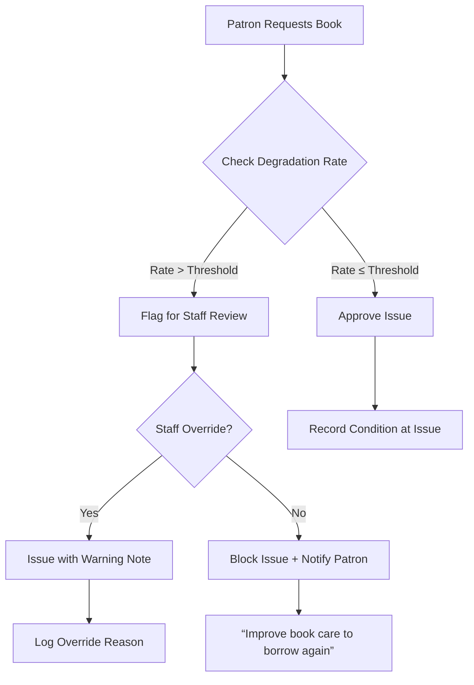
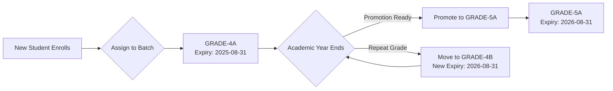

# 📚 Library Management System: Enhanced Functionality Specification

_Comprehensive patron lifecycle management, program administration, staff governance, and automated recognition systems_

---

## 🌟 CORE ENHANCEMENTS OVERVIEW

| Enhancement                   | Purpose                                                                 | Ghana Context Integration                                       |
| ----------------------------- | ----------------------------------------------------------------------- | --------------------------------------------------------------- |
| **Patron Lifecycle Tracking** | Holistic view of reading behavior, book care, and program participation | Batch promotion aligned with Ghana academic calendar (Sept–Aug) |
| **Automated Badge System**    | Motivate reading without manual admin intervention                      | Culturally relevant badges (Adinkra symbols, local proverbs)    |
| **Book Degradation Engine**   | Protect collection integrity with data-driven issuance controls         | Thresholds adjustable per library budget (rural vs urban)       |
| **Library Programs Module**   | Structured community engagement with appraisal tracking                 | Supports Ghana Education Service literacy initiatives           |
| **Staff Governance**          | Clear role hierarchy for Manager version deployments                    | Ghana Card ID verification for all staff records                |

---

## 📖 PATRON PROFILE: Enhanced Data Model

### Extended Patron Document Structure

```json
{
  "_id": "patron-GHA-123456789-0",
  "type": "patron",
  "patronType": "CHILD",
  "basicInfo": {
    "ghanaCardId": "hashed:GHA-123456789-0",
    "firstName": "Kwame",
    "lastName": "Asante",
    "dateOfBirth": "2012-05-15",
    "schoolId": "ACCRA-GREATER-001",
    "batchCode": "GRADE-4A",
    "currentGrade": 4,
    "batchExpiryDate": "2025-08-31",
    "enrollmentDate": "2023-09-01"
  },
  "readingMetrics": {
    "lifetimeBooksRead": 27,
    "currentYearBooks": 8,
    "avgBooksPerMonth": 2.3,
    "favoriteGenres": ["folktales", "science", "history"],
    "interactionScore": 87,
    "degradationRate": 0.18,
    "degradationThreshold": 0.3,
    "borrowingStatus": "active"
  },
  "bookHistory": [
    {
      "bookCopyId": "copy-BASIC-SCI-G4-042",
      "title": "Basic Science Grade 4",
      "issuedDate": "2024-01-15",
      "dueDate": "2024-02-05",
      "returnedDate": "2024-02-03",
      "conditionAtIssue": {
        "spine": 5,
        "cover": 5,
        "pages": 5,
        "edges": 5
      },
      "conditionAtReturn": {
        "spine": 4,
        "cover": 5,
        "pages": 4,
        "edges": 5
      },
      "degradationNotes": "Minor spine crease near binding",
      "degradationScore": 0.05
    }
  ],
  "lostBooks": [
    {
      "bookCopyId": "copy-GH-HISTORY-G5-018",
      "title": "Ghana History Grade 5",
      "reportedDate": "2023-11-10",
      "status": "unresolved",
      "replacementCost": 25.0,
      "staffNotes": "Parent contacted on 2023-11-15"
    }
  ],
  "programParticipation": [
    {
      "programId": "program-summer-reading-2024",
      "status": "active",
      "attendance": [true, true, false, true],
      "appraisal": {
        "participationLevel": "high",
        "improvement": "notable",
        "staffNotes": "Completed all reading logs early; recommended for advanced group",
        "dateAppraised": "2024-07-20"
      }
    }
  ],
  "badges": [
    {
      "badgeId": "book-worm",
      "awardedDate": "2024-06-15",
      "criteriaMet": "Read 10 books in June 2024"
    },
    {
      "badgeId": "gentle-reader",
      "awardedDate": "2024-03-10",
      "criteriaMet": "Returned 15 books with zero degradation"
    }
  ]
}
```

---

## 🔍 BOOK DEGRADATION ENGINE: Automated Protection System

### Condition Tracking Components

| Component | Technical Term         | Scale | Assessment Method                        |
| --------- | ---------------------- | ----- | ---------------------------------------- |
| **Spine** | Binding integrity      | 1-5   | Visual inspection of creases, separation |
| **Cover** | Board/lamination       | 1-5   | Check for tears, stains, warping         |
| **Pages** | Paper integrity        | 1-5   | Note tears, markings, moisture damage    |
| **Edges** | Page edges (fore-edge) | 1-5   | Inspect for fraying, dog-ears, cuts      |

### Degradation Calculation Logic

```javascript
// Per-book degradation score (0.0 = perfect, 1.0 = destroyed)
function calculateBookDegradation(issueCondition, returnCondition) {
  const components = ["spine", "cover", "pages", "edges"];
  let totalDegradation = 0;
  components.forEach((comp) => {
    const loss = issueCondition[comp] - returnCondition[comp];
    // Normalize to 0-1 scale per component
    totalDegradation += Math.max(0, loss) / 4;
  });
  return totalDegradation / components.length; // Average across components
}
// Patron degradation rate (rolling 12-month average)
function calculatePatronDegradationRate(patronBookHistory) {
  const relevantBooks = patronBookHistory.filter(
    (book) => book.returnedDate > oneYearAgo,
  );
  if (relevantBooks.length < 3) return 0; // Minimum 3 books for reliable rate
  const totalDegradation = relevantBooks.reduce(
    (sum, book) => sum + book.degradationScore,
    0,
  );
  return totalDegradation / relevantBooks.length;
}
```

### Threshold Enforcement Workflow



**Configurable Thresholds** (Per Library Settings):

- **Green Zone** (≤0.15): No restrictions
- **Yellow Zone** (0.16–0.29): Warning message on issue screen
- **Red Zone** (≥0.30): Requires staff override; max 1 book at a time
- **Critical** (≥0.45): Temporary suspension until staff review

---

## 🎯 LIBRARY PROGRAMS MODULE

### Program Creation Workflow

1. **Define Program**
   - Title, description, dates, target audience (CHILD/GENERAL)
   - Max participants, session schedule
   - _Ghana Example_: "GES Literacy Boost: Grade 4 Reading Challenge (Sept–Dec 2024)"

2. **Participant Selection**
   - Auto-select by criteria: `schoolId = "ACCRA-GREATER-001" AND batchCode = "GRADE-4*"`
   - Manual override: Add/remove individual patrons
   - Parental consent tracking for minors (required field)

3. **Session Management**
   - Digital attendance tracking (QR scan or manual check-in)
   - Session notes field for facilitator observations
   - Material distribution log (books issued for program)

4. **Appraisal System**

   ```json
   "appraisal": {
     "metrics": {
       "attendanceRate": 85,
       "completionRate": 100,
       "engagementLevel": "high", // low/medium/high
       "readingImprovement": "significant" // none/minor/significant
     },
     "staffNotes": "Kwame consistently completed reading logs early. Recommended for advanced group next term.",
     "nextSteps": "Assign challenging titles; invite to storytelling workshop",
     "dateAppraised": "2024-12-15",
     "appraisedBy": "staff-MPS-78901"
   }
   ```

### Program Dashboard View

```text
┌──────────────────────────────────────────────────────┐
│  SUMMER READING CHALLENGE 2024 • Active             │
├──────────────────────────────────────────────────────┤
│  📊 PARTICIPATION: 42/50 (84%)                       │
│  📅 Next Session: Aug 15, 2024 • "Folktales of Ghana"│
│                                                      │
│  TOP PERFORMERS                                      │
│  • Kwame A. (GRADE-4A) • 12 books • ⭐⭐⭐⭐⭐         │
│  • Ama S. (GRADE-4B) • 10 books • ⭐⭐⭐⭐            │
│                                                      │
│  NEEDS ATTENTION                                     │
│  • Kofi Mensah (GRADE-4C) • 2 sessions missed       │
│    → Send reminder SMS to parent                    │
│                                                      │
│  [TAKE ATTENDANCE]  [APPRAISE PARTICIPANTS]         │
└──────────────────────────────────────────────────────┘
```

---

## 🏆 AUTOMATED BADGE SYSTEM (Zero Manual Assignment)

### Badge Configuration Document (`badge-config`)

```json
{
  "_id": "badge-config",
  "type": "system_config",
  "badges": [
    {
      "id": "book-worm",
      "name": "Book Worm",
      "description": "Read 10 books in one calendar month",
      "icon": "assets/badges/book-worm.svg",
      "criteria": {
        "booksRead": 10,
        "timeframe": "month",
        "minBookValue": 1 // Exclude picture books for this badge
      },
      "ghanaCulturalNote": "Celebrates love of learning (Sankofa symbol)"
    },
    {
      "id": "gentle-reader",
      "name": "Gentle Reader",
      "description": "Returned 15 books with zero degradation",
      "icon": "assets/badges/gentle-reader.svg",
      "criteria": {
        "minBooks": 15,
        "maxDegradationRate": 0.01
      },
      "ghanaCulturalNote": "Honors care for community resources (Fawohodie symbol)"
    },
    {
      "id": "adinkra-reader",
      "name": "Adinkra Reader",
      "description": "Read 5 Ghanaian folklore books",
      "icon": "assets/badges/adinkra.svg",
      "criteria": {
        "genres": ["folktales", "ghana-history", "twi-literature"],
        "minBooks": 5
      },
      "ghanaCulturalNote": "Celebrates Ghanaian storytelling heritage"
    },
    {
      "id": "rising-star",
      "name": "Rising Star",
      "description": "Improved reading level by 2 grades in one year",
      "icon": "assets/badges/rising-star.svg",
      "criteria": {
        "minGradeImprovement": 2,
        "assessmentPeriod": "year"
      }
    }
  ],
  "awardSchedule": "daily", // Run badge checks every 24 hours
  "displayRules": {
    "maxBadgesPerPatron": 8,
    "prioritizeRecent": true
  }
}
```

### Badge Awarding Process

1. **Nightly Job** (Manager: `node-schedule`; Enterprise: CouchDB update handler)
2. **Evaluate Criteria** against patron reading history
3. **Auto-award** new badges meeting criteria
4. **Notify Patron** via app notification:
   _"🎉 Kwame! You earned 'Book Worm' badge for reading 10 books in June!"_
5. **Display in Patron Dashboard** with SVG icon + cultural note

> ✅ **Critical**: Badges NEVER manually assigned by staff – purely algorithmic to ensure fairness and reduce admin burden

---

## 👥 STAFF GOVERNANCE (Manager Version Specific)

### Staff Document Structure

```json
{
  "_id": "staff-MPS-78901",
  "type": "staff",
  "role": "section_leader",
  "department": "children_section",
  "personalInfo": {
    "ghanaCardId": "hashed:GHA-987654321-0",
    "firstName": "Akosua",
    "lastName": "Boateng",
    "serviceNumber": "MPS-78901",
    "rank": "Senior Librarian",
    "dateOfAppointment": "2018-03-10"
  },
  "contactInfo": {
    "email": "akosua.boateng@accralibrary.gov.gh",
    "phone": "+233249876543",
    "emergencyContact": {
      "name": "Kofi Boateng",
      "relationship": "Spouse",
      "phone": "+233201234567"
    }
  },
  "responsibilities": [
    "Oversee children's section operations",
    "Approve book withdrawals for children's collection",
    "Manage Grade 1-6 batch promotions",
    "Lead storytelling sessions every Tuesday"
  ],
  "supervisorId": "staff-MPS-12345", // Department head
  "isActive": true,
  "lastLogin": "2024-02-12T08:45:22Z"
}
```

### Role Hierarchy Implementation

| Role                | Permissions                                    | Manager Version Implementation                                    |
| ------------------- | ---------------------------------------------- | ----------------------------------------------------------------- |
| **Super Admin**     | Full system access                             | Single account per installation                                   |
| **Department Head** | Manage staff in department; view analytics     | Staff document with `role: "department_head"`                     |
| **Section Leader**  | Manage section operations; approve withdrawals | Staff document with `role: "section_leader"` + `department` field |
| **Librarian**       | Circulation, cataloging, program facilitation  | Staff document with `role: "librarian"`                           |
| **Assistant**       | Check-in/out only; no deletions                | Staff document with `role: "assistant"`                           |

> 🔒 **Security**: Staff logins use same authentication as patrons but with role-based UI filtering. Ghana Card ID hashed for privacy.

---

## 📅 PATRON BATCHING & PROMOTION SYSTEM

### Batch Lifecycle Management



### Promotion Workflow

1. **Pre-Promotion Report** (Generated June 15 annually)
   - Lists all batches expiring August 31
   - Shows patron count per batch
   - Flags patrons with attendance <70% for review

2. **Staff Action**
   - Select batch → "Promote Batch"
   - System auto-creates next grade batch (GRADE-4A → GRADE-5A)
   - For repeats: Create new batch code (GRADE-4B) with extended expiry
   - Parent notification SMS: _"Kwame promoted to Grade 5! New library batch: GRADE-5A"_

3. **Ghana Curriculum Alignment**

   | Current Batch | Promoted To | Curriculum Duration | Expiry Calculation             |
   | ------------- | ----------- | ------------------- | ------------------------------ |
   | KG-1          | KG-2        | 1 year              | Enroll date + 1 year           |
   | PRIMARY-6     | JHS-1       | 1 year              | Aug 31 following academic year |
   | JHS-3         | SHS-1       | 1 year              | Aug 31 following academic year |

---

## 🔧 IMPLEMENTATION ROADMAP BY VERSION

### Manager Version (Weeks 1-10)

| Week    | Module                      | Key Deliverables                                                            |
| ------- | --------------------------- | --------------------------------------------------------------------------- |
| **1-2** | Staff Governance            | Staff CRUD interface; role-based UI filtering; Ghana Card ID hashing        |
| **3-4** | Patron Profile Enhancements | Degradation tracking UI; lost books log; batch management                   |
| **5-6** | Book Degradation Engine     | Condition scoring interface; threshold enforcement; staff override workflow |
| **7-8** | Library Programs            | Program creation; participant selection; attendance tracking                |
| **9**   | Badge System                | Badge config UI; nightly awarding job; patron dashboard display             |
| **10**  | Batch Promotion             | Promotion workflow; expiry date calculator; parent notifications            |

### Enterprise Version (Weeks 11-14)

| Week   | Module                 | Key Deliverables                                                    |
| ------ | ---------------------- | ------------------------------------------------------------------- |
| **11** | Centralized Staff Mgmt | CouchDB `_users` integration; department security objects           |
| **12** | Multi-Branch Programs  | Program visibility controls per branch; centralized reporting       |
| **13** | Degradation Analytics  | Cross-branch degradation rate comparisons; budget impact reports    |
| **14** | Ghana Curriculum Sync  | OTA updates for curriculum changes; Ministry of Education alignment |

---

## 🌍 GHANA-SPECIFIC ADAPTATIONS

| Feature                    | Standard Implementation    | Ghana Adaptation                                                                        |
| -------------------------- | -------------------------- | --------------------------------------------------------------------------------------- |
| **Batch Expiry**           | Calendar year (Dec 31)     | Academic year (Aug 31) aligned with GES                                                 |
| **Badge Icons**            | Generic book/star icons    | Adinkra symbols (Sankofa, Fawohodie) with cultural notes                                |
| **Program Types**          | Generic reading challenges | GES Literacy Boost, National Reading Day events                                         |
| **Parental Consent**       | Email confirmation         | SMS consent + physical signature option for rural areas                                 |
| **Degradation Thresholds** | Fixed global value         | Configurable per library (rural libraries: higher thresholds due to budget constraints) |
| **Lost Book Resolution**   | Fine payment required      | Flexible options: replacement book donation, community service hours                    |

---

## 📱 PATRON DASHBOARD: Unified View

```text
┌──────────────────────────────────────────────────────┐
│  KWAME ASANTE • GRADE-4A • Batch Expiry: Aug 31, 2025│
├──────────────────────────────────────────────────────┤
│  📚 READING STATS                                    │
│  • Books Read This Year: 8/12 (Target)              │
│  • Avg. Books/Month: 2.3 • Interaction Score: 87/100 │
│  • Book Care Rating: ★★★★☆ (Degradation: 0.18)     │
│                                                      │
│  🏆 BADGES EARNED (3)                                │
│  [🪱 Book Worm] [🛡️ Gentle Reader] [⭐ Rising Star]  │
│                                                      │
│  📖 RECENT RETURNS                                   │
│  • Basic Science G4 (Returned: Feb 3)                │
│    Condition: Spine 4/5 • Pages 4/5 • Edges 5/5     │
│  • Ghana Folktales (Returned: Jan 20)                │
│    Condition: Perfect (5/5 all components)           │
│                                                      │
│  ⚠️ LOST BOOKS                                       │
│  • Ghana History G5 (Reported: Nov 10, 2023)         │
│    Status: Parent contacted • Replacement cost: GHS 25│
│                                                      │
│  🌱 PROGRAM PARTICIPATION                            │
│  • Summer Reading Challenge 2024 (Active)            │
│    Attendance: 3/4 sessions • Appraisal: "High engagement"│
│                                                      │
│  [VIEW FULL HISTORY]  [SUGGEST NEXT BOOK]           │
└──────────────────────────────────────────────────────┘
```

---

## ✅ CRITICAL SUCCESS FACTORS

1. **Degradation Threshold Flexibility**
   - Rural libraries can set higher thresholds (0.40) due to limited replacement budgets
   - Urban libraries maintain stricter standards (0.25) with robust acquisition budgets

2. **Batch Promotion Automation**
   - Eliminates manual grade tracking errors
   - Parent notifications reduce administrative calls

3. **Badge System Integrity**
   - Algorithmic awards prevent favoritism accusations
   - Cultural relevance increases child engagement

4. **Staff Governance Clarity**
   - Clear role hierarchy prevents workflow conflicts in Manager version
   - Ghana Card ID verification ensures staff authenticity

5. **Ghana Curriculum Alignment**
   - Automatic expiry dates reduce admin overhead
   - Program types support national literacy initiatives

---

## 📥 READY FOR DEVELOPMENT

This specification provides:

- ✅ Complete data models for all new features (degradation tracking, programs, badges, staff)
- ✅ Algorithmic logic for automated systems (badge awards, degradation calculation)
- ✅ Ghana-specific adaptations embedded in every workflow
- ✅ Clear separation of Manager vs Enterprise implementation paths
- ✅ UI mockups showing integrated patron dashboard
- ✅ Threshold enforcement workflows with staff override paths
