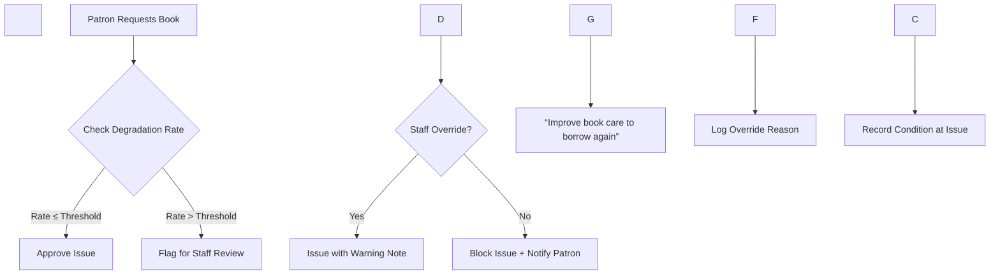
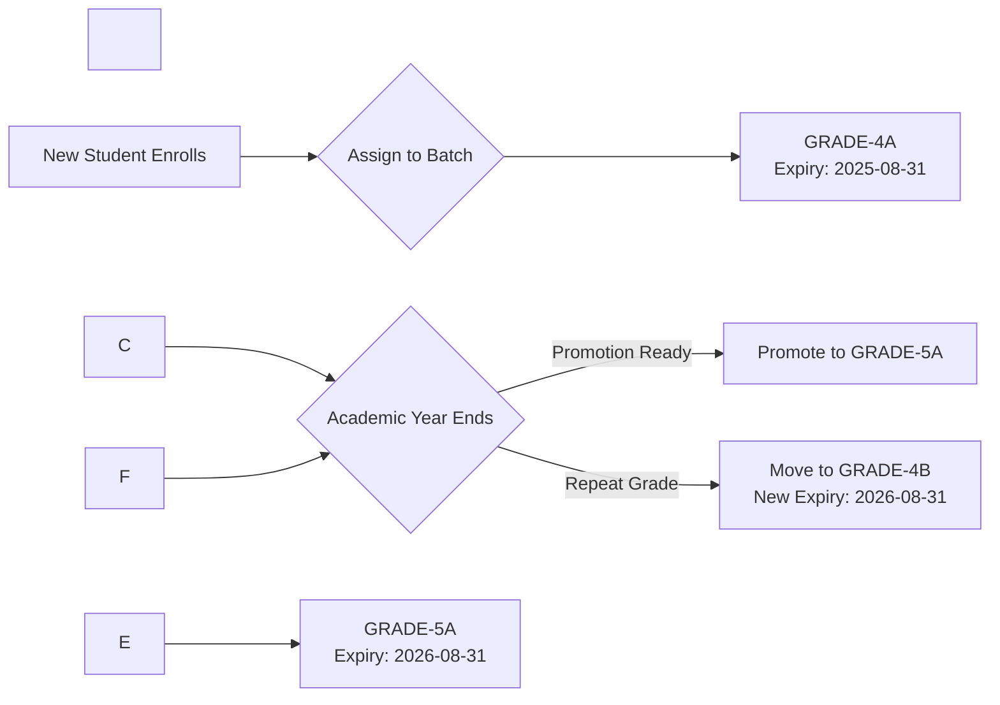

\# 📚 Library Management System: Enhanced Functionality Specification  

\*Comprehensive patron lifecycle management, program administration, staff governance, and automated recognition systems\*


---


\## 🌟 CORE ENHANCEMENTS OVERVIEW


| Enhancement | Purpose | Ghana Context Integration |

|-------------|---------|---------------------------|

| \*\*Patron Lifecycle Tracking\*\* | Holistic view of reading behavior, book care, and program participation | Batch promotion aligned with Ghana academic calendar (Sept–Aug) |

| \*\*Automated Badge System\*\* | Motivate reading without manual admin intervention | Culturally relevant badges (Adinkra symbols, local proverbs) |

| \*\*Book Degradation Engine\*\* | Protect collection integrity with data-driven issuance controls | Thresholds adjustable per library budget (rural vs urban) |

| \*\*Library Programs Module\*\* | Structured community engagement with appraisal tracking | Supports Ghana Education Service literacy initiatives |

| \*\*Staff Governance\*\* | Clear role hierarchy for Manager version deployments | Ghana Card ID verification for all staff records |


---


\## 📖 PATRON PROFILE: Enhanced Data Model


\### Extended Patron Document Structure

```json

{

&nbsp; "\_id": "patron-GHA-123456789-0",

&nbsp; "type": "patron",

&nbsp; "patronType": "CHILD",

&nbsp; "basicInfo": {

&nbsp;   "ghanaCardId": "hashed:GHA-123456789-0",

&nbsp;   "firstName": "Kwame",

&nbsp;   "lastName": "Asante",

&nbsp;   "dateOfBirth": "2012-05-15",

&nbsp;   "schoolId": "ACCRA-GREATER-001",

&nbsp;   "batchCode": "GRADE-4A",

&nbsp;   "currentGrade": 4,

&nbsp;   "batchExpiryDate": "2025-08-31",

&nbsp;   "enrollmentDate": "2023-09-01"

&nbsp; },

&nbsp; "readingMetrics": {

&nbsp;   "lifetimeBooksRead": 27,

&nbsp;   "currentYearBooks": 8,

&nbsp;   "avgBooksPerMonth": 2.3,

&nbsp;   "favoriteGenres": \["folktales", "science", "history"],

&nbsp;   "interactionScore": 87,

&nbsp;   "degradationRate": 0.18,

&nbsp;   "degradationThreshold": 0.30,

&nbsp;   "borrowingStatus": "active"

&nbsp; },

&nbsp; "bookHistory": \[

&nbsp;   {

&nbsp;     "bookCopyId": "copy-BASIC-SCI-G4-042",

&nbsp;     "title": "Basic Science Grade 4",

&nbsp;     "issuedDate": "2024-01-15",

&nbsp;     "dueDate": "2024-02-05",

&nbsp;     "returnedDate": "2024-02-03",

&nbsp;     "conditionAtIssue": {

&nbsp;       "spine": 5,

&nbsp;       "cover": 5,

&nbsp;       "pages": 5,

&nbsp;       "edges": 5

&nbsp;     },

&nbsp;     "conditionAtReturn": {

&nbsp;       "spine": 4,

&nbsp;       "cover": 5,

&nbsp;       "pages": 4,

&nbsp;       "edges": 5

&nbsp;     },

&nbsp;     "degradationNotes": "Minor spine crease near binding",

&nbsp;     "degradationScore": 0.05

&nbsp;   }

&nbsp; ],

&nbsp; "lostBooks": \[

&nbsp;   {

&nbsp;     "bookCopyId": "copy-GH-HISTORY-G5-018",

&nbsp;     "title": "Ghana History Grade 5",

&nbsp;     "reportedDate": "2023-11-10",

&nbsp;     "status": "unresolved",

&nbsp;     "replacementCost": 25.00,

&nbsp;     "staffNotes": "Parent contacted on 2023-11-15"

&nbsp;   }

&nbsp; ],

&nbsp; "programParticipation": \[

&nbsp;   {

&nbsp;     "programId": "program-summer-reading-2024",

&nbsp;     "status": "active",

&nbsp;     "attendance": \[true, true, false, true],

&nbsp;     "appraisal": {

&nbsp;       "participationLevel": "high",

&nbsp;       "improvement": "notable",

&nbsp;       "staffNotes": "Completed all reading logs early; recommended for advanced group",

&nbsp;       "dateAppraised": "2024-07-20"

&nbsp;     }

&nbsp;   }

&nbsp; ],

&nbsp; "badges": \[

&nbsp;   {

&nbsp;     "badgeId": "book-worm",

&nbsp;     "awardedDate": "2024-06-15",

&nbsp;     "criteriaMet": "Read 10 books in June 2024"

&nbsp;   },

&nbsp;   {

&nbsp;     "badgeId": "gentle-reader",

&nbsp;     "awardedDate": "2024-03-10",

&nbsp;     "criteriaMet": "Returned 15 books with zero degradation"

&nbsp;   }

&nbsp; ]

}

```


---


\## 🔍 BOOK DEGRADATION ENGINE: Automated Protection System


\### Condition Tracking Components

| Component | Technical Term | Scale | Assessment Method |

|-----------|----------------|-------|-------------------|

| \*\*Spine\*\* | Binding integrity | 1-5 | Visual inspection of creases, separation |

| \*\*Cover\*\* | Board/lamination | 1-5 | Check for tears, stains, warping |

| \*\*Pages\*\* | Paper integrity | 1-5 | Note tears, markings, moisture damage |

| \*\*Edges\*\* | Page edges (fore-edge) | 1-5 | Inspect for fraying, dog-ears, cuts |


\### Degradation Calculation Logic

```javascript

// Per-book degradation score (0.0 = perfect, 1.0 = destroyed)

function calculateBookDegradation(issueCondition, returnCondition) {

&nbsp; const components = \['spine', 'cover', 'pages', 'edges'];

&nbsp; let totalDegradation = 0;

&nbsp; 

&nbsp; components.forEach(comp => {

&nbsp;   const loss = issueCondition\[comp] - returnCondition\[comp];

&nbsp;   // Normalize to 0-1 scale per component

&nbsp;   totalDegradation += Math.max(0, loss) / 4; 

&nbsp; });

&nbsp; 

&nbsp; return totalDegradation / components.length; // Average across components

}


// Patron degradation rate (rolling 12-month average)

function calculatePatronDegradationRate(patronBookHistory) {

&nbsp; const relevantBooks = patronBookHistory.filter(book => 

&nbsp;   book.returnedDate > oneYearAgo

&nbsp; );

&nbsp; 

&nbsp; if (relevantBooks.length < 3) return 0; // Minimum 3 books for reliable rate

&nbsp; 

&nbsp; const totalDegradation = relevantBooks.reduce((sum, book) => 

&nbsp;   sum + book.degradationScore, 0

&nbsp; );

&nbsp; 

&nbsp; return totalDegradation / relevantBooks.length;

}

```


\### Threshold Enforcement Workflow




\*\*Configurable Thresholds\*\* (Per Library Settings):

\- \*\*Green Zone\*\* (≤0.15): No restrictions

\- \*\*Yellow Zone\*\* (0.16–0.29): Warning message on issue screen

\- \*\*Red Zone\*\* (≥0.30): Requires staff override; max 1 book at a time

\- \*\*Critical\*\* (≥0.45): Temporary suspension until staff review


---


\## 🎯 LIBRARY PROGRAMS MODULE


\### Program Creation Workflow

1\. \*\*Define Program\*\*  

&nbsp;  - Title, description, dates, target audience (CHILD/GENERAL)  

&nbsp;  - Max participants, session schedule  

&nbsp;  - \*Ghana Example\*: "GES Literacy Boost: Grade 4 Reading Challenge (Sept–Dec 2024)"


2\. \*\*Participant Selection\*\*  

&nbsp;  - Auto-select by criteria: `schoolId = "ACCRA-GREATER-001" AND batchCode = "GRADE-4\*"`  

&nbsp;  - Manual override: Add/remove individual patrons  

&nbsp;  - Parental consent tracking for minors (required field)


3\. \*\*Session Management\*\*  

&nbsp;  - Digital attendance tracking (QR scan or manual check-in)  

&nbsp;  - Session notes field for facilitator observations  

&nbsp;  - Material distribution log (books issued for program)


4\. \*\*Appraisal System\*\*  

&nbsp;  ```json

&nbsp;  "appraisal": {

&nbsp;    "metrics": {

&nbsp;      "attendanceRate": 85,

&nbsp;      "completionRate": 100,

&nbsp;      "engagementLevel": "high", // low/medium/high

&nbsp;      "readingImprovement": "significant" // none/minor/significant

&nbsp;    },

&nbsp;    "staffNotes": "Kwame consistently completed reading logs early. Recommended for advanced group next term.",

&nbsp;    "nextSteps": "Assign challenging titles; invite to storytelling workshop",

&nbsp;    "dateAppraised": "2024-12-15",

&nbsp;    "appraisedBy": "staff-MPS-78901"

&nbsp;  }

&nbsp;  ```


\### Program Dashboard View

```

┌──────────────────────────────────────────────────────┐

│  SUMMER READING CHALLENGE 2024 • Active             │

├──────────────────────────────────────────────────────┤

│  📊 PARTICIPATION: 42/50 (84%)                       │

│  📅 Next Session: Aug 15, 2024 • "Folktales of Ghana"│

│                                                      │

│  TOP PERFORMERS                                      │

│  • Kwame A. (GRADE-4A) • 12 books • ⭐⭐⭐⭐⭐         │

│  • Ama S. (GRADE-4B) • 10 books • ⭐⭐⭐⭐            │

│                                                      │

│  NEEDS ATTENTION                                     │

│  • Kofi Mensah (GRADE-4C) • 2 sessions missed       │

│    → Send reminder SMS to parent                    │

│                                                      │

│  \[TAKE ATTENDANCE]  \[APPRAISE PARTICIPANTS]         │

└──────────────────────────────────────────────────────┘

```


---


\## 🏆 AUTOMATED BADGE SYSTEM (Zero Manual Assignment)


\### Badge Configuration Document (`badge-config`)

```json

{

&nbsp; "\_id": "badge-config",

&nbsp; "type": "system\_config",

&nbsp; "badges": \[

&nbsp;   {

&nbsp;     "id": "book-worm",

&nbsp;     "name": "Book Worm",

&nbsp;     "description": "Read 10 books in one calendar month",

&nbsp;     "icon": "assets/badges/book-worm.svg",

&nbsp;     "criteria": {

&nbsp;       "booksRead": 10,

&nbsp;       "timeframe": "month",

&nbsp;       "minBookValue": 1 // Exclude picture books for this badge

&nbsp;     },

&nbsp;     "ghanaCulturalNote": "Celebrates love of learning (Sankofa symbol)"

&nbsp;   },

&nbsp;   {

&nbsp;     "id": "gentle-reader",

&nbsp;     "name": "Gentle Reader",

&nbsp;     "description": "Returned 15 books with zero degradation",

&nbsp;     "icon": "assets/badges/gentle-reader.svg",

&nbsp;     "criteria": {

&nbsp;       "minBooks": 15,

&nbsp;       "maxDegradationRate": 0.01

&nbsp;     },

&nbsp;     "ghanaCulturalNote": "Honors care for community resources (Fawohodie symbol)"

&nbsp;   },

&nbsp;   {

&nbsp;     "id": "adinkra-reader",

&nbsp;     "name": "Adinkra Reader",

&nbsp;     "description": "Read 5 Ghanaian folklore books",

&nbsp;     "icon": "assets/badges/adinkra.svg",

&nbsp;     "criteria": {

&nbsp;       "genres": \["folktales", "ghana-history", "twi-literature"],

&nbsp;       "minBooks": 5

&nbsp;     },

&nbsp;     "ghanaCulturalNote": "Celebrates Ghanaian storytelling heritage"

&nbsp;   },

&nbsp;   {

&nbsp;     "id": "rising-star",

&nbsp;     "name": "Rising Star",

&nbsp;     "description": "Improved reading level by 2 grades in one year",

&nbsp;     "icon": "assets/badges/rising-star.svg",

&nbsp;     "criteria": {

&nbsp;       "minGradeImprovement": 2,

&nbsp;       "assessmentPeriod": "year"

&nbsp;     }

&nbsp;   }

&nbsp; ],

&nbsp; "awardSchedule": "daily", // Run badge checks every 24 hours

&nbsp; "displayRules": {

&nbsp;   "maxBadgesPerPatron": 8,

&nbsp;   "prioritizeRecent": true

&nbsp; }

}

```


\### Badge Awarding Process

1\. \*\*Nightly Job\*\* (Manager: `node-schedule`; Enterprise: CouchDB update handler)  

2\. \*\*Evaluate Criteria\*\* against patron reading history  

3\. \*\*Auto-award\*\* new badges meeting criteria  

4\. \*\*Notify Patron\*\* via app notification:  

&nbsp;  \*"🎉 Kwame! You earned 'Book Worm' badge for reading 10 books in June!"\*  

5\. \*\*Display in Patron Dashboard\*\* with SVG icon + cultural note  


> ✅ \*\*Critical\*\*: Badges NEVER manually assigned by staff – purely algorithmic to ensure fairness and reduce admin burden


---


\## 👥 STAFF GOVERNANCE (Manager Version Specific)


\### Staff Document Structure

```json

{

&nbsp; "\_id": "staff-MPS-78901",

&nbsp; "type": "staff",

&nbsp; "role": "section\_leader",

&nbsp; "department": "children\_section",

&nbsp; "personalInfo": {

&nbsp;   "ghanaCardId": "hashed:GHA-987654321-0",

&nbsp;   "firstName": "Akosua",

&nbsp;   "lastName": "Boateng",

&nbsp;   "serviceNumber": "MPS-78901",

&nbsp;   "rank": "Senior Librarian",

&nbsp;   "dateOfAppointment": "2018-03-10"

&nbsp; },

&nbsp; "contactInfo": {

&nbsp;   "email": "akosua.boateng@accralibrary.gov.gh",

&nbsp;   "phone": "+233249876543",

&nbsp;   "emergencyContact": {

&nbsp;     "name": "Kofi Boateng",

&nbsp;     "relationship": "Spouse",

&nbsp;     "phone": "+233201234567"

&nbsp;   }

&nbsp; },

&nbsp; "responsibilities": \[

&nbsp;   "Oversee children's section operations",

&nbsp;   "Approve book withdrawals for children's collection",

&nbsp;   "Manage Grade 1-6 batch promotions",

&nbsp;   "Lead storytelling sessions every Tuesday"

&nbsp; ],

&nbsp; "supervisorId": "staff-MPS-12345", // Department head

&nbsp; "isActive": true,

&nbsp; "lastLogin": "2024-02-12T08:45:22Z"

}

```


\### Role Hierarchy Implementation

| Role | Permissions | Manager Version Implementation |

|------|-------------|-------------------------------|

| \*\*Super Admin\*\* | Full system access | Single account per installation |

| \*\*Department Head\*\* | Manage staff in department; view analytics | Staff document with `role: "department\_head"` |

| \*\*Section Leader\*\* | Manage section operations; approve withdrawals | Staff document with `role: "section\_leader"` + `department` field |

| \*\*Librarian\*\* | Circulation, cataloging, program facilitation | Staff document with `role: "librarian"` |

| \*\*Assistant\*\* | Check-in/out only; no deletions | Staff document with `role: "assistant"` |


> 🔒 \*\*Security\*\*: Staff logins use same authentication as patrons but with role-based UI filtering. Ghana Card ID hashed for privacy.


---


\## 📅 PATRON BATCHING \& PROMOTION SYSTEM


\### Batch Lifecycle Management




\### Promotion Workflow

1\. \*\*Pre-Promotion Report\*\* (Generated June 15 annually)  

&nbsp;  - Lists all batches expiring August 31  

&nbsp;  - Shows patron count per batch  

&nbsp;  - Flags patrons with attendance <70% for review  


2\. \*\*Staff Action\*\*  

&nbsp;  - Select batch → "Promote Batch"  

&nbsp;  - System auto-creates next grade batch (GRADE-4A → GRADE-5A)  

&nbsp;  - For repeats: Create new batch code (GRADE-4B) with extended expiry  

&nbsp;  - Parent notification SMS: \*"Kwame promoted to Grade 5! New library batch: GRADE-5A"\*  


3\. \*\*Ghana Curriculum Alignment\*\*  

&nbsp;  | Current Batch | Promoted To | Curriculum Duration | Expiry Calculation |

&nbsp;  |---------------|-------------|---------------------|---------------------|

&nbsp;  | KG-1 | KG-2 | 1 year | Enroll date + 1 year |

&nbsp;  | PRIMARY-6 | JHS-1 | 1 year | Aug 31 following academic year |

&nbsp;  | JHS-3 | SHS-1 | 1 year | Aug 31 following academic year |


---


\## 🔧 IMPLEMENTATION ROADMAP BY VERSION


\### Manager Version (Weeks 1-10)

| Week | Module | Key Deliverables |

|------|--------|------------------|

| \*\*1-2\*\* | Staff Governance | Staff CRUD interface; role-based UI filtering; Ghana Card ID hashing |

| \*\*3-4\*\* | Patron Profile Enhancements | Degradation tracking UI; lost books log; batch management |

| \*\*5-6\*\* | Book Degradation Engine | Condition scoring interface; threshold enforcement; staff override workflow |

| \*\*7-8\*\* | Library Programs | Program creation; participant selection; attendance tracking |

| \*\*9\*\* | Badge System | Badge config UI; nightly awarding job; patron dashboard display |

| \*\*10\*\* | Batch Promotion | Promotion workflow; expiry date calculator; parent notifications |


\### Enterprise Version (Weeks 11-14)

| Week | Module | Key Deliverables |

|------|--------|------------------|

| \*\*11\*\* | Centralized Staff Mgmt | CouchDB `\_users` integration; department security objects |

| \*\*12\*\* | Multi-Branch Programs | Program visibility controls per branch; centralized reporting |

| \*\*13\*\* | Degradation Analytics | Cross-branch degradation rate comparisons; budget impact reports |

| \*\*14\*\* | Ghana Curriculum Sync | OTA updates for curriculum changes; Ministry of Education alignment |


---


\## 🌍 GHANA-SPECIFIC ADAPTATIONS


| Feature | Standard Implementation | Ghana Adaptation |

|---------|-------------------------|------------------|

| \*\*Batch Expiry\*\* | Calendar year (Dec 31) | Academic year (Aug 31) aligned with GES |

| \*\*Badge Icons\*\* | Generic book/star icons | Adinkra symbols (Sankofa, Fawohodie) with cultural notes |

| \*\*Program Types\*\* | Generic reading challenges | GES Literacy Boost, National Reading Day events |

| \*\*Parental Consent\*\* | Email confirmation | SMS consent + physical signature option for rural areas |

| \*\*Degradation Thresholds\*\* | Fixed global value | Configurable per library (rural libraries: higher thresholds due to budget constraints) |

| \*\*Lost Book Resolution\*\* | Fine payment required | Flexible options: replacement book donation, community service hours |


---


\## 📱 PATRON DASHBOARD: Unified View


```

┌──────────────────────────────────────────────────────┐

│  KWAME ASANTE • GRADE-4A • Batch Expiry: Aug 31, 2025│

├──────────────────────────────────────────────────────┤

│  📚 READING STATS                                    │

│  • Books Read This Year: 8/12 (Target)              │

│  • Avg. Books/Month: 2.3 • Interaction Score: 87/100 │

│  • Book Care Rating: ★★★★☆ (Degradation: 0.18)     │

│                                                      │

│  🏆 BADGES EARNED (3)                                │

│  \[🪱 Book Worm] \[🛡️ Gentle Reader] \[⭐ Rising Star]  │

│                                                      │

│  📖 RECENT RETURNS                                   │

│  • Basic Science G4 (Returned: Feb 3)                │

│    Condition: Spine 4/5 • Pages 4/5 • Edges 5/5     │

│  • Ghana Folktales (Returned: Jan 20)                │

│    Condition: Perfect (5/5 all components)           │

│                                                      │

│  ⚠️ LOST BOOKS                                       │

│  • Ghana History G5 (Reported: Nov 10, 2023)         │

│    Status: Parent contacted • Replacement cost: GHS 25│

│                                                      │

│  🌱 PROGRAM PARTICIPATION                            │

│  • Summer Reading Challenge 2024 (Active)            │

│    Attendance: 3/4 sessions • Appraisal: "High engagement"│

│                                                      │

│  \[VIEW FULL HISTORY]  \[SUGGEST NEXT BOOK]           │

└──────────────────────────────────────────────────────┘

```


---


\## ✅ CRITICAL SUCCESS FACTORS


1\. \*\*Degradation Threshold Flexibility\*\*  

&nbsp;  - Rural libraries can set higher thresholds (0.40) due to limited replacement budgets  

&nbsp;  - Urban libraries maintain stricter standards (0.25) with robust acquisition budgets  


2\. \*\*Batch Promotion Automation\*\*  

&nbsp;  - Eliminates manual grade tracking errors  

&nbsp;  - Parent notifications reduce administrative calls  


3\. \*\*Badge System Integrity\*\*  

&nbsp;  - Algorithmic awards prevent favoritism accusations  

&nbsp;  - Cultural relevance increases child engagement  


4\. \*\*Staff Governance Clarity\*\*  

&nbsp;  - Clear role hierarchy prevents workflow conflicts in Manager version  

&nbsp;  - Ghana Card ID verification ensures staff authenticity  


5\. \*\*Ghana Curriculum Alignment\*\*  

&nbsp;  - Automatic expiry dates reduce admin overhead  

&nbsp;  - Program types support national literacy initiatives  


---


\## 📥 READY FOR DEVELOPMENT


This specification provides:

\- ✅ Complete data models for all new features (degradation tracking, programs, badges, staff)

\- ✅ Algorithmic logic for automated systems (badge awards, degradation calculation)

\- ✅ Ghana-specific adaptations embedded in every workflow

\- ✅ Clear separation of Manager vs Enterprise implementation paths

\- ✅ UI mockups showing integrated patron dashboard

\- ✅ Threshold enforcement workflows with staff override paths


