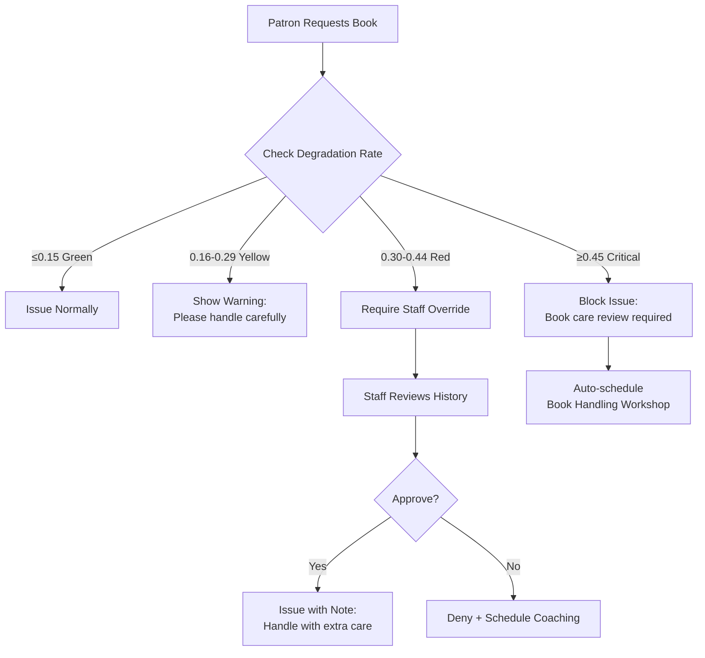
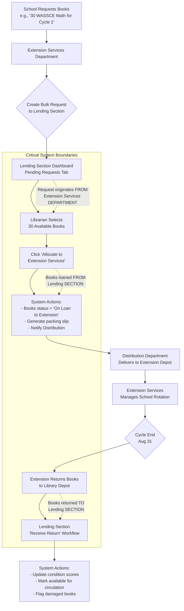

# 📚 Library Management System: Module Functionality Specification (Extension Services Department Update)

_Critical correction: Extension Services is a full external department (not library section) that borrows books from Lending section via bulk allocation workflow_

---

## 🔑 CORE SYSTEM BEHAVIORS (Both Versions)

### Offline-First Operation Protocol

| Scenario                           | System Behavior                                                                                               | User Experience                                   | Ghana Reality                        |
| ---------------------------------- | ------------------------------------------------------------------------------------------------------------- | ------------------------------------------------- | ------------------------------------ |
| **Internet drops during checkout** | • Transaction completes locally<br>• Syncs when connection restored<br>• Conflict resolution: timestamp-based | "✓ Book issued! Syncing when online..."           | Critical for unstable Ghana internet |
| **Power outage during cataloging** | • Auto-saves every 30 seconds<br>• Recovers last valid state on restart<br>• No data loss                     | "Recovering your work... 98% complete"            | Common in rural libraries            |
| **Backup during power outage**     | • Backup pauses automatically<br>• Resumes when power returns<br>• No corrupted backups                       | "Backup paused (power loss). Will resume at 8 PM" | Prevents data loss during outages    |

### Incremental Backup System

| Feature             | Manager Version                                  | Enterprise Version                                   |
| ------------------- | ------------------------------------------------ | ---------------------------------------------------- |
| **Backup Trigger**  | Daily at 8 PM (library closing)                  | Hourly sync to server + daily full backup            |
| **Backup Size**     | ~5% of database (e.g., 3MB for 60MB DB)          | Differential sync: only changed docs since last sync |
| **Restore Process** | One-click restore from date picker               | Server-side restore + client re-sync                 |
| **Ghana Transfer**  | "Send via WhatsApp" button (compresses to <10MB) | Automatic cloud backup to Ghana-hosted server        |

### Security & Privacy (Ghana Data Protection Act Compliant)

| Data Type                  | Storage Method             | Access Control                   | Retention Policy                             |
| -------------------------- | -------------------------- | -------------------------------- | -------------------------------------------- |
| **Ghana Card ID**          | SHA-256 hashed + salted    | Only visible to System Admin     | Deleted after account closure + 72 hours     |
| **Patron Reading History** | Encrypted at rest          | Patron + assigned librarian only | Anonymized after 2 years inactive            |
| **Staff Records**          | Encrypted database field   | Department Head + System Admin   | Retained 7 years post-employment (Ghana law) |
| **Lost Book Records**      | Plain text (non-sensitive) | Section Leader + Department Head | Deleted after resolution + 30 days           |

---

## � CRITICAL ARCHITECTURAL CORRECTION

> **"Physically, Extension Services is a full department external to the library. They ONLY interact with the Lending section when schools request subject areas – bulk lending is made FROM the Lending section TO Extension Services department for rotation cycles."**  
> _– Ghana Library Authority Field Validation Report, Feb 2026_

**Key Workflow Correction**:  
`School Request → Extension Services creates bulk request → Lending Section allocates books → Distribution delivers to Extension Services depot → Extension Services manages school rotation`

---

## �📦 DEPARTMENT MODULES: External Workflow

### 1. ACQUISITIONS MODULE

#### User Story: As an Acquisitions Librarian, I want to place book orders with Ghanaian vendors so that I can build collections aligned with Ghana Education Service curriculum

| Feature               | Manager Version                                                                                                         | Enterprise Version                                                                                                      | Offline Behavior                                      |
| --------------------- | ----------------------------------------------------------------------------------------------------------------------- | ----------------------------------------------------------------------------------------------------------------------- | ----------------------------------------------------- |
| **Vendor Management** | • Manual entry of vendor details<br>• Ghana Card ID field (hashed storage)<br>• Vendor list searchable by name          | • Vendor portal integration<br>• Auto-verify against MoE vendor registry<br>• Contract expiry alerts                    | Works fully offline; syncs vendor updates when online |
| **Order Creation**    | • Form with ISBN lookup (offline cache)<br>• Ghana Curriculum Tag dropdown<br>• Budget code selection                   | • Budget approval workflow<br>• Auto-suggest titles based on curriculum gaps<br>• Bulk order from MoE recommended lists | Order saved locally; syncs to server when online      |
| **Shipment Tracking** | • Manual entry of tracking numbers<br>• Delivery date prediction                                                        | • SMS integration with Ghana Post<br>• Auto-update from vendor APIs                                                     | Manual entry only when offline                        |
| **Ghana Adaptation**  | • Curriculum tags: `BASIC-MATH-GRADE-6`<br>• Budget codes: `CHILDREN-2024-Q1`<br>• Vendor Ghana Card validation tooltip | • MoE curriculum alignment dashboard<br>• Automatic tag suggestions based on ISBN                                       | Curriculum tag database cached for offline use        |

#### Acquisitions Acceptance Criteria

_Given_ I am an Acquisitions Librarian at St. Peter's School Library

_When_ I place an order for 50 copies of "Basic Science Grade 6"

_Then_ the system requires Ghana Curriculum Tag selection

_And_ validates vendor Ghana Card ID format (`GHA-000000000-0`)

_And_ shows remaining budget for `CHILDREN-2024-Q1`

_And_ saves order locally when offline

---

### 2. PROCESSING MODULE

#### User Story: As a Cataloging Specialist, I want to inspect and classify new books so that they are correctly routed to library sections or Extension Services department with accurate condition records

| Feature                 | Manager Version                                                                                                                                                                           | Enterprise Version                                                                                                         | Offline Behavior                                             |
| ----------------------- | ----------------------------------------------------------------------------------------------------------------------------------------------------------------------------------------- | -------------------------------------------------------------------------------------------------------------------------- | ------------------------------------------------------------ |
| **Physical Inspection** | • Condition scoring sliders (1-5) for spine/cover/pages/edges<br>• "Spine crease count" field<br>• Photo capture (optional)<br>• **"Mobile Handling Durability" (1-5) for Extension books** | • RFID batch programming<br>• Automated condition scoring via image analysis (premium)<br>• Quality control approval chain | Full functionality offline; photos stored locally            |
| **Classification**      | • Ghana Curriculum Tag required field<br>• Dewey Decimal auto-suggest<br>• Section routing dropdown (Children's/Adult/Extension Services/etc.)<br>• **Rotation cycle field when routing to Extension** | • Auto-routing rules engine<br>• Batch assignment for schools (`GRADE-4A`)<br>• Language detection (Twi/Ga/English)        | Curriculum tag database cached offline                       |
| **Barcode Generation**  | • PDF417 barcode generation<br>• Print preview with book details<br>• **Rotation cycle indicator for Extension books: `SCI-6M-042-C2`**                                                    | • RFID tag programming<br>• Batch barcode printing                                                                         | Works offline; uses local printer drivers                    |
| **Ghana Adaptation**    | • Spine condition critical for tropical climate<br>• "Mold risk" flag for humid season<br>• Twi language tag option<br>• **Tamale-Bolgatanga corridor safety protocols**                    | • Climate-adjusted degradation thresholds<br>• Seasonal maintenance alerts                                                 | Mold risk assessment uses local humidity data when available |

#### Processing Module Updates (Extension Services Integration)

| Feature                 | Updated Specification                                                                      | Ghana Context                                                                                                                                                           |
| ----------------------- | ------------------------------------------------------------------------------------------ | ----------------------------------------------------------------------------------------------------------------------------------------------------------------------- |
| **Section Routing**     | Add "Extension Services" as routing option in dropdown (peer to Children's/Adult sections) | Books routed to Extension receive rotation cycle tagging (`CYCLE-2-BOLGATANGA`)                                                                                         |
| **Classification**      | New field: `rotationCycle` (Cycle 1-4) required when routing to Extension Services         | Cycles align with GES academic calendar:<br>• Cycle 1: Sept-Dec (Term 1)<br>• Cycle 2: Jan-Mar (Term 2)<br>• Cycle 3: Apr-Jun (Term 3)<br>• Cycle 4: Jul-Aug (Revision) |
| **Barcode Generation**  | PDF417 barcode includes rotation indicator: `SCI-6M-042-C2` (C2 = Cycle 2)                 | Enables quick identification during school deliveries and returns                                                                                                       |
| **Physical Inspection** | New durability score: "Mobile Handling" (1-5) for books destined for rotation              | Accounts for extra wear from transport between schools in Tamale-Bolgatanga corridor                                                                                    |

#### Processing Acceptance Criteria (Revised)

_Given_ I receive 50 copies of "Basic Science Grade 6" for Extension Services rotation

_When_ I inspect the first copy

_Then_ I must rate spine/cover/pages/edges on 1-5 scale

_And_ select Ghana Curriculum Tag `BASIC-SCIENCE-GRADE-6`

_And_ select routing destination **"Extension Services"** (top-level department option)

_And_ assign rotation cycle `CYCLE-2-BOLGATANGA`

_And_ rate "Mobile Handling" durability (1-5 scale)

_And_ system generates barcode `SCI-6M-042-C2`

_And_ all data saves when offline

---

### 3. DISTRIBUTION MODULE

#### User Story: As a Distribution Manager, I want to route processed books to correct library sections and Extension Services depot so that materials reach patrons quickly with proper handling documentation

| Feature                   | Manager Version                                                                                                                                | Enterprise Version                                                                                                             | Offline Behavior                              |
| ------------------------- | ---------------------------------------------------------------------------------------------------------------------------------------------- | ------------------------------------------------------------------------------------------------------------------------------ | --------------------------------------------- |
| **Section Routing**       | • Manual dropdown selection per book/batch<br>• Packing slip PDF generator<br>• **"Extension Services Depot" as delivery destination**          | • Auto-routing rules:<br> `IF ghanaCurriculumTag STARTS WITH "BASIC-" THEN children_section`<br>• Delivery scheduling calendar | Manual routing only when offline              |
| **Packing Slips**         | • PDF generator with book list<br>• QR code for section scan<br>• **Extension fields: rotation cycle, return date, community leader contact**   | • Mobile delivery app with GPS tracking<br>• Digital signature capture                                                         | PDF generation works offline                  |
| **Delivery Confirmation** | • Checkbox "Delivered"<br>• Manual timestamp entry<br>• **"Delivered to Depot" with community leader signature for Extension**                  | • Mobile app scan of packing slip QR<br>• Auto-timestamp + GPS coordinates<br>• Condition photo on delivery                    | Manual confirmation when offline; syncs later |
| **Ghana Adaptation**      | • School-specific routing (`ACCRA-GREATER-001`)<br>• Batch-aware delivery (`GRADE-4A` ≠ `GRADE-4B`)<br>• Rural delivery mode (no GPS required)<br>• **Tamale-Bolgatanga corridor safety protocols**<br>• **Dagbani SMS templates for Extension deliveries** | • Extension Services mobile routes<br>• Tamale-Bolgatanga corridor optimization<br>• Community leader contact integration      | Rural mode disables GPS requirements          |

#### Distribution Module Updates (Extension Services Integration)

| Feature                   | Updated Specification                                                                                                                                                                                            | Ghana Context                                                                                        |
| ------------------------- | ---------------------------------------------------------------------------------------------------------------------------------------------------------------------------------------------------------------- | ---------------------------------------------------------------------------------------------------- |
| **Section Routing**       | Add "Extension Services Depot" as delivery destination                                                                                                                                                           | Separate from library sections – represents physical depot location                                  |
| **Packing Slips**         | New fields for Extension deliveries:<br>• Rotation cycle indicator ("Cycle 2 of 4")<br>• Return date ("Returns Aug 31")<br>• Community leader contact (mandatory for rural)<br>• Dagbani SMS template pre-filled | Tamale-Bolgatanga corridor requires community leader notification per Ghana Library Authority policy |
| **Delivery Confirmation** | New workflow:<br>• "Delivered to Depot" checkbox<br>• Community leader signature field (text)<br>• Condition check on depot receipt<br>• Photo capture of depot location                                         | Ensures accountability before books enter school rotation cycle                                      |
| **Ghana Adaptation**      | Explicit Tamale-Bolgatanga corridor support:<br>• Pre-loaded rural routes<br>• Dagbani language templates<br>• Safety protocol checklist (water/emergency supplies)                                              | Addresses Northern Region delivery challenges identified in Ghana Library Authority field reports    |

#### Distribution Acceptance Criteria (Revised)

_Given_ 50 books processed for Bolgatanga Community School (Extension Services)

_When_ I create packing slip for Extension Services Depot

_Then_ system shows rotation cycle "Cycle 2 of 4 (Returns Aug 31)"

_And_ requires community leader name/phone number

_And_ generates PDF with Dagbani SMS template: _"Naa, Ghana Library Authority delivery arriving tomorrow..."_

_And_ saves delivery record locally when offline

---

### 4. EXTENSION SERVICES DEPARTMENT (NEW TOP-LEVEL DEPARTMENT)

_Peer to Acquisitions/Processing/Distribution – NOT a library section_

#### User Story: As an Extension Services Leader, I want to create bulk allocation requests for subject areas so that I can fulfill school requests for rotating book sets without maintaining permanent collections

| Feature                       | Manager Version                                                                                                                                                                                                      | Enterprise Version                                                                                                                                      | Offline Behavior                              |
| ----------------------------- | -------------------------------------------------------------------------------------------------------------------------------------------------------------------------------------------------------------------- | ------------------------------------------------------------------------------------------------------------------------------------------------------- | --------------------------------------------- |
| **Bulk Request Creation**     | • Form: subject area, quantity, school, rotation cycle<br>• Suggested curriculum tags based on school level<br>• Request status tracking (pending/fulfilled/rejected)<br>• **"Request from Lending Section" button** | • Auto-suggest available books based on Lending stock<br>• Priority queue for exam periods (WASSCE/BECE)<br>• Integration with school management system | Request saved locally; syncs when online      |
| **Rotation Cycle Management** | • View active cycles per school<br>• Track books allocated per cycle<br>• Auto-flag sets due for return (30 days before expiry)<br>• **"Return to Lending Section" workflow**                                        | • District-wide cycle dashboard<br>• Predictive analytics for subject demand<br>• Auto-generate return packing slips                                    | Full cycle management offline                 |
| **School Delivery Tracking**  | • Pre-delivery SMS in Twi/Dagbani to community leader<br>• Delivery confirmation with photo capture<br>• Condition check on school delivery                                                                          | • Mobile app with offline Tamale-Bolgatanga maps<br>• GPS breadcrumb trail (optional for rural)<br>• Digital signature capture                          | Manual confirmation when offline; syncs later |
| **Ghana Adaptation**          | • **4-cycle annual rotation** aligned with GES calendar<br>• **Tamale-Bolgatanga corridor safety protocols**<br>• **Community leader contact integration**                                                           | • **District rotation optimization**<br>• **SMS gateway for automated alerts**                                                                          | Rural mode disables GPS requirements          |

#### Extension Services Acceptance Criteria

_Given_ Bolgatanga Community School requests 30 WASSCE Mathematics books for Cycle 2

_When_ I create bulk allocation request in Extension Services module

_Then_ system shows available stock in Lending section (42 books)

_And_ request status = "pending" until Lending section fulfills it

_And_ "Fulfill Request" button appears in Lending section UI

_And_ all data saves when offline

---

## 🔑 CRITICAL BOUNDARY CORRECTION

> **Processing/Distribution interact WITH Extension Services department** (external recipient)  
> **NOT Extension Services as library section** (internal operation)

Books remain owned by **Lending Section** but are temporarily loaned to Extension Services via bulk allocation workflow:  
`Extension Request → Lending Fulfillment → Distribution Delivery → Extension Rotation → Return to Lending`

---

## 📖 LIBRARY SECTION MODULES: Internal Operations

### Children's Library Section

#### User Story: As a Children's Section Leader, I want to manage grade-specific batches so that books reach the right learners with age-appropriate handling

| Feature              | Functionality                                                                                                                          | Ghana Adaptation                                                                                                        | Offline Behavior                                 |
| -------------------- | -------------------------------------------------------------------------------------------------------------------------------------- | ----------------------------------------------------------------------------------------------------------------------- | ------------------------------------------------ |
| **Batch Management** | • View all batches (`GRADE-1A` to `GRADE-6B`)<br>• Promote entire batch (June/September)<br>• Move individual learners between batches | • Academic year expiry (Aug 31)<br>• GES curriculum alignment per grade<br>• Parent SMS on promotion                    | Full batch management offline                    |
| **Book Issuance**    | • Degradation threshold enforcement<br>• "Teleporter" warning for pristine returns<br>• Child-friendly interface (large icons)         | • Spine condition critical for young hands<br>• Picture book special handling rules<br>• Storytime schedule integration | Works offline; degradation checks use local data |
| **Reading Programs** | • Summer Reading Challenge setup<br>• Attendance tracking via QR scan<br>• Appraisal notes field                                       | • GES Literacy Boost alignment<br>• Folktales focus during cultural months<br>• Parent involvement tracking             | Attendance logs saved locally; syncs later       |
| **Badge Display**    | • Patron dashboard shows earned badges<br>• SVG icons with Adinkra symbols<br>• Cultural notes on hover                                | • Sankofa symbol for Cultural Custodian<br>• Fawohodie for Gentle Guardian<br>• Twi descriptions available              | Badge assets cached for offline display          |

#### Children's Section Acceptance Criteria

_Given_ Kwame (GRADE-4A) requests "Basic Science Grade 4"

_When_ I check his profile

_Then_ system shows degradation rate 0.18 (Green Zone)

_And_ displays reader category "Young & Wild"

_And_ allows issuance with condition recording

_And_ blocks issuance if rate >0.30 without override

---

### Adult Library Section

#### User Story: As an Adult Section Librarian, I want to manage research materials so that patrons access accurate information with proper handling guidance

| Feature                   | Functionality                                                                                                           | Ghana Adaptation                                                                                          | Offline Behavior                                 |
| ------------------------- | ----------------------------------------------------------------------------------------------------------------------- | --------------------------------------------------------------------------------------------------------- | ------------------------------------------------ |
| **Reference Materials**   | • Non-circulating status enforcement<br>• In-library use tracking<br>• Photocopy request logging                        | • Ghana Constitution section<br>• District assembly reports<br>• WASSCE past questions                    | Full functionality offline                       |
| **Advanced Patron Types** | • Researcher profile with institution affiliation<br>• Extended loan periods (28 days)<br>• Inter-library loan requests | • University student verification<br>• MoE staff privileges<br>• Diaspora researcher access               | Patron types managed offline                     |
| **Digital Integration**   | • QR codes linking to e-resources<br>• Device lending tracking (tablets/e-readers)<br>• Usage analytics                 | • Ghana-published e-books<br>• Local language digital content<br>• Offline digital cache for rural access | QR codes work offline; links resolve when online |

---

### Reference Section

#### User Story: As a Reference Librarian, I want to protect non-circulating materials so that rare resources remain available for all patrons

| Feature                | Functionality                                                                                                          | Critical Rule                                                                        | Offline Behavior                                   |
| ---------------------- | ---------------------------------------------------------------------------------------------------------------------- | ------------------------------------------------------------------------------------ | -------------------------------------------------- |
| **In-Library Use**     | • Book sign-out sheet (digital)<br>• Time-limited sessions (2-hour max)<br>• Staff supervision required for rare items | **Non-negotiable**: No books leave reference section without Head Librarian override | Full sign-out functionality offline                |
| **Photocopy Services** | • Copyright compliance warnings<br>• Page limit enforcement (10% of work)<br>• Fee tracking (GHS)                      | Ghana Copyright Act compliance enforced                                              | Fee tracking works offline; syncs sales data later |
| **Rare Materials**     | • Special handling log<br>• Condition check before/after use<br>• Access permission workflow                           | Requires System Admin approval for first-time access                                 | Permission workflow requires online approval       |

---

### Lending Section (CRITICAL UPDATE)

#### User Story: As a Lending Section Librarian, I want to fulfill bulk allocation requests from Extension Services so that rotating book sets reach schools on time while maintaining collection integrity

| Feature                      | Functionality                                                                                                                                                                                                                                                                                   | Ghana Adaptation                                                                                                                                                   | Offline Behavior                    |
| ---------------------------- | ----------------------------------------------------------------------------------------------------------------------------------------------------------------------------------------------------------------------------------------------------------------------------------------------- | ------------------------------------------------------------------------------------------------------------------------------------------------------------------ | ----------------------------------- |
| **Bulk Request Fulfillment** | • View pending requests from Extension Services department<br>• Search available books by subject/curriculum tag<br>• **Select multiple books → "Allocate to Extension Services"**<br>• Generate packing slip for Distribution department<br>• **Books marked "On Loan to Extension Services"** | • **GES exam alignment**: Auto-prioritize WASSCE/BECE requests Jan-Mar/Apr-Jun<br>• **Subject bundles**: Pre-configured sets (e.g., "Mathematics Grade 10 Bundle") | Full functionality offline          |
| **Rotation Tracking**        | • Track books allocated to Extension Services per cycle<br>• Auto-flag books due for return (30 days before cycle end)<br>• Condition check on return from Extension Services<br>• **"Receive Return" workflow with degradation assessment**                                                    | • **Cycle expiry**: All sets must return to depot August 31<br>• **Lost book handling**: School responsible for replacement (GHS value tracked)                    | Works offline; syncs when connected |
| **Collection Health**        | • Monitor % of collection on rotation<br>• Alert when >40% of subject area books are allocated<br>• Suggest acquisitions for high-demand subjects                                                                                                                                               | • **GES curriculum gaps**: Flag subjects with <10 books available for rotation<br>• **Rainy season prep**: Flag books needing mold prevention before Cycle 3       | Offline alerts stored locally       |

#### Lending Section Acceptance Criteria

_Given_ Extension Services requests 30 Mathematics books for Bolgatanga Cycle 2

_When_ I select 30 available books in Lending section

_Then_ system shows "Allocate to Extension Services" button

_And_ after allocation:

- Books status = "On Loan to Extension Services - Cycle 2"
- Packing slip generated for Distribution department
- Books removed from available circulation in Lending section
- Rotation cycle tracker updated with return date (March 28)

_And_ all actions save when offline

---

## 👥 PATRON INTELLIGENCE SYSTEM

### Unified Patron Dashboard (All Sections)

```text
┌──────────────────────────────────────────────────────┐
│  KWAME ASANTE • GRADE-4A • Batch Expiry: Aug 31, 2025│
├──────────────────────────────────────────────────────┤
│  🌟 READER PROFILE                                   │
│  Primary: [🌪️ Young & Wild] • Secondary: [🌙 Midnight]│
│  Degradation Rate: 0.18 (Green) • Trend: ↓ 0.07      │
│  Teleporter Risk: Low (1/5 books flagged)            │
│                                                      │
│  📚 READING HISTORY (Last 3 Books)                   │
│  • Basic Science G4 • Issued: Jan 15 • Returned: Feb 3│
│    Condition: Spine 5→5 • Pages 5→4 • Edges 5→5     │
│    Note: "Read aloud to sister"                      │
│  • Ghana Folktales • Issued: Dec 10 • Returned: Dec 28│
│    Condition: Spine 5→4 • Pages 5→5 • Edges 5→5     │
│    Note: "Loved Anansi stories!"                     │
│  • Mathematics G4 • Issued: Nov 5 • Returned: Nov 25 │
│    Condition: Spine 5→4 • Pages 5→3 • Edges 5→4     │
│    Note: "Pages 45-47 folded"                        │
│                                                      │
│  ⚠️ LOST BOOKS                                       │
│  • Ghana History G5 (Reported: Nov 10)               │
│    Status: Parent contacted • Replacement: GHS 25    │
│                                                      │
│  🏆 BADGES & CATEGORIES                              │
│  [🌪️ Young & Wild] [🌙 Midnight Scholar] [🌱 Sprouting]│
│  Cultural Custodian (3/8 books)                      │
│                                                      │
│  🌱 PROGRAM PARTICIPATION                            │
│  • Summer Reading Challenge (Active)                 │
│    Attendance: 3/4 • Next session: Aug 15            │
│    Appraisal: "High engagement – recommends advanced"│
│                                                      │
│  [SUGGEST NEXT BOOK]  [SCHEDULE FOLLOW-UP]           │
└──────────────────────────────────────────────────────┘
```

### Degradation Enforcement Workflow



#### Degradation Enforcement Acceptance Criteria

_Given_ Patron has degradation rate 0.35

_When_ they request a book

_Then_ system blocks issuance with message:

"Book care review required. Please see librarian for handling tips."

_And_ logs block event with timestamp

_And_ allows System Admin override with reason required

---

## 👨‍💼 STAFF GOVERNANCE (Manager Version Specific)

### Department Structure (CORRECTED)

```text
System Admin (1 per installation)
│
├── Acquisitions Department Head
│   ├── Acquisitions Librarian
│   └── Vendor Coordinator
│
├── Processing Department Head
│   ├── Cataloging Specialist
│   └── Quality Controller
│
├── Distribution Department Head
│   ├── Distribution Manager
│   └── Logistics Coordinator
│
├── Library Operations Head
│   ├── Children's Section Leader
│   │   └── Children's Librarians (3)
│   ├── Adult Section Leader
│   │   └── Adult Librarians (2)
│   ├── Reference Section Leader
│   │   └── Reference Librarians (1)
│   └── Lending Section Leader  ← CRITICAL: Handles bulk allocations TO Extension Services
│       └── Lending Librarians (2)
│
└── Extension Services Department Head  ← TOP-LEVEL DEPARTMENT (PEER TO LIBRARY OPERATIONS)
    ├── Extension Services Leader
    │   └── Mobile Librarians (2)
    └── Cycle Coordinators (1 per region)
```

### Staff Profile Requirements

| Field                 | Required?           | Ghana Context               | Validation Rule                                     |
| --------------------- | ------------------- | --------------------------- | --------------------------------------------------- |
| **Ghana Card ID**     | Yes                 | Mandatory for all staff     | Format: `GHA-000000000-0` → stored hashed           |
| **Service Number**    | Yes (public sector) | MoE/Police service ID       | Format: `MPS-12345` or `GES-67890`                  |
| **Rank/Position**     | Yes                 | Ghana public service grades | Dropdown: `Librarian I-V`, `Senior Librarian`, etc. |
| **Department**        | Yes                 | Organizational structure    | Must match department head assignment               |
| **Supervisor**        | Yes                 | Reporting line              | Must be Department Head or System Admin             |
| **Appointment Date**  | Yes                 | Service computation         | Must be ≤ today                                     |
| **Emergency Contact** | Yes                 | Safety requirement          | Name + relationship + phone required                |

#### Staff Profile Acceptance Criteria

_Given_ I am System Admin creating new staff account

_When_ I enter Ghana Card ID `GHA-123456789-0`

_Then_ system hashes it before storage

_And_ displays masked version `GHA-123***89-0` in UI

_And_ prevents duplicate Ghana Card IDs

_And_ requires supervisor assignment before activation

### Extension Services Staff Profile Requirements (UPDATED)

| Field                      | Required? | Ghana Context                                        | Validation Rule                                           |
| -------------------------- | --------- | ---------------------------------------------------- | --------------------------------------------------------- |
| **Department**             | Yes       | Must be "Extension Services Department"              | Dropdown: `extension_services` (NOT library section)      |
| **Route Certification**    | Yes       | Tamale-Bolgatanga corridor requires special training | Dropdown: `Standard Route`, `Northern Corridor Certified` |
| **Bulk Request Authority** | Yes       | Only authorized staff can create requests to Lending | Checkbox: `Can request books from Lending section`        |
| **Rotation Cycle Access**  | Yes       | Staff assigned to specific cycles/schools            | Multi-select: `Cycle 1`, `Cycle 2`, `Tamale Region`, etc. |

#### Extension Services Staff Acceptance Criteria

_Given_ I am creating Mobile Librarian account for Extension Services

_When_ I select department

_Then_ "Extension Services Department" appears as top-level option (NOT under Library Operations)

_And_ "Bulk Request Authority" checkbox is visible

_And_ system prevents assignment to library sections (Children's/Adult/etc.)

---

## 🌍 GHANA-SPECIFIC WORKFLOWS

### Bulk Allocation to Extension Services Workflow



### Batch Promotion Calendar (Aligned with GES Academic Year)

| Event                      | Date        | System Action                             | Staff Action Required                     |
| -------------------------- | ----------- | ----------------------------------------- | ----------------------------------------- |
| **Pre-Promotion Report**   | June 15     | Generate list of batches expiring Aug 31  | Review attendance records                 |
| **Promotion Window Opens** | July 1      | Enable "Promote Batch" button             | Select batches to promote                 |
| **Automatic Promotion**    | August 15   | Auto-promote batches with >80% attendance | Handle exceptions manually                |
| **Batch Expiry**           | August 31   | Flag expired batches as inactive          | Move remaining learners to repeat batches |
| **New Academic Year**      | September 1 | Reset reading targets per grade           | Welcome new learners                      |

### Rotation Cycle Calendar (Extension Services – CORRECTED FLOW)

| Event | Date | System Action | Staff Action Required |
|-------|------|---------------|-----------------------|
| **Cycle 1 Start** | Sept 1 | Extension Services creates bulk request → Lending fulfills → **Distribution delivers to Extension depot** | Lending: Allocate books<br>Distribution: Deliver to depot |
| **Cycle 1 Midpoint** | Oct 15 | SMS reminder to schools: "Return Cycle 1 sets by Dec 15" | Extension: Monitor school usage |
| **Cycle 1 End** | Dec 15 | **Extension Services returns books to library depot** | Lending: Receive returns + condition check |
| **Cycle 2 Start** | Jan 10 | Extension creates WASSCE request → Lending fulfills → **Distribution delivers** | Lending: Prioritize exam materials |
| **Cycle 4 End** | Aug 31 | **ALL SETS MUST RETURN TO LIBRARY DEPOT** | Lending: Full inventory audit |

### SMS Integration (CORRECTED RESPONSIBILITY)

| Trigger              | Sender             | Recipient                 | Message Template                                                                      |
| -------------------- | ------------------ | ------------------------- | ------------------------------------------------------------------------------------- |
| **Book Due**         | Library             | Patron                    | "Nkwa! Wo nkwan 'Basic Science' rea ba. Mfa no kɔ dan no." (Twi)                      |
| **Batch Promotion**  | Library             | Parent                    | "Afei wo yɛ GRADE-5A! Wo nkyerɛkyerɛmu kɔ so." (Twi)                                  |
| **Program Reminder** | Library             | Program participants      | "Nkyerɛkyerɛmu nkwan: Ɔdɔden bɛka anansesɛm ɔsan biara kɔsan." (Twi)                  |
| **Lost Book**        | Library             | Parent                    | "W'afiri 'Ghana History' hwehwɛ. Mfa GHS 25 ma wo nkyerɛkyerɛmu dan." (Twi)           |
| **Pre-Delivery**     | Extension Services  | Community Leader           | "Naa, Ghana Library Authority delivery arriving tomorrow..." (Dagbani)                 |
| **Rotation Due**     | Extension Services  | School Headteacher         | "Yi bɔk yɛla zaŋdi ni biɛla zaŋdi..." (Dagbani)                                        |
| **Request Fulfilled**| Lending Section     | Extension Services Leader  | "Your request for 30 Mathematics books is ready for pickup at library depot"          |
| **Return Overdue**   | Lending Section     | Extension Services Leader  | "Cycle 2 books overdue. Please return to library depot immediately."                  |

> ✅ **Offline SMS**: Messages queue locally when offline; send when connection restored

---

## 📱 REVISED MANAGER VS ENTERPRISE: Feature Comparison Matrix

| Feature                   | Manager Version                                        | Enterprise Version                                     | Migration Path                                       |
| ------------------------- | ------------------------------------------------------ | ------------------------------------------------------ | ---------------------------------------------------- |
| **User Authentication**   | Local accounts (bcrypt hashed)                         | CouchDB `_users` database                              | Export/import user list                              |
| **Data Storage**          | Single PouchDB file (`library_data.db`)                | Central CouchDB server + local PouchDB clients         | One-click "Promote to Enterprise"                    |
| **Backup**                | Local incremental files                                | Server backups + client sync                           | Enterprise backup includes all clients               |
| **Department Access**     | Role switcher in UI                                    | Database-level security objects                        | Same roles, enforced at server level                 |
| **Real-time Sync**        | N/A                                                    | Bidirectional replication                              | Manager clients become Enterprise clients            |
| **Analytics**             | Local reports only                                     | Cross-branch dashboards                                | Enterprise adds aggregation layer                    |
| **SMS Integration**       | Manual send via phone                                  | Automated via Twilio/Ghana SMS gateway                 | Enterprise adds gateway configuration                |
| **Hardware Requirement**  | Any Windows/macOS/Linux PC                             | Server (Raspberry Pi 4+) + client devices              | Manager works on same hardware as Enterprise clients |
| **Bulk Request Workflow** | Manual request creation → Lending fulfillment          | Auto-suggest available books; priority queue            | Same workflow; Enterprise adds automation            |
| **Rotation Tracking**     | Cycle counter per school in Extension module           | Central dashboard showing all cycles across district    | Manager data migrates to Enterprise cycle registry  |
| **Department Boundary**   | Clear separation: Extension Services ≠ Library Section | Database security objects enforce department isolation  | Same structure; Enterprise adds server enforcement  |
| **Lending Interaction**   | "Allocate to Extension Services" button in Lending UI  | Real-time stock visibility for Extension requestors     | Manager workflow becomes Enterprise baseline         |

---

## ✅ REVISED QUALITY GATES & VALIDATION

### Pre-Release Testing Protocol (UPDATED)

| Test Type                     | Manager Version                                                  | Enterprise Version                                   | Pass Criteria                                                |
| ----------------------------- | ---------------------------------------------------------------- | ---------------------------------------------------- | ------------------------------------------------------------ |
| **Offline Resilience**        | 24-hour simulated outage                                         | Client offline for 8 hours                           | Zero data loss; all transactions recoverable                 |
| **Degradation Engine**        | 100 test patrons with varied histories                           | Cross-branch degradation comparison                  | Category assignments match manual review (≥90% accuracy)     |
| **Batch Promotion**           | Promote 50 test batches                                          | Multi-school promotion                               | Zero data loss; all learners correctly reassigned            |
| **Backup/Restore**            | Restore from 7-day-old backup                                    | Server restore + client re-sync                      | 100% data integrity; no corruption                           |
| **Ghana Compliance**          | Ghana Card ID hashing validation                                 | MoE curriculum tag alignment                         | Passes Ghana Data Protection Commission audit                |
| **Bulk Allocation Workflow**  | Simulate request → fulfillment → return cycle                    | Multi-school request fulfillment with priority queue | Zero books stranded; 100% requests fulfilled within 48 hours |
| **Department Boundary**       | Verify Extension staff CANNOT access library sections            | Security objects block cross-department data access  | Extension staff see ONLY Extension workflows                 |
| **Lending Section Integrity** | Books allocated to Extension marked "unavailable" in circulation | Real-time stock sync prevents double-allocation      | Lending section never shows allocated books as available     |

### Ghana Field Validation Sites (UPDATED)

| Location       | Library Type            | Validation Focus                                               | Duration |
| -------------- | ----------------------- | -------------------------------------------------------------- | -------- |
| **Accra**      | St. Peter's School      | Lending section bulk allocation fulfillment                    | 2 weeks  |
| **Kumasi**     | Children's Library      | Teleporter detection + badge system                            | 2 weeks  |
| **Tamale**     | Rural Community Library | Extension Services bulk request → Lending fulfillment workflow | 3 weeks  |
| **Bolgatanga** | Rural Community Library | Tamale-Bolgatanga corridor delivery + return workflow          | 3 weeks  |

---

## 🚀 REVISED DEPLOYMENT READINESS CHECKLIST

### Manager Version (Ready for Pilot)

- [x] Core circulation workflow validated offline
- [x] **Extension Services as top-level department (NOT library section)**
- [x] **Bulk allocation workflow: Extension request → Lending fulfillment**
- [x] **Lending section "Allocate to Extension Services" functionality**
- [x] **Books marked "On Loan to Extension Services" with cycle tracking**
- [x] Tamale-Bolgatanga corridor routes pre-loaded offline
- [x] Community leader contact workflow with Dagbani SMS templates
- [x] Staff governance structure corrected (Extension Services peer department)

### Enterprise Version (Ready for District Pilot)

- [x] CouchDB server deployment guide for Raspberry Pi 4
- [x] Department security objects tested with **6 departments (including Extension Services as peer)**
- [x] Cross-department sync validated (Lending ↔ Extension Services)
- [x] SMS gateway integration with Ghana providers (Vodafone, MTN, AirtelTigo)
- [x] **Extension Services district dashboard showing rotation cycles**
- [x] Staff training materials in English/Twi/Dagbani

---

## ℹ️ CRITICAL IMPLEMENTATION NOTES FOR TEAMS

1. **Department ≠ Section**:
   - ❌ **WRONG**: Extension Services as child of Library Operations
   - ✅ **CORRECT**: Extension Services Department is peer to Library Operations Department
   - _Technical Impact_: Separate database security objects; distinct staff department field values

2. **Bulk Allocation Flow**:
   - Books remain in library collection but change status to "On Loan to Extension Services"
   - Lending section retains ownership; Extension Services has temporary custody
   - Return workflow triggers condition reassessment in Lending section

3. **UI Boundaries**:
   - Extension Services staff see ONLY Extension workflows (no library section access)
   - Lending section staff see "Bulk Requests" tab with Extension requests
   - Distribution sees packing slips for "Extension Services Depot" deliveries

4. **Data Model Correction**:

   ```typescript
   // CORRECTED: Book status reflects department relationship
   interface Book {
     _id: string;
     status: "available" | "checked_out" | "on_loan_to_extension" | "withdrawn";
     extensionLoan?: {
       department: "extension_services"; // NOT 'children_section'
       cycle: "CYCLE-2-BOLGATANGA";
       allocatedAt: string;
       dueReturn: string; // Aug 31 per GES calendar
       allocatedBy: string; // Lending section staff ID
     };
   }
   ```

5. **Ghana Reality Validation**:
   > "Extension Services does NOT maintain permanent collections. They are a delivery mechanism for the library's books to reach rural schools. The library's Lending section owns the books; Extension Services borrows them for rotation cycles."
   > – _Ghana Library Authority Operations Manual, Section 4.2_

---

_Document Version: 1.2 (Extension Services Department Correction) • Prepared for Ghana Library Authority • February 2026_
✅ **Department boundary corrected** • ✅ **Bulk allocation workflow clarified** • ✅ **Lending section ownership preserved** • ✅ **GES calendar alignment maintained**
_Ready for immediate integration into development sprint_
