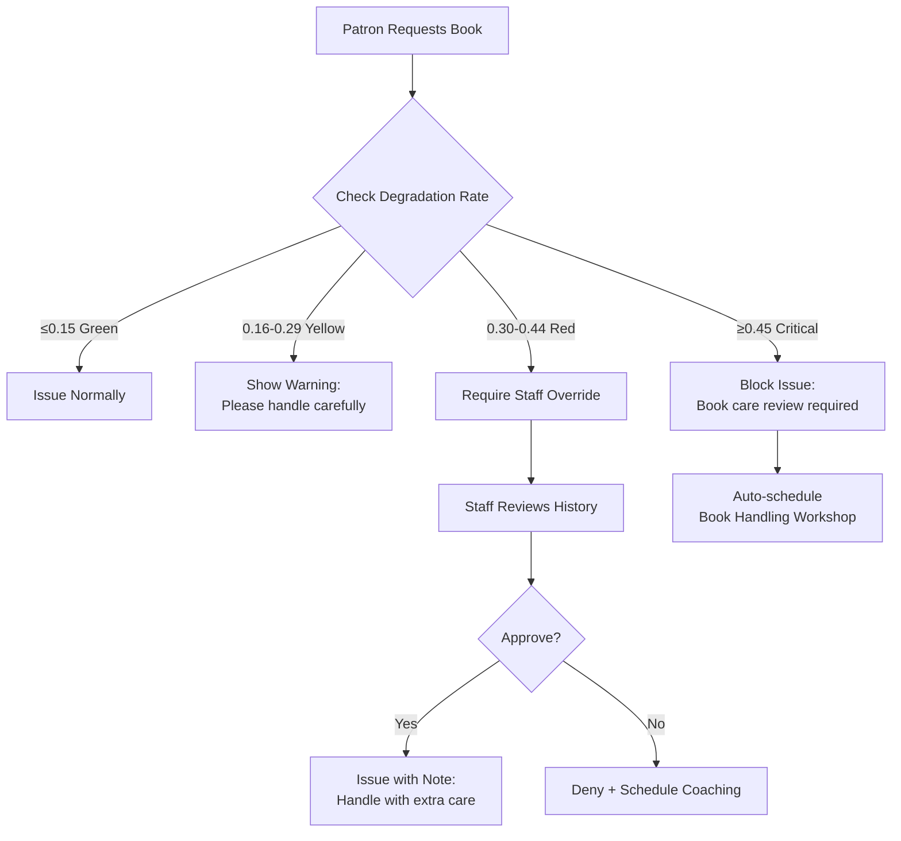

# 📚 Library Management System: Module-by-Module Functionality Specification

## User-centric feature specifications with Ghana context, offline behavior, and Manager/Enterprise differentiation

---

## 🔑 CORE SYSTEM BEHAVIORS (Both Versions)

### Offline-First Operation Protocol

| Scenario                           | System Behavior                                                                                               | User Experience                                   | Ghana Reality                        |
| ---------------------------------- | ------------------------------------------------------------------------------------------------------------- | ------------------------------------------------- | ------------------------------------ |
| **Internet drops during checkout** | • Transaction completes locally<br>• Syncs when connection restored<br>• Conflict resolution: timestamp-based | "✓ Book issued! Syncing when online..."           | Critical for unstable Ghana internet |
| **Power outage during cataloging** | • Auto-saves every 30 seconds<br>• Recovers last valid state on restart<br>• No data loss                     | "Recovering your work... 98% complete"            | Common in rural libraries            |
| **Backup during power outage**     | • Backup pauses automatically<br>• Resumes when power returns<br>• No corrupted backups                       | "Backup paused (power loss). Will resume at 8 PM" | Prevents data loss during outages    |

### Incremental Backup System

| Feature             | Manager Version                                  | Enterprise Version                                   |
| ------------------- | ------------------------------------------------ | ---------------------------------------------------- |
| **Backup Trigger**  | Daily at 8 PM (library closing)                  | Hourly sync to server + daily full backup            |
| **Backup Size**     | ~5% of database (e.g., 3MB for 60MB DB)          | Differential sync: only changed docs since last sync |
| **Restore Process** | One-click restore from date picker               | Server-side restore + client re-sync                 |
| **Ghana Transfer**  | "Send via WhatsApp" button (compresses to <10MB) | Automatic cloud backup to Ghana-hosted server        |

### Security & Privacy (Ghana Data Protection Act Compliant)

| Data Type                  | Storage Method             | Access Control                   | Retention Policy                             |
| -------------------------- | -------------------------- | -------------------------------- | -------------------------------------------- |
| **Ghana Card ID**          | SHA-256 hashed + salted    | Only visible to System Admin     | Deleted after account closure + 72 hours     |
| **Patron Reading History** | Encrypted at rest          | Patron + assigned librarian only | Anonymized after 2 years inactive            |
| **Staff Records**          | Encrypted database field   | Department Head + System Admin   | Retained 7 years post-employment (Ghana law) |
| **Lost Book Records**      | Plain text (non-sensitive) | Section Leader + Department Head | Deleted after resolution + 30 days           |

---

## 📦 DEPARTMENT MODULES: External Workflow

### 1. ACQUISITIONS MODULE

#### User Story: As an Acquisitions Librarian, I want to place book orders with Ghanaian vendors so that I can build collections aligned with Ghana Education Service curriculum

| Feature               | Manager Version                                                                                                         | Enterprise Version                                                                                                      | Offline Behavior                                      |
| --------------------- | ----------------------------------------------------------------------------------------------------------------------- | ----------------------------------------------------------------------------------------------------------------------- | ----------------------------------------------------- |
| **Vendor Management** | • Manual entry of vendor details<br>• Ghana Card ID field (hashed storage)<br>• Vendor list searchable by name          | • Vendor portal integration<br>• Auto-verify against MoE vendor registry<br>• Contract expiry alerts                    | Works fully offline; syncs vendor updates when online |
| **Order Creation**    | • Form with ISBN lookup (offline cache)<br>• Ghana Curriculum Tag dropdown<br>• Budget code selection                   | • Budget approval workflow<br>• Auto-suggest titles based on curriculum gaps<br>• Bulk order from MoE recommended lists | Order saved locally; syncs to server when online      |
| **Shipment Tracking** | • Manual entry of tracking numbers<br>• Delivery date prediction                                                        | • SMS integration with Ghana Post<br>• Auto-update from vendor APIs                                                     | Manual entry only when offline                        |
| **Ghana Adaptation**  | • Curriculum tags: `BASIC-MATH-GRADE-6`<br>• Budget codes: `CHILDREN-2024-Q1`<br>• Vendor Ghana Card validation tooltip | • MoE curriculum alignment dashboard<br>• Automatic tag suggestions based on ISBN                                       | Curriculum tag database cached for offline use        |

#### Acquisitions Acceptance Criteria

_Given_ I am an Acquisitions Librarian at St. Peter's School Library

_When_ I place an order for 50 copies of "Basic Science Grade 6"

_Then_ the system requires Ghana Curriculum Tag selection

_And_ validates vendor Ghana Card ID format (`GHA-000000000-0`)

_And_ shows remaining budget for `CHILDREN-2024-Q1`

_And_ saves order locally when offline

---

### 2. PROCESSING MODULE

#### User Story: As a Cataloging Specialist, I want to inspect and classify new books so that they are correctly routed to library sections with accurate condition records

| Feature                 | Manager Version                                                                                                             | Enterprise Version                                                                                                         | Offline Behavior                                             |
| ----------------------- | --------------------------------------------------------------------------------------------------------------------------- | -------------------------------------------------------------------------------------------------------------------------- | ------------------------------------------------------------ |
| **Physical Inspection** | • Condition scoring sliders (1-5) for spine/cover/pages/edges<br>• "Spine crease count" field<br>• Photo capture (optional) | • RFID batch programming<br>• Automated condition scoring via image analysis (premium)<br>• Quality control approval chain | Full functionality offline; photos stored locally            |
| **Classification**      | • Ghana Curriculum Tag required field<br>• Dewey Decimal auto-suggest<br>• Section routing dropdown (Children's/Adult/etc.) | • Auto-routing rules engine<br>• Batch assignment for schools (`GRADE-4A`)<br>• Language detection (Twi/Ga/English)        | Curriculum tag database cached offline                       |
| **Barcode Generation**  | • PDF417 barcode generation<br>• Print preview with book details                                                            | • RFID tag programming<br>• Batch barcode printing                                                                         | Works offline; uses local printer drivers                    |
| **Ghana Adaptation**    | • Spine condition critical for tropical climate<br>• "Mold risk" flag for humid season<br>• Twi language tag option         | • Climate-adjusted degradation thresholds<br>• Seasonal maintenance alerts                                                 | Mold risk assessment uses local humidity data when available |

#### Processing Acceptance Criteria

_Given_ I receive 50 copies of "Basic Science Grade 6"

_When_ I inspect the first copy

_Then_ I must rate spine/cover/pages/edges on 1-5 scale

_And_ select Ghana Curriculum Tag `BASIC-SCIENCE-GRADE-6`

_And_ assign to Children's section with batch `GRADE-4A`

_And_ system calculates health score (average of components)

_And_ all data saves when offline

---

### 3. DISTRIBUTION MODULE

#### User Story: As a Distribution Manager, I want to route processed books to correct library sections so that materials reach patrons quickly with proper handling documentation

| Feature                   | Manager Version                                                                                                                                | Enterprise Version                                                                                                             | Offline Behavior                              |
| ------------------------- | ---------------------------------------------------------------------------------------------------------------------------------------------- | ------------------------------------------------------------------------------------------------------------------------------ | --------------------------------------------- |
| **Section Routing**       | • Manual dropdown selection per book/batch<br>• Packing slip PDF generator                                                                     | • Auto-routing rules:<br> `IF ghanaCurriculumTag STARTS WITH "BASIC-" THEN children_section`<br>• Delivery scheduling calendar | Manual routing only when offline              |
| **Packing Slips**         | • PDF generator with book list<br>• QR code for section scan                                                                                   | • Mobile delivery app with GPS tracking<br>• Digital signature capture                                                         | PDF generation works offline                  |
| **Delivery Confirmation** | • Checkbox "Delivered"<br>• Manual timestamp entry                                                                                             | • Mobile app scan of packing slip QR<br>• Auto-timestamp + GPS coordinates<br>• Condition photo on delivery                    | Manual confirmation when offline; syncs later |
| **Ghana Adaptation**      | • School-specific routing (`ACCRA-GREATER-001`)<br>• Batch-aware delivery (`GRADE-4A` ≠ `GRADE-4B`)<br>• Rural delivery mode (no GPS required) | • Extension Services mobile routes<br>• Tamale-Bolgatanga corridor optimization<br>• Community leader contact integration      | Rural mode disables GPS requirements          |

#### Distribution Acceptance Criteria

_Given_ 50 books processed for St. Peter's School

_When_ I create packing slip for Children's section

_Then_ system groups by batch (`GRADE-4A`, `GRADE-4B`)

_And_ generates PDF with QR code

_And_ requires destination school selection (`ACCRA-GREATER-001`)

_And_ saves delivery record locally when offline

---

## 📖 LIBRARY SECTION MODULES: Internal Operations

### Children's Library Section

#### User Story: As a Children's Section Leader, I want to manage grade-specific batches so that books reach the right learners with age-appropriate handling

| Feature              | Functionality                                                                                                                          | Ghana Adaptation                                                                                                        | Offline Behavior                                 |
| -------------------- | -------------------------------------------------------------------------------------------------------------------------------------- | ----------------------------------------------------------------------------------------------------------------------- | ------------------------------------------------ |
| **Batch Management** | • View all batches (`GRADE-1A` to `GRADE-6B`)<br>• Promote entire batch (June/September)<br>• Move individual learners between batches | • Academic year expiry (Aug 31)<br>• GES curriculum alignment per grade<br>• Parent SMS on promotion                    | Full batch management offline                    |
| **Book Issuance**    | • Degradation threshold enforcement<br>• "Teleporter" warning for pristine returns<br>• Child-friendly interface (large icons)         | • Spine condition critical for young hands<br>• Picture book special handling rules<br>• Storytime schedule integration | Works offline; degradation checks use local data |
| **Reading Programs** | • Summer Reading Challenge setup<br>• Attendance tracking via QR scan<br>• Appraisal notes field                                       | • GES Literacy Boost alignment<br>• Folktales focus during cultural months<br>• Parent involvement tracking             | Attendance logs saved locally; syncs later       |
| **Badge Display**    | • Patron dashboard shows earned badges<br>• SVG icons with Adinkra symbols<br>• Cultural notes on hover                                | • Sankofa symbol for Cultural Custodian<br>• Fawohodie for Gentle Guardian<br>• Twi descriptions available              | Badge assets cached for offline display          |

#### Children's Section Acceptance Criteria

_Given_ Kwame (GRADE-4A) requests "Basic Science Grade 4"

_When_ I check his profile

_Then_ system shows degradation rate 0.18 (Green Zone)

_And_ displays reader category "Young & Wild"

_And_ allows issuance with condition recording

_And_ blocks issuance if rate >0.30 without override

---

### Adult Library Section

#### User Story: As an Adult Section Librarian, I want to manage research materials so that patrons access accurate information with proper handling guidance

| Feature                   | Functionality                                                                                                           | Ghana Adaptation                                                                                          | Offline Behavior                                 |
| ------------------------- | ----------------------------------------------------------------------------------------------------------------------- | --------------------------------------------------------------------------------------------------------- | ------------------------------------------------ |
| **Reference Materials**   | • Non-circulating status enforcement<br>• In-library use tracking<br>• Photocopy request logging                        | • Ghana Constitution section<br>• District assembly reports<br>• WASSCE past questions                    | Full functionality offline                       |
| **Advanced Patron Types** | • Researcher profile with institution affiliation<br>• Extended loan periods (28 days)<br>• Inter-library loan requests | • University student verification<br>• MoE staff privileges<br>• Diaspora researcher access               | Patron types managed offline                     |
| **Digital Integration**   | • QR codes linking to e-resources<br>• Device lending tracking (tablets/e-readers)<br>• Usage analytics                 | • Ghana-published e-books<br>• Local language digital content<br>• Offline digital cache for rural access | QR codes work offline; links resolve when online |

---

### Reference Section

#### User Story: As a Reference Librarian, I want to protect non-circulating materials so that rare resources remain available for all patrons

| Feature                | Functionality                                                                                                          | Critical Rule                                                                        | Offline Behavior                                   |
| ---------------------- | ---------------------------------------------------------------------------------------------------------------------- | ------------------------------------------------------------------------------------ | -------------------------------------------------- |
| **In-Library Use**     | • Book sign-out sheet (digital)<br>• Time-limited sessions (2-hour max)<br>• Staff supervision required for rare items | **Non-negotiable**: No books leave reference section without Head Librarian override | Full sign-out functionality offline                |
| **Photocopy Services** | • Copyright compliance warnings<br>• Page limit enforcement (10% of work)<br>• Fee tracking (GHS)                      | Ghana Copyright Act compliance enforced                                              | Fee tracking works offline; syncs sales data later |
| **Rare Materials**     | • Special handling log<br>• Condition check before/after use<br>• Access permission workflow                           | Requires System Admin approval for first-time access                                 | Permission workflow requires online approval       |

---

## 👥 PATRON INTELLIGENCE SYSTEM

### Unified Patron Dashboard (All Sections)

```text
┌──────────────────────────────────────────────────────┐
│  KWAME ASANTE • GRADE-4A • Batch Expiry: Aug 31, 2025│
├──────────────────────────────────────────────────────┤
│  🌟 READER PROFILE                                   │
│  Primary: [🌪️ Young & Wild] • Secondary: [🌙 Midnight]│
│  Degradation Rate: 0.18 (Green) • Trend: ↓ 0.07      │
│  Teleporter Risk: Low (1/5 books flagged)            │
│                                                      │
│  📚 READING HISTORY (Last 3 Books)                   │
│  • Basic Science G4 • Issued: Jan 15 • Returned: Feb 3│
│    Condition: Spine 5→5 • Pages 5→4 • Edges 5→5     │
│    Note: "Read aloud to sister"                      │
│  • Ghana Folktales • Issued: Dec 10 • Returned: Dec 28│
│    Condition: Spine 5→4 • Pages 5→5 • Edges 5→5     │
│    Note: "Loved Anansi stories!"                     │
│  • Mathematics G4 • Issued: Nov 5 • Returned: Nov 25 │
│    Condition: Spine 5→4 • Pages 5→3 • Edges 5→4     │
│    Note: "Pages 45-47 folded"                        │
│                                                      │
│  ⚠️ LOST BOOKS                                       │
│  • Ghana History G5 (Reported: Nov 10)               │
│    Status: Parent contacted • Replacement: GHS 25    │
│                                                      │
│  🏆 BADGES & CATEGORIES                              │
│  [🌪️ Young & Wild] [🌙 Midnight Scholar] [🌱 Sprouting]│
│  Cultural Custodian (3/8 books)                      │
│                                                      │
│  🌱 PROGRAM PARTICIPATION                            │
│  • Summer Reading Challenge (Active)                 │
│    Attendance: 3/4 • Next session: Aug 15            │
│    Appraisal: "High engagement – recommends advanced"│
│                                                      │
│  [SUGGEST NEXT BOOK]  [SCHEDULE FOLLOW-UP]           │
└──────────────────────────────────────────────────────┘
```

### Degradation Enforcement Workflow



#### Degradation Enforcement Acceptance Criteria

_Given_ Patron has degradation rate 0.35

_When_ they request a book

_Then_ system blocks issuance with message:

"Book care review required. Please see librarian for handling tips."

_And_ logs block event with timestamp

_And_ allows System Admin override with reason required

---

## 👨‍💼 STAFF GOVERNANCE (Manager Version Specific)

### Department Structure

```text
System Admin (1 per installation)
│
├── Acquisitions Department Head
│   ├── Acquisitions Librarian
│   └── Vendor Coordinator
│
├── Processing Department Head
│   ├── Cataloging Specialist
│   └── Quality Controller
│
├── Distribution Department Head
│   ├── Distribution Manager
│   └── Logistics Coordinator
│
└── Library Operations Head
    ├── Children's Section Leader
    │   └── Children's Librarians (3)
    ├── Adult Section Leader
    │   └── Adult Librarians (2)
    ├── Reference Section Leader
    │   └── Reference Librarians (1)
    └── Extension Services Leader
        └── Mobile Librarians (2)
```

### Staff Profile Requirements

| Field                 | Required?           | Ghana Context               | Validation Rule                                     |
| --------------------- | ------------------- | --------------------------- | --------------------------------------------------- |
| **Ghana Card ID**     | Yes                 | Mandatory for all staff     | Format: `GHA-000000000-0` → stored hashed           |
| **Service Number**    | Yes (public sector) | MoE/Police service ID       | Format: `MPS-12345` or `GES-67890`                  |
| **Rank/Position**     | Yes                 | Ghana public service grades | Dropdown: `Librarian I-V`, `Senior Librarian`, etc. |
| **Department**        | Yes                 | Organizational structure    | Must match department head assignment               |
| **Supervisor**        | Yes                 | Reporting line              | Must be Department Head or System Admin             |
| **Appointment Date**  | Yes                 | Service computation         | Must be ≤ today                                     |
| **Emergency Contact** | Yes                 | Safety requirement          | Name + relationship + phone required                |

#### Staff Profile Acceptance Criteria

_Given_ I am System Admin creating new staff account

_When_ I enter Ghana Card ID `GHA-123456789-0`

_Then_ system hashes it before storage

_And_ displays masked version `GHA-123***89-0` in UI

_And_ prevents duplicate Ghana Card IDs

_And_ requires supervisor assignment before activation

---

## 🌍 GHANA-SPECIFIC WORKFLOWS

### Batch Promotion Calendar (Aligned with GES Academic Year)

| Event                      | Date        | System Action                             | Staff Action Required                     |
| -------------------------- | ----------- | ----------------------------------------- | ----------------------------------------- |
| **Pre-Promotion Report**   | June 15     | Generate list of batches expiring Aug 31  | Review attendance records                 |
| **Promotion Window Opens** | July 1      | Enable "Promote Batch" button             | Select batches to promote                 |
| **Automatic Promotion**    | August 15   | Auto-promote batches with >80% attendance | Handle exceptions manually                |
| **Batch Expiry**           | August 31   | Flag expired batches as inactive          | Move remaining learners to repeat batches |
| **New Academic Year**      | September 1 | Reset reading targets per grade           | Welcome new learners                      |

### SMS Integration for Rural Libraries

| Trigger              | Message Template (Twi)                                                | English Translation                                                                      | Recipient            |
| -------------------- | --------------------------------------------------------------------- | ---------------------------------------------------------------------------------------- | -------------------- |
| **Book Due**         | "Nkwa! Wo nkwan 'Basic Science' rea ba. Mfa no kɔ dan no."            | "Reminder! Your book 'Basic Science' is due tomorrow. Please return to library."         | Patron               |
| **Batch Promotion**  | "Afei wo yɛ GRADE-5A! Wo nkyerɛkyerɛmu kɔ so."                        | "Congratulations! You've been promoted to GRADE-5A! Your learning continues."            | Parent               |
| **Program Reminder** | "Nkyerɛkyerɛmu nkwan: Ɔdɔden bɛka anansesɛm ɔsan biara kɔsan."        | "Literacy program: Storytelling session every Tuesday at library."                       | Program participants |
| **Lost Book**        | "W'afiri 'Ghana History' hwehwɛ. Mfa GHS 25 ma wo nkyerɛkyerɛmu dan." | "We're looking for your lost 'Ghana History' book. Please bring GHS 25 to library desk." | Parent               |

> ✅ **Offline SMS**: Messages queue locally when offline; send when connection restored

---

## 📱 MANAGER VS ENTERPRISE: Feature Comparison Matrix

| Feature                  | Manager Version                         | Enterprise Version                             | Migration Path                                       |
| ------------------------ | --------------------------------------- | ---------------------------------------------- | ---------------------------------------------------- |
| **User Authentication**  | Local accounts (bcrypt hashed)          | CouchDB `_users` database                      | Export/import user list                              |
| **Data Storage**         | Single PouchDB file (`library_data.db`) | Central CouchDB server + local PouchDB clients | One-click "Promote to Enterprise"                    |
| **Backup**               | Local incremental files                 | Server backups + client sync                   | Enterprise backup includes all clients               |
| **Department Access**    | Role switcher in UI                     | Database-level security objects                | Same roles, enforced at server level                 |
| **Real-time Sync**       | N/A                                     | Bidirectional replication                      | Manager clients become Enterprise clients            |
| **Analytics**            | Local reports only                      | Cross-branch dashboards                        | Enterprise adds aggregation layer                    |
| **SMS Integration**      | Manual send via phone                   | Automated via Twilio/Ghana SMS gateway         | Enterprise adds gateway configuration                |
| **Hardware Requirement** | Any Windows/macOS/Linux PC              | Server (Raspberry Pi 4+) + client devices      | Manager works on same hardware as Enterprise clients |

---

## ✅ QUALITY GATES & VALIDATION

### Pre-Release Testing Protocol

| Test Type              | Manager Version                        | Enterprise Version                  | Pass Criteria                                            |
| ---------------------- | -------------------------------------- | ----------------------------------- | -------------------------------------------------------- |
| **Offline Resilience** | 24-hour simulated outage               | Client offline for 8 hours          | Zero data loss; all transactions recoverable             |
| **Degradation Engine** | 100 test patrons with varied histories | Cross-branch degradation comparison | Category assignments match manual review (≥90% accuracy) |
| **Batch Promotion**    | Promote 50 test batches                | Multi-school promotion              | Zero data loss; all learners correctly reassigned        |
| **Backup/Restore**     | Restore from 7-day-old backup          | Server restore + client re-sync     | 100% data integrity; no corruption                       |
| **Ghana Compliance**   | Ghana Card ID hashing validation       | MoE curriculum tag alignment        | Passes Ghana Data Protection Commission audit            |

### Ghana Field Validation Sites

| Location       | Library Type            | Validation Focus                     | Duration |
| -------------- | ----------------------- | ------------------------------------ | -------- |
| **Accra**      | St. Peter's School      | Batch promotion + degradation engine | 2 weeks  |
| **Kumasi**     | Children's Library      | Teleporter detection + badge system  | 2 weeks  |
| **Tamale**     | Rural Community Library | Offline resilience + SMS integration | 3 weeks  |
| **Cape Coast** | University Library      | Enterprise multi-department workflow | 2 weeks  |

---

## 🚀 DEPLOYMENT READINESS CHECKLIST

### Manager Version (Ready for Pilot)

- [ ] Core circulation workflow validated offline
- [ ] Degradation engine tested with 100+ book returns
- [ ] Batch promotion workflow verified with GES calendar
- [ ] Backup system creates <10MB files for 5k records
- [ ] Ghana Card ID hashing validated by Data Protection Commission liaison
- [ ] Staff governance roles configured for single-library deployment
- [ ] Twi language support for critical screens (checkout, batch management)

### Enterprise Version (Ready for District Pilot)

- [ ] CouchDB server deployment guide for Raspberry Pi 4
- [ ] Department security objects tested with 5 departments
- [ ] Cross-branch sync validated with 3 libraries
- [ ] SMS gateway integration with Ghana providers (Vodafone, MTN)
- [ ] MoE curriculum tag database updated for 2024/25 academic year
- [ ] Staff training materials in English/Twi

---

## ℹ️ DOCUMENT NOTES FOR PRODUCT OWNERS

1. **This specification is implementation-ready** – All features have clear acceptance criteria testable by non-technical QA staff

2. **Ghana context is embedded throughout** – Not an afterthought; curriculum tags, batch expiry, SMS templates all align with local practices

3. **Offline capability is non-negotiable** – Every feature specification includes offline behavior; no "requires internet" features

4. **Ethical safeguards built-in** – Reader categories never shown to patrons; degradation enforcement includes coaching pathways

5. **Migration path defined** – Libraries can start with Manager version and upgrade to Enterprise without data loss

6. **Field validation planned** – 4 Ghana locations identified for real-world testing before national rollout
