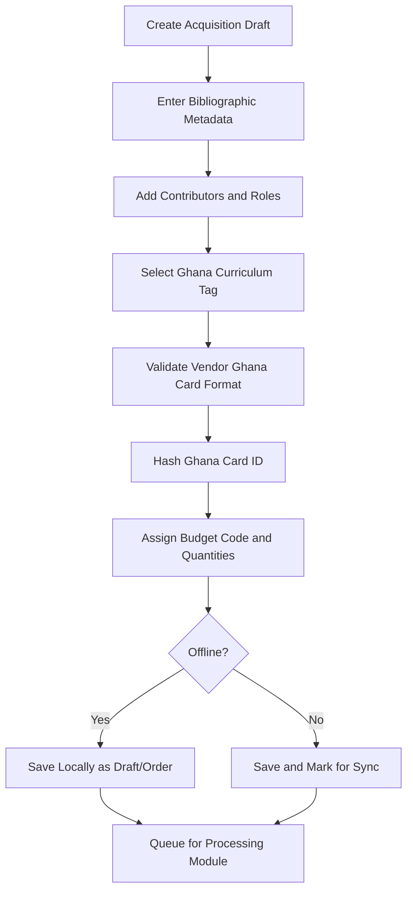
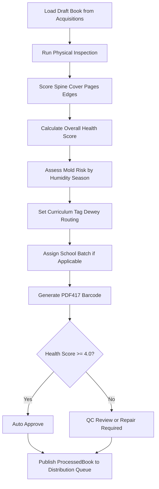
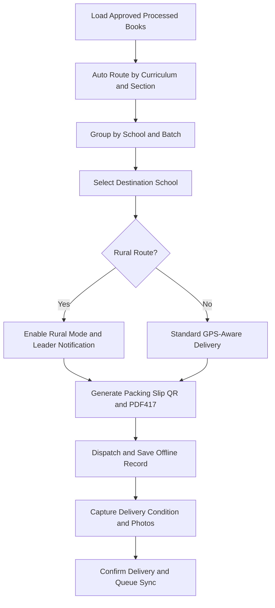
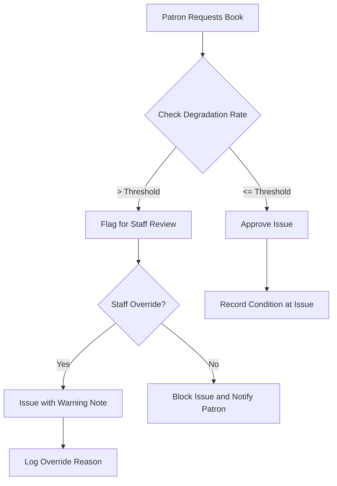
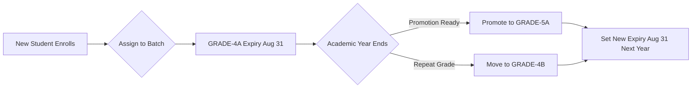

# Alpha Rabbit LMS - Development Prompt

You are building **Alpha Rabbit**, a Ghana-ready Library Management System with one codebase and two deployment modes:

1. **Manager (Standalone):** Fully offline desktop app for a single library.
2. **Enterprise (Multi-tier):** Desktop client with local PouchDB and sync to CouchDB for multi-department and multi-branch operations.

Prioritize offline reliability, incremental backups, role-based workflows, and simple UI for low-literacy staff.

## Mission

Deliver a dependable, offline-first platform that supports the full lifecycle of library operations:
**acquisitions → processing → distribution → section operations → patron outcomes**.

## Core Constraints

- Single codebase for both modes.
- Manager mode must work 100% offline.
- Enterprise mode must support resilient sync and role-based data isolation.
- Zero native modules; use pure JavaScript dependencies.
- Must run well on low-spec hardware and unstable power/internet conditions.
- Data durability, auditability, and backup safety are mandatory.

## Required Project Structure

```text
alpha_rabbit-LMS/
├─ app/
│  ├─ main/
│  │  ├─ bootstrap/
│  │  ├─ ipc/
│  │  │  ├─ shared/
│  │  │  ├─ manager/
│  │  │  └─ enterprise/
│  │  ├─ db/
│  │  │  ├─ shared/
│  │  │  ├─ manager/
│  │  │  └─ enterprise/
│  │  ├─ backup/
│  │  │  └─ manager/
│  │  ├─ sync/
│  │  │  └─ enterprise/
│  │  ├─ security/
│  │  ├─ config/
│  │  └─ utils/
│  └─ renderer/
│     ├─ app/
│     ├─ pages/
│     │  ├─ common/
│     │  ├─ manager/
│     │  └─ enterprise/
│     ├─ modules/
│     │  ├─ acquisitions/
│     │  ├─ processing/
│     │  ├─ distribution/
│     │  ├─ sections/
│     │  │  ├─ children/
│     │  │  ├─ adult/
│     │  │  ├─ reference/
│     │  │  ├─ lending/
│     │  │  ├─ extension/
│     │  │  └─ digital/
│     │  ├─ patrons/
│     │  ├─ inventory/
│     │  ├─ analytics/
│     │  ├─ reports/
│     │  └─ admin/
│     ├─ components/
│     │  ├─ common/
│     │  ├─ forms/
│     │  ├─ tables/
│     │  ├─ cards/
│     │  └─ icons/
│     ├─ stores/
│     ├─ hooks/
│     ├─ schemas/
│     ├─ styles/
│     ├─ assets/
│     └─ utils/
├─ packages/
│  ├─ shared-types/
│  ├─ shared-validation/
│  └─ shared-utils/
├─ configs/
│  ├─ manager/
│  └─ enterprise/
├─ scripts/
│  ├─ setup/
│  ├─ migrate/
│  ├─ backup/
│  ├─ sync/
│  └─ package/
├─ data/
│  ├─ manager/
│  └─ enterprise/
├─ docs/
│  ├─ prompt_main.md
│  └─ ressources/
├─ tests/
│  ├─ unit/
│  ├─ integration/
│  ├─ e2e/
│  └─ fixtures/
└─ README.md
```

## Feature Categories (Build Scope)

### 1) Platform Foundation

- Offline-first transaction model with local-first writes.
- Power-loss resilience: autosave + safe recovery.
- Incremental backups (Manager) and resumable backups.
- Enterprise replication with conflict handling and retry.
- Security controls: authentication, audit logs, role checks.
- Ghana Data Protection compliance (hashing, encryption, retention rules).

### 2) External Workflow Modules

#### Acquisitions Module

- Vendor management with Ghana Card validation (stored hashed).
- Order creation with ISBN lookup, curriculum tags, and budget codes.
- Shipment tracking and delivery status capture.
- Enterprise additions: approval workflows, vendor integrations, auto-suggestions.

#### Processing Module

- Physical inspection scoring (spine, cover, pages, edges).
- Cataloging/classification with Ghana curriculum tags + Dewey support.
- Barcode generation and print flow.
- Enterprise additions: RFID, QC chain, batch processing, language detection.

#### Distribution Module

- Section routing by section/school/batch.
- Packing slip generation with QR support.
- Delivery confirmation and condition-at-delivery capture.
- Enterprise additions: auto-routing rules, scheduling, mobile confirmation.

### 3) Internal Section Modules

#### Children Section

- Grade batch management and promotion workflows.
- Degradation-aware issuance controls with overrides.
- Reading program participation and badge display.

#### Adult Section

- Reference/research handling and advanced patron types.
- Extended loan policies and digital resource linkage.

#### Reference Section

- Non-circulating enforcement and in-library usage tracking.
- Photocopy workflow with policy limits.
- Rare-material access workflow.

#### Lending / Extension / Digital Sections

- Lending circulation and due/return management.
- Extension route and outreach operations.
- Digital content access, device lending, and usage tracking.

### 4) Patron Intelligence and Engagement

- Unified patron dashboard with reading history and risk indicators.
- Degradation engine with threshold zones:
  - Green: normal issue
  - Yellow: warning
  - Red: staff override
  - Critical: block + coaching path
- Lost book tracking and remediation status.
- Program enrollment, attendance, and appraisal notes.
- Automated badge engine (algorithmic, non-manual assignment).

### 5) Staff Governance and Access

- Department hierarchy with role-specific permissions.
- Staff profile requirements including Ghana Card ID hashing.
- Supervisor-linked activation and accountability controls.
- Manager: role switching in one installation.
- Enterprise: strict role enforcement via CouchDB security.

### 6) Ghana-Specific Adaptations

- Ghana curriculum tagging in core workflows.
- Batch lifecycle aligned to academic year (promotion and expiry windows).
- Local language support and culturally relevant badge semantics.
- Rural operation mode (reduced GPS dependency, offline emphasis).
- SMS queue behavior for offline-to-online delivery.

### 7) Analytics, Reporting, and Quality Gates

- Borrowing trends, collection health, and inactivity detection.
- Batch and section performance reporting.
- Backup/restore integrity verification.
- Offline resilience and degradation-engine validation checks.

## Detailed Feature Inventory (Additive)

### A) Core Resilience Features

- Offline transaction completion for checkout/return flows with deferred sync.
- Autosave every 30 seconds during cataloging and safe recovery after restart.
- Backup pause/resume behavior during power interruptions.
- One-click restore (Manager) and server restore plus client re-sync (Enterprise).

### B) External Department Feature Set

#### Acquisitions (Manager + Enterprise)

- Vendor records with Ghana Card format validation and hashed storage.
- Budget-aware ordering with curriculum tag enforcement.
- ISBN-assisted order entry and offline curriculum-tag cache.
- Shipment tracking with manual mode offline and integrated updates online.

#### Processing (Manager + Enterprise)

- Multi-component condition inspection: spine, cover, pages, edges (1-5).
- Health score calculation from condition components.
- Classification with Ghana curriculum tags and Dewey suggestion.
- Barcode generation (PDF417) and enterprise RFID-ready pathways.

#### Distribution (Manager + Enterprise)

- Section and school routing with batch-aware handling.
- Packing slip generation with QR code.
- Delivery confirmation workflow with offline-safe local recording.
- Enterprise auto-routing, route scheduling, and mobile confirmation support.

### C) Section Operations Feature Set

- Children section: batch promotion, degradation-gated issuance, reading programs, badge display.
- Adult section: research material handling, advanced patron types, digital-link workflows.
- Reference section: non-circulating enforcement, in-library-only controls, rare-material approvals.
- Lending/Extension/Digital sections: circulation, outreach logistics, digital lending and usage tracking.

### D) Patron Intelligence Feature Set

- Unified patron profile including reading history, degradation trends, and program participation.
- Degradation thresholds and enforcement:
  - Green (≤0.15): normal issue
  - Yellow (0.16-0.29): warning required
  - Red (0.30-0.44): staff override required
  - Critical (≥0.45): issue blocked pending coaching/review
- Lost-book tracking with status, replacement path, and staff notes.
- Automated badges awarded algorithmically (no manual assignment).

### E) Governance and Compliance Features

- Staff hierarchy with supervisor-linked accountability.
- Required staff profile controls: Ghana Card ID, service number, department, emergency contact.
- Role-based access boundaries per department/section.
- Ghana Data Protection controls: hashing, encryption at rest, and retention policy handling.

### F) Ghana Context Features

- Ghana Education Service curriculum tag alignment.
- Academic-year batch lifecycle (promotion, expiry, rollover).
- Rural-friendly operation modes (offline-first, reduced GPS dependency where applicable).
- SMS queue and delayed send behavior for low-connectivity environments.

## Mode-Specific Capability Boundaries

### Manager (Standalone)

- Fully offline operations.
- Local PouchDB database.
- Daily incremental + periodic full backups.
- Manual routing and simplified workflows where needed.

### Enterprise (Multi-tier)

- Local PouchDB + CouchDB sync.
- Department-level data restrictions.
- Auto-routing, approvals, and cross-branch analytics.
- Multi-client synchronization and server-backed restore.

## Technical Direction

- Desktop shell: Electron.
- UI: React + Vite + Tailwind.
- State/forms/validation: Zustand + React Hook Form + Zod.
- Data: PouchDB local, CouchDB for enterprise sync.
- IPC boundary between renderer and main process.
- Keep module implementation isolated, reusable, and testable.

## Output Rules for Future Implementation Tasks

- Implement features only inside the structure defined above.
- Prefer shared modules first; add mode-specific files only when behavior differs.
- Keep offline behavior explicit for every user-facing workflow.
- Treat data integrity and recovery as non-negotiable.

## Delivery Priority

1. Foundation (offline, data, auth, backup)
2. External modules (acquisitions, processing, distribution)
3. Internal sections (children, adult, reference, lending, extension, digital)
4. Patron intelligence (degradation, programs, badges, dashboard)
5. Enterprise sync and role hardening
6. Analytics and readiness validation

## Build and Packaging Procedure (Manager + Enterprise)

The project must produce **two installable packages** from the same codebase:

- **Manager Package:** offline-first single-library installer.
- **Enterprise Package:** multi-department installer with sync configuration.

### 1) Build Profiles

- Maintain mode-specific runtime configuration under:
  - `configs/manager/`
  - `configs/enterprise/`
- Resolve mode at build and startup using `APP_MODE` (`manager` or `enterprise`).

### 2) Mode-Aware Bootstrapping

- In main process bootstrap, load mode-specific services:
  - Manager: local DB + backup scheduler.
  - Enterprise: local DB + sync engine + server configuration workflow.
- In renderer, expose mode-specific pages/features while reusing shared modules.

### 3) Packaging Strategy

- Use separate Electron Builder targets/configurations per mode (or one config with two publishable flavors).
- Produce distinct installer outputs (example naming):
  - `AlphaRabbit-Manager-Setup.exe`
  - `AlphaRabbit-Enterprise-Setup.exe`

### 4) Package Scripts

- Define build scripts for each mode in `package.json`:
  - `build:manager`
  - `build:enterprise`
- Each script must set `APP_MODE` and invoke the corresponding packaging configuration.

### 5) Installation-Time Handling

- Keep mode data paths isolated:
  - Manager data root for standalone operations/backups.
  - Enterprise data root for local cache and sync state.
- Run first-launch setup by mode:
  - Manager: initialize local database and backup defaults.
  - Enterprise: run CouchDB connection wizard and sync validation.

### 6) Release and CI

- Build and sign both installers independently in CI.
- Publish artifacts as separate release assets with clear mode labels.
- Validate both packages with smoke tests before release:
  - Manager offline workflow test.
  - Enterprise sync/connectivity and role-access test.

## Workflow Expansion for Development (Acquisitions, Processing, Distribution)

Use the following implementation-level workflow instructions as the source of truth for module delivery.

### 1) Acquisitions Workflow (Week 1 Scope)

#### Acquisitions Purpose

- Capture complete bibliographic and vendor/order data with Ghana-compliant validation.
- Ensure every acquisition is development-ready for Processing without manual data reconstruction.

#### Acquisitions Data Contracts

- `BookMetadata` must include:
  - required: `title`, `contributors[]`, `publisher`, `publicationYear`, `ghanaCurriculumTag`, `createdAt`, `createdBy`, `status`
  - crucial Ghana fields: `ghanaCurriculumTag`, `localLanguage`, `culturalContext`, `ghanaAuthors`
- `AcquisitionOrder` must include:
  - `vendor`, `items[]`, `budget`, `workflow`, `status`, timestamps
- `Vendor` must store `ghanaCardId` in hashed form only.

#### Critical Validation Rules

- Ghana Card format validation before hashing: `GHA-000000000-0`.
- Reject save if required acquisition fields are missing.
- Enforce at least one contributor with valid role + name.
- Enforce Ghana Curriculum Tag as non-optional for all books.
- Validate publication year range (1800 to current year + 1).

#### Acquisitions Offline and Reliability Requirements

- Draft saves must succeed fully offline.
- Daily incremental backup at 8 PM and weekly full backup.
- Recovery expectation: no loss of saved draft/order data on restart.

#### Handoff to Processing

- Output artifact: acquisition draft/order with complete metadata.
- Processing must consume this artifact directly as input (`draftBook` style handoff).

#### Acquisitions Diagram



### 2) Processing Workflow (Week 2 Scope)

#### Processing Purpose

- Inspect physical condition, classify materials, assign routing/batch, and generate barcode labels.
- Produce an approved/rejected `ProcessedBook` record ready for Distribution.

#### Processing Data Contracts

- `ProcessedBook` extends acquisition metadata and must include:
  - `processingStatus`, `inspectionDate`, `inspectedBy`
  - `condition.spine|cover|pages|edges`, `spineCreases`, `moldRisk`, `overallHealthScore`
  - `deweyDecimal`, `sectionRouting`, optional `batchAssignment`
  - `barcode`, `barcodeType`, `qualityControl`, `climateAssessment`, `processingHistory[]`

#### Critical Processing Logic

- Health score = average of the four condition components.
- Mold risk assessment depends on humidity exposure + Ghana seasonal context.
- Barcode generation must follow Ghana-ready format (PDF417 path).
- Auto-approval path: `overallHealthScore >= 4.0`.
- Repair/withdrawal guidance path for low-condition items.

#### Processing Offline and Reliability Requirements

- Photo capture and condition data save locally when offline.
- Processing records must be recoverable and sync-safe.
- Processing history events must be appended for auditability.

#### Handoff to Distribution

- Output artifact: `ProcessedBook` with `sectionRouting`, `batchAssignment`, and `barcode`.
- Distribution consumes approved processed records only.

#### Processing Diagram



### 3) Distribution Workflow (Week 3 Scope)

#### Distribution Purpose

- Route approved books to sections/schools, generate packing slips, and confirm delivery with offline safety.
- Preserve batch-aware separation (example: `GRADE-4A` vs `GRADE-4B`).

#### Distribution Data Contracts

- `DistributionRecord` must include:
  - `processedBookIds`, `books[]`, `routing`, `logistics`, `ghanaContext`, `_syncStatus`
- `PackingSlip` must include:
  - school identity, batch groups, totals, QR, PDF417, dispatch metadata

#### Critical Distribution Logic

- Auto-group books by batch code before dispatch.
- Validate destination school before packing slip generation.
- Auto-detect rainy season and attach mold-risk handling notes.
- Rural mode must allow GPS-optional delivery and community-leader workflow.
- Record delivery condition + photos at confirmation step.

#### Distribution Offline and Reliability Requirements

- Packing slip generation must work offline and save locally.
- Dispatch and confirmation events must persist offline with sync status tracking.
- No dispatch should be finalized without a generated packing slip ID.

#### Distribution Diagram



### Cross-Module Workflow Contract (Must Not Break)

- Acquisitions output must be directly consumable by Processing.
- Processing output must be directly consumable by Distribution.
- `ghanaCurriculumTag`, `batchAssignment`, and `barcode` are mandatory continuity fields across module boundaries.
- All three modules must remain operational when offline, with eventual sync and audit-safe event history.

## Additional Development Guidance (Expanded Specs)

### 1) Patron Lifecycle Data Requirements

Implement a unified patron model that supports lifecycle intelligence and intervention workflows.

- Core patron fields:
  - `basicInfo`: identity, school, batch, grade, enrollment, expiry.
  - `readingMetrics`: yearly and lifetime usage, interaction score, degradation rate.
  - `bookHistory`: issue/return condition snapshots and degradation score per return.
  - `lostBooks`: unresolved/resolved state, replacement cost, staff follow-up notes.
  - `programParticipation`: attendance and appraisal records.
  - `badges`: awarded badge IDs, dates, and criteria trace.
- Privacy controls:
  - Ghana Card IDs hashed at rest.
  - Reading history access must be role-limited and auditable.

### 2) Degradation Engine Rules (Must Be Deterministic)

- Per-book degradation score:
  - Compute component losses for `spine`, `cover`, `pages`, `edges`.
  - Normalize each component by dividing loss by 4.
  - Final per-book score = average normalized loss across the four components.
- Patron degradation rate:
  - Rolling 12-month mean of per-book degradation scores.
  - Minimum sample threshold: 3 returned books before applying strict enforcement.
- Enforcement zones:
  - Green `<= 0.15`: normal borrowing.
  - Yellow `0.16 - 0.29`: warning banner + caution note.
  - Red `0.30 - 0.44`: staff override required; reason is mandatory.
  - Critical `>= 0.45`: block issuance and schedule coaching/review.

### 3) Programs Module Implementation Notes

- Program lifecycle must include:
  - definition (`title`, date range, target audience, max participants),
  - participant selection (rule-based + manual override),
  - attendance tracking (QR/manual),
  - appraisal capture.
- Appraisal object should store:
  - `attendanceRate`, `completionRate`, `engagementLevel`, `readingImprovement`,
  - `staffNotes`, `nextSteps`, `dateAppraised`, `appraisedBy`.
- Ghana alignment:
  - Include GES-aligned program templates (e.g., literacy challenge windows).
  - Support parent-facing communication cues for minors.

### 4) Automated Badge Engine Requirements

- Badge assignment must be algorithmic only (never manually awarded by staff).
- Implement configurable `badge-config` with:
  - badge ID, name, description, icon path, criteria, cultural note.
- Awarding process:
  - run scheduled evaluation job (daily),
  - evaluate criteria against patron history,
  - persist newly earned badges,
  - emit patron notification event.
- Keep award traceability for audits (`criteriaMet`, timestamp, run identifier).

### 5) Staff Governance and Role Hardening

- Staff model should include:
  - role, department, supervisor ID, service number, appointment date, active status,
  - Ghana Card hash, emergency contact, and login metadata.
- Role hierarchy baseline:
  - super admin,
  - department head,
  - section leader,
  - librarian,
  - assistant.
- Access behavior:
  - Manager mode can use role-switched UI contexts.
  - Enterprise mode must enforce role permissions server-side (CouchDB security objects).

### 6) Batch Promotion and Academic Calendar Automation

- Batch lifecycle must align with Ghana academic cycle (September-August).
- Expiry default for active school batches: August 31 of academic year end.
- Promotion workflow requirements:
  - pre-promotion report generation,
  - batch promotion action,
  - repeat path handling (`A` to `B` stream),
  - parent notification trigger.
- Preserve batch identity across modules and avoid cross-batch routing mistakes.

### 7) Development Acceptance Gates (Minimum)

Before moving a module to production readiness, verify:

- Functional gates:
  - required form fields and validation paths,
  - offline save and replay/sync behavior,
  - role access restrictions,
  - audit event creation for sensitive actions.
- Data gates:
  - schema conformance and migration compatibility,
  - no plaintext Ghana Card persistence,
  - continuity fields preserved across handoffs.
- Workflow gates:
  - Acquisitions -> Processing handoff succeeds,
  - Processing -> Distribution handoff succeeds,
  - failure and recovery paths are testable and deterministic.

### 8) Patron and Promotion Diagram References




