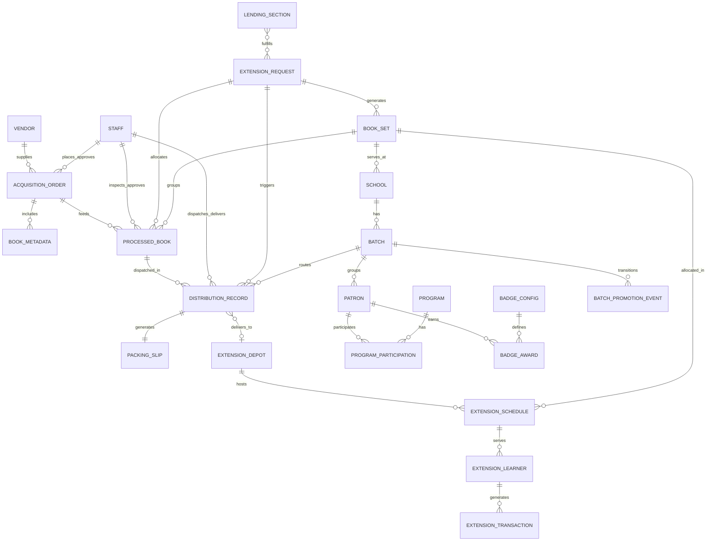

# Alpha Rabbit LMS Database Schema Guide

This document is the canonical schema reference for LLM-assisted database design.
It consolidates entities from acquisitions, processing, distribution, extension services, patron intelligence, governance, and cross-country African library workflows.

## File Context

**Purpose:** This file is the canonical data contract for the project. It tells agents which documents exist, which fields are required, how records relate to one another, and which operations must remain auditable across offline and synced modes.

**Why this matters:** Library operations in Africa often involve mixed public-library, school-library, mobile-library, and outreach-service workflows. This schema intentionally separates core library records from country-specific policy rules so the same platform can work in Ghana, Kenya, Uganda, or similar jurisdictions without forcing a single national model.

**How agents use it:** Agents should treat this as the source of truth before implementing forms, APIs, sync rules, or validation logic. If a new field is added, it must align with the shared envelope, ownership rules, and audit model described here.

## 1) Design Goals

- Support one codebase with two modes: Manager (offline standalone) and Enterprise (sync with CouchDB).
- Preserve offline-first durability and eventual sync.
- Support country-aware rules for national curriculum, school terms, local language labels, and identity document handling without hard-coding one nation.
- Keep auditability for sensitive operations (identity, overrides, approvals, deliveries, bulk allocation, and mobile outreach).
- Model shared African library realities: mobile services, school integration, rural access, repeated rotation cycles, and mixed public/private ownership structures.

## 2) Storage Model

- **Manager mode**: local PouchDB document stores.
- **Enterprise mode**: local PouchDB + CouchDB replication.
- Recommended per-domain databases/collections:
  - `books`
  - `vendors`
  - `orders`
  - `processing`
  - `distribution`
  - `extension`
  - `patrons`
  - `programs`
  - `staff`
  - `users`
  - `audit_logs`
  - `config`

## 3) Shared Document Envelope (All Entities)

Every document should include:

- `_id`: string (globally unique)
- `type`: string (entity discriminator)
- `createdAt`: ISO-8601 datetime
- `updatedAt`: ISO-8601 datetime
- `_syncStatus`: `pending | synced | failed` (for offline queue tracking)
- `_schemaVersion`: integer (for migrations)

## 4) Entity Catalog

| Entity                     | `type`                  | Module              | Manager | Enterprise                  |
| -------------------------- | ----------------------- | ------------------- | ------- | --------------------------- |
| UserAccount                | `user`                  | Security            | ✅      | ✅                          |
| Staff                      | `staff`                 | Governance          | ✅      | ✅                          |
| AuditLog                   | `audit_log`             | Security            | ✅      | ✅                          |
| Vendor                     | `vendor`                | Acquisitions        | ✅      | ✅                          |
| AcquisitionOrder           | `acquisition_order`     | Acquisitions        | ✅      | ✅                          |
| AcquisitionOrderItem       | embedded                | Acquisitions        | ✅      | ✅                          |
| BookMetadata (draft/final) | `book_metadata`         | Acquisitions        | ✅      | ✅                          |
| ProcessedBook              | `processed_book`        | Processing          | ✅      | ✅                          |
| ProcessingEvent            | embedded                | Processing          | ✅      | ✅                          |
| DistributionRecord         | `distribution_record`   | Distribution        | ✅      | ✅                          |
| PackingSlip                | `packing_slip`          | Distribution        | ✅      | ✅                          |
| Patron                     | `patron`                | Patron Intelligence | ✅      | ✅                          |
| LostBookCase               | embedded                | Patron Intelligence | ✅      | ✅                          |
| Program                    | `program`               | Programs            | ✅      | ✅                          |
| ProgramSession             | embedded                | Programs            | ✅      | ✅                          |
| ProgramParticipation       | embedded                | Programs            | ✅      | ✅                          |
| BadgeConfig                | `badge_config`          | Programs/Patrons    | ✅      | ✅                          |
| BadgeAward                 | embedded                | Patron Intelligence | ✅      | ✅                          |
| CountryProfile             | `country_profile`       | Jurisdiction Policy | ✅      | ✅                          |
| School                     | `school`                | Country Context     | ✅      | ✅                          |
| Batch                      | `batch`                 | Country Context     | ✅      | ✅                          |
| BatchPromotionEvent        | `batch_promotion_event` | Country Context     | ✅      | ✅                          |
| ExtensionRequest           | `extension_request`     | Extension Services  | ✅      | ✅                          |
| ExtensionLearner           | `extension_learner`     | Extension Services  | ✅      | ✅                          |
| ExtensionTransaction       | `extension_transaction` | Extension Services  | ✅      | ✅                          |
| ExtensionSchedule          | `extension_schedule`    | Extension Services  | ✅      | ✅                          |
| BookSet                    | `book_set`              | Extension Services  | ✅      | ✅                          |
| BackupManifest             | `backup_manifest`       | Platform            | ✅      | ⚠️ (server-side equivalent) |

## 5) Core Schemas

## 5.1 UserAccount (`user`)

- `username`: string, unique
- `passwordHash`: string
- `role`: `admin | librarian | hod | staff | assistant | branch_manager | intern | overseer`
- `department`: optional string
- `isActive`: boolean
- `lastLoginAt`: optional datetime

## 5.2 Staff (`staff`)

- `serviceNumber`: string, unique
- `role`: `super_admin | department_head | section_leader | librarian | assistant | intern | overseer`
- `department`: `extension | processing | distribution | lending | library_services | acquisitions | tech_support`
- `supervisorId`: optional string (`staff._id`)
- `personalInfo`:
  - `nationalIdHash`: string (**never plaintext**)
  - `firstName`, `lastName`, `rank`, `dateOfAppointment`
- `contactInfo`:
  - `email`, `phone`
  - `emergencyContact { name, relationship, phone }`
- `isActive`: boolean

## 5.3 AuditLog (`audit_log`)

- `actorId`: string (`user` or `staff`)
- `action`: string (`login`, `create_order`, `override_degradation`, etc.)
- `entityType`: string
- `entityId`: string
- `before`: optional object snapshot
- `after`: optional object snapshot
- `reason`: optional string (mandatory for overrides)
- `timestamp`: datetime

## 5.4 Vendor (`vendor`)

- `name`: string (company/organization legal name)
- `companyType`: `sole_proprietorship | partnership | limited_liability | nonprofit | government | institution`
- `businessRegistration`: string (national business registration or company registration number — required)
- `taxId`: string (tax or revenue registration number, if applicable)
- `vatNumber`: optional string
- `contactPerson`, `phone`, `email`, `address`
- `city`, `region`, `country`
- `specialties`: string[] (e.g., `["children's books", "reference", "local_language", "school_textbooks"]`)
- `website`: optional string
- `social`: string[] (e.g., `["facebook", "x", "instagram", "linkedin", "whatsapp"]`)
- `bankDetails`:
  - `bankName`: string
  - `branch`: string
  - `accountNumber`: string
  - `accountName`: string
- `contractStartDate`, `contractExpiryDate`
- `status`: `active | inactive | suspended`

## 5.5 AcquisitionOrder (`acquisition_order`)

- `status`: `draft | placed | received | cancelled | partially_received`
- `placedAt`, `expectedDeliveryDate`, `receivedAt`
- `vendor`: reference + denormalized display fields
- `budget`:
  - `code`
  - `allocatedAmount`, `spentAmount`, `remainingAmount`
- `items`: `AcquisitionOrderItem[]`
- `workflow`: `placedBy`, `approvedBy`, `receivedBy`, timestamps

### AcquisitionOrderItem (embedded)

- `bookMetadataId` or embedded `bookMetadata`
- `quantity`, `unitPrice`, `currency`, `subtotal`
- `expectedDeliveryDate`, `receivedQuantity`, `conditionOnReceipt`

## 5.6 BookMetadata (`book_metadata`)

- `title`: required string
- `subtitle`, `uniformTitle`, `titleStatement`
- `contributors[]`: `{ id, role, fullName, affiliation, orcid }`
- `isbn`, `isbn10`, `lccn`, `oclc`, `localId`
- `publisher`, `publicationPlace`, `publicationYear`, `editionStatement`
- `extent`, `illustrations`, `dimensions`, `binding`
- `language`, `subjects[]`, `summary`, `contents[]`, `notes[]`, classification
- Country-aware metadata:
  - `countryProfileId`: string (links to the selected national or institutional profile)
  - `curriculumTag` (required when a local curriculum is enforced)
  - `curriculumSystem`: `national | regional | institutional | custom | none`
  - `localLanguage`
  - `culturalContext`
  - `schoolLevel` / `gradeBand` (when used for school libraries)
- `status`: `draft | cataloged | withdrawn`

> Country examples such as `kenya | ghana | uganda` are valid values only when the selected `country_profile` declares them. The authoritative rule is the active country profile, not a hard-coded table.

## 5.7 ProcessedBook (`processed_book`)

- `acquisitionOrderId`: string
- `processingStatus`: `pending_inspection | inspected | approved | rejected | withdrawn`
- `inspectionDate`, `inspectedBy`
- `condition`:
  - `spine`, `cover -(front, back)`, `pages`, `fore edge`, `head`,`tail` (1–5)
  - `spineCreases` (0–5)
  - `moldRisk`: `none | low | medium | high | critical`
  - `overallHealthScore` (0.0–5.0)
- `classification`:
  - `countryProfileId`: string
  - `curriculumTag` (required when a local curriculum is enforced)
  - `curriculumSystem`: `national | regional | institutional | custom | none`
  - `deweyDecimal`
  - `sectionRouting`: `children | adult | reference | lending | digital` (note: `extension` removed — Extension Services borrows from Lending)
  - `batchAssignment { schoolId, batchCode, expiryDate }`
- `barcode`, `barcodeType`, optional `rfidTag`
- `qualityControl`: `approved`, approver fields, notes, repair flags
- `climateAssessment`: humidity exposure + storage recommendation
- `extensionLoanHistory[]` (optional — array of all extension allocations; present when book has been loaned to Extension Services):
  - `rotationCycle`: `CYCLE-1 | CYCLE-2 | CYCLE-3 | CYCLE-4`
  - `schoolId`: string
  - `schoolName`: string
  - `allocatedDate`: ISO date
  - `dueDate`: string (derived from the selected country policy / academic calendar)
  - `allocatedBy`: string (Lending staff ID)
  - `status`: `allocated | returned | overdue`
  - `returnDate`: optional string
  - `conditionAtAllocation`: number (0.0–5.0 — overall health score at time of allocation)
  - `conditionAtReturn`: optional number (0.0–5.0 — overall health score at time of return)
  - `notes`: optional string
- `processingHistory[]`

## 5.8 DistributionRecord (`distribution_record`)

- `status`: `draft | dispatched | delivered | partially_delivered | failed`
- `processedBookIds[]`
- `books[]`: denormalized dispatch snapshot (title, tag, barcode, condition)
- `routing`:
  - `source`
  - `destination`: `children_section | adult_section | reference_section | lending_section | extension_services | digital_section`
  - `destinationDetails`: one of:
    - `{ type: 'library_section', section: string }`
    - `{ type: 'extension_services', depotLocation: string, communityLeader?: { name, phone } }` (community leader required for rural depots)
  - `destinationSchool { id, name, address, contactPerson, contactPhone }` (for non-extension routes)
  - `batchGrouping[] { batchCode, bookIds[], learnerCount }`
  - `requiresSpecialHandling`, `specialHandlingNotes`
- `logistics`:
  - `packingSlipId`, `packingSlipPdfPath`
  - `dispatchedAt`, `expectedDeliveryDate`, `actualDeliveryDate`
  - `dispatchedBy`, `deliveredBy`
  - `deliveryMethod`
  - `deliveryDestination`:
    - `type`: `library_section | extension_depot`
    - `name`: string (e.g., "Tamale Regional Extension Depot")
  - `ruralMode`, optional `gpsCoordinates`
  - `conditionOnDelivery`, `deliveryPhotos[]`
- `countryContext`:
  - `academicYear`
  - `rainySeasonAlert`
  - `communityLeaderNotified`, leader contact
  - `corridorSafetyProtocol`: optional `none | regional_road_network | rural_route | mobile_outreach`
  - `safetyProtocolStatus`: optional `pending | completed | waived`

## 5.9 PackingSlip (`packing_slip`)

- `distributionRecordId`
- `generationDate`
- `school { id, name, address }`
- `batches[] { batchCode, bookCount, curriculumTags[] }`
- `totalBooks`
- `qrCode` (payload or base64)
- `pdf417Barcode`
- `dispatchedBy`
- `notes`

## 5.10 Patron (`patron`)

- `patronType`: `CHILD | STUDENT | GENERAL | RESEARCHER`
- `basicInfo`:
  - `nationalIdHash` (or guardian-linked for minors)
  - names, DOB, school/batch/grade, enrollment/expiry
- `readingMetrics`:
  - `lifetimeBooksRead`, `currentYearBooks`, `avgBooksPerMonth`
  - `interactionScore`
  - `degradationRate`, `degradationThreshold`
  - `borrowingStatus`
- `bookHistory[]`:
  - issue/return dates
  - condition at issue and return
  - `degradationScore`
- `lostBooks[]`
- `programParticipation[]`
- `badges[]`

## 5.11 Program (`program`)

- `title`, `description`, `targetAudience`, `maxParticipants`
- `startDate`, `endDate`
- `selectionRules` (query-based targeting)
- `sessions[]` with attendance settings
- `status`: `draft | active | completed | archived`

### ProgramParticipation (embedded in `patron` or `program`)

- `programId`, `patronId`, `status`
- `attendance[]` (boolean or date-status tuples)
- `appraisal { metrics, staffNotes, nextSteps, dateAppraised, appraisedBy }`

## 5.12 BadgeConfig (`badge_config`)

- `badges[]`:
  - `id`, `name`, `description`, `icon`
  - `criteria` object
  - optional `ghanaCulturalNote`
- `awardSchedule` (daily)
- `displayRules`

## 5.13 School (`school`)

- `schoolId`, `name`, `region`, `district`
- `address`, `contactPerson`, `contactPhone`
- `isRural`: boolean
- `supportedBatches[]`

## 5.14 Batch (`batch`)

- `schoolId`
- `batchCode` (e.g., `GRADE-4A`)
- `gradeLevel`
- `academicYear` (e.g., `2024-2025`)
- `countryProfileId`: string (links to selected policy)
- `expiryDate`: ISO date derived from the active country policy or custom profile
- `status`: `active | promoted | expired`
- `termRules`: optional object containing the active `termName`, `startDate`, `endDate`, `promotionDate`, and `expiryOverride`

## 5.15 CountryProfile (`country_profile`)

- `countryCode`: string (e.g., `GH`, `KE`, `UG`, `TZ`)
- `countryName`: string
- `isCustom`: boolean
- `curriculumSystem`: `national | regional | institutional | custom`
- `curriculumProfile`: {
  - `profileId`: string
  - `name`: string
  - `version`: string
  - `gradeBands[]`: { `gradeLevel`, `label`, `termStructure[]`, `promotionWindow` }
  - `subjects[]`: string[]
  - `languageCodes[]`: string[]
  - `requiredTags[]`: string[]
    }
- `academicRules`: {
  - `schoolTerms[]`: { `name`, `startDate`, `endDate`, `promotionDate?`, `expiryDate?` }
  - `defaultPromotionWindow`: optional string
  - `defaultExpiryDate`: optional ISO date
  - `customCalendarEnabled`: boolean
    }
- `identityRules`: {
  - `nationalIdRequired`: boolean
  - `idFormat`: string (e.g., `GHA-000000000-0` or `KE-#######`)
  - `hashingStrategy`: string
    }
- `localLabels`: {
  - `language`: string
  - `sectionLabels`: object
  - `statusLabels`: object
    }
- `status`: `active | draft | archived`
- `createdAt`, `updatedAt`

This record allows the platform to save a selected national policy and reuse it for all curriculum tagging, term expiry logic, and batch promotion. A custom profile can also be created when the institution requires local rules not covered by the preloaded country template.

## 5.16 BatchPromotionEvent (`batch_promotion_event`)

- `fromBatchCode`, `toBatchCode`
- `schoolId`
- `countryProfileId`: string
- `promotionDate`
- `promotedCount`, `repeatCount`
- `initiatedBy`
- `notificationStatus`

## 5.17 ExtensionRequest (`extension_request`)

- `_id`: string (e.g., `ext-req-BOLGATANGA-2024-CYCLE-2-001`)
- `status`: `pending | fulfilled | rejected | cancelled`
- `requestedBy`: string (Extension staff ID)
- `schoolId`: string (e.g., `BOLGATANGA-UE-001`)
- `rotationCycle`: `CYCLE-1 | CYCLE-2 | CYCLE-3 | CYCLE-4`
- `cycleEndDate`: string (derived from the active country policy and academic year)
- `subjectAreas`: string[]
- `totalBooksRequested`: number
- `bookRequirements`: `{ curriculumTags: string[], conditionMinimum: 1-5 }`
- `fulfilledBy`: optional string (Lending Section staff ID)
- `booksAllocated`: string[] (`processed_book._id` array)
- `bookSetIds`: string[] (`book_set._id` arrays — sets generated from this request)
- `packingSlipId`: optional string (links to `DistributionRecord`)

- `countryContext`: {
  - `countryCode`: string
  - `countryProfileId`: string
  - `academicYear`: string
  - `termName`: string
  - `deliveryRegion`: string
    }
- `communityDelivery`: {
  - `communityLeaderName`: optional string
  - `communityLeaderPhone`: optional string
  - `deliveryPoint`: optional string
  - `routeType`: `mobile_van | community_leader | designated_room`
    }

## 5.18 ExtensionLearner (`extension_learner`)

- `_id`: string (e.g., `ext-learner-BOLGATANGA-UE-001-042`)
- `qrCodeId`: string (e.g., `EXT-QR-BOL-00042` — **only** data encoded in QR)
- `qrCodeImageUrl`: optional string (Base64 PNG for laminated card)
- `personalInfo`:
  - `firstName`, `lastName`
  - `schoolId`: string
  - `level`: string (e.g., `GRADE-4`)
  - `expiryDate`: string (derived from the selected academic policy profile)
- `currentBooks[]`: `{ bookBarcode, checkoutDate }`
- `borrowingHistory[]`: `{ bookBarcode, checkoutDate, returnDate }`
- `extensionServiceTag`: `true` (always true)
- `serviceLocationType`: `mobile_van | designated_room`

## 5.19 ExtensionTransaction (`extension_transaction`)

- `_id`: string (e.g., `ext-trans-20240228-BOL-001`)
- `learnerQrCodeId`: string (e.g., `EXT-QR-BOL-00042`)
- `learnerSchoolId`: string
- `bookBarcode`: string
- `transactionType`: `checkout | return`
- `transactionDate`: ISO datetime
- `serviceDate`: ISO date
- `serviceLocation`: string (e.g., `Bolgatanga Mobile Van Route 3`)
- `serviceLocationType`: `mobile_van | designated_room`
- `staffId`: string
- Note: condition scores are **explicitly excluded** (per traffic/bandwidth constraint)

## 5.20 ExtensionSchedule (`extension_schedule`)

- `_id`: string (e.g., `ext-schedule-BOLGATANGA-UE-001-2024-03-15`)
- `schoolId`: string
- `serviceLocationType`: `mobile_van | designated_room`
- `scheduledDate`: string
- `assignedStaff[]`: `{ staffId, role: 'mobile_librarian' }`
- `bookSetsAllocated[]`: `{ setId, rotationCycle, bookCount }`
- `status`: `planned | cancelled`

## 5.21 BookSet (`book_set`)

- `setName`: string (e.g., "Bolgatanga Rural Kit A")
- `countryProfileId`: string
- `rotationCycle`: `CYCLE-1 | CYCLE-2 | CYCLE-3 | CYCLE-4`
- `academicYear`: string (e.g., `2024-2025`)
- `expectedBooks[]`:
  - `processedBookId`: string (links to `processed_book._id`)
  - `barcode`: string
  - `title`: string (denormalized display)
  - `ghanaCurriculumTag`: string
  - `conditionAtAllocation`: number (0.0–5.0)
- `cycleHistory[]`:
  - `rotationCycle`: `CYCLE-1 | CYCLE-2 | CYCLE-3 | CYCLE-4`
  - `schoolId`: string
  - `schoolName`: string
  - `allocatedDate`: ISO date
  - `dueDate`: ISO date
  - `returnedDate`: optional ISO date
  - `booksPresent[]`: string[] (`processedBookId` values returned)
  - `booksMissing[]`: string[] (`processedBookId` values not returned)
  - `missingCondition[]`:
    - `processedBookId`: string
    - `conditionAtAllocation`: number
    - `conditionAtReturn`: number
    - `degradationDelta`: number
  - `status`: `allocated | returned | partial_return`
- `currentStatus`: `in_circulation | in_transit | in_storage | archived`
- `totalCyclesCompleted`: number

## 6) Relationships (Conceptual)

## 7) Critical Validation and Constraints

- A country-specific national ID or equivalent identifier must pass the configured format validation before hashing; examples such as `GHA-000000000-0` or `KE-#######` are valid only when the active `country_profile` declares them.
- No plaintext national ID may be stored in any entity.
- `curriculumTag` is required in Acquisitions and Processing records when local curriculum rules are active.
- Distribution dispatch requires a valid destination and generated packing slip ID.
- Degradation override requires `reason` and audit log entry.
- Batch-aware routing must preserve distinctions (example: `GRADE-4A` != `GRADE-4B`).
- **Country Policy Enforcement**: every school, batch, extension request, and book set should link to a valid `country_profile`, or an explicit custom profile override.
- **Academic Rules are not hard-coded**: term duration, promotion date, expiry date, and curriculum profile must come from the selected country profile or institutional override.
- **Extension Loan History Integrity**: `processed_book.extensionLoanHistory` requires `sectionRouting = 'lending'`.
- **Single Active Loan**: `extensionLoanHistory` must contain at most one entry with `status: 'allocated'` at any time.
- **Condition Continuity**: `conditionAtReturn` of cycle N should equal `conditionAtAllocation` of cycle N+1 (or be explained by intervening processing events).
- **Depot Delivery Validation**: `distribution_record.routing.destination = 'extension_services'` requires `deliveryDestination.type = 'extension_depot'`.
- **Academic Calendar Enforcement**: each `extensionLoanHistory[].dueDate` must fall within the configured academic-year calendar for the active `country_profile`.
- **Rural Depot Safety**: depots in rural or remote service corridors require a `communityLeader` entry in `destinationDetails` when local delivery policy mandates it.
- **No Condition Scores in Extension Transactions**: `extension_transaction` explicitly excludes condition fields (per traffic constraint).
- **QR Privacy**: `extension_learner.qrCodeId` contains ONLY the ID (no personal data).
- **Set Integrity**: `book_set.expectedBooks` must contain unique `processedBookId` values.
- **Missing Book Flag**: Any `booksMissing[]` entry must be resolved before the set can be archived.
- **Cycle Continuity**: `cycleHistory[n].returnedDate` must precede `cycleHistory[n+1].allocatedDate`.
- **Condition Delta**: `degradationDelta` = `conditionAtReturn` - `conditionAtAllocation` (negative = degradation).

## 8) Recommended Indexes

- `books`: `type`, `curriculumTag`, `status`, `sectionRouting`, `updatedAt`
- `orders`: `type`, `status`, `placedAt`, `vendor.id`, `budget.code`
- `vendors`: `type`, `status`, `name`, `region`
- `processing`: `type`, `processingStatus`, `qualityControl.approved`, `inspectionDate`, `extensionLoan.status`, `extensionLoan.dueDate`
- `distribution`: `type`, `status`, `routing.destination`, `logistics.deliveryDestination.name`, `logistics.dispatchedAt`
- `extension`: `type`, `status`, `schoolId`, `rotationCycle`, `qrCodeId`, `learnerQrCodeId`, `serviceDate`, `_syncStatus`
- `book_sets`: `type`, `rotationCycle`, `academicYear`, `currentStatus`, `schoolId`
- `patrons`: `type`, `patronType`, `basicInfo.schoolId`, `basicInfo.batchCode`, `readingMetrics.degradationRate`
- `staff`: `type`, `role`, `department`, `isActive`
- `audit_logs`: `type`, `actorId`, `action`, `timestamp`

## 9) Sync and Conflict Strategy

- Add `updatedAt` to all writes for deterministic merge support.
- Default conflict policy: last-write-wins by timestamp for non-sensitive fields.
- Sensitive conflicts (identity, approvals, overrides, delivery confirmation) require manual resolution queue.
- **Extension Services Android sync**: `extension_transaction` and `extension_learner` records sync from the Android app via `_syncStatus` field. Conflicts resolved by `transactionDate` timestamp (latest wins).

## 10) LLM Output Expectations (When Generating DB Artifacts)

When using this guide, the LLM should:

- Generate schema/types first, then validators, then indexes, then migration files.
- Keep Manager and Enterprise schemas identical where possible; isolate only operational differences.
- Include seed config for `badge_config`, curriculum tags, schools, and batch templates.
- Produce test fixtures for each core entity and one end-to-end lifecycle:
  - acquisition -> processing -> distribution -> patron outcome.
