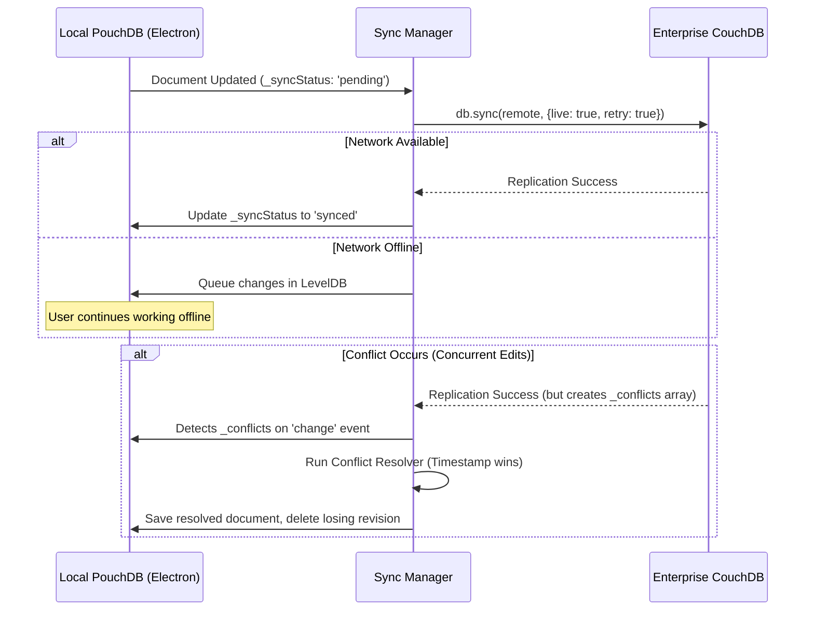

This is the "missing manual" for building enterprise-grade, offline-first applications with PouchDB and CouchDB. Most tutorials treat PouchDB as a simple local cache, but for a mission-critical system like the **Ghana Library Management System (LMS)**, you must treat it as a **distributed synchronization engine**.

Here is your comprehensive technical implementation guide, structured for a senior engineering workflow.

---

## 1. The Ecosystem & Toolchain

CouchDB/PouchDB relies on a specific set of tools to bridge the gap between a schema-less document store and a strongly-typed TypeScript application.

| Library                  | Purpose              | Why we use it                                                                       |
| :----------------------- | :------------------- | :---------------------------------------------------------------------------------- |
| `pouchdb`                | Core database engine | Runs in Node (Electron Main) or Browser. Uses LevelDB by default in Node.           |
| `pouchdb-find`           | Mango Queries        | Enables MongoDB-like queries and **indexing** (critical for performance).           |
| `zod`                    | Schema Validation    | Enforces strict typing at runtime before data hits the disk or network.             |
| `nanoid`                 | ID Generation        | Creates URL-safe, collision-resistant IDs (better than UUIDv4 for CouchDB B-trees). |
| `pouchdb-adapter-memory` | Testing/Mocking      | Useful for unit testing without touching the disk.                                  |

---

## 2. Provisioning, Data Modeling & Strong Typing

CouchDB is schema-less at the database level. If you aren't careful, your database will become a swamp of malformed documents. We enforce schemas at **three layers**: TypeScript (Compile time), Zod (Runtime App), and CouchDB VDU (Runtime Server).

### 2.1 The Base Document Contract

Every document in your LMS must inherit from this base interface to support sync tracking and versioning.

```typescript
// types/database.ts
export type SyncStatus = "synced" | "pending" | "conflict" | "error";

export interface BaseDoc {
  _id: string;
  _rev?: string; // Managed by CouchDB/PouchDB
  type: string; // Discriminator for Mango queries (e.g., 'book', 'patron')
  createdAt: number; // Unix timestamp
  updatedAt: number; // Unix timestamp
  _syncStatus: SyncStatus;
  _schemaVersion: number; // For future migrations
  _conflicts?: string[]; // Populated by PouchDB when conflicts occur
}
```

### 2.2 Domain Models & Zod Schemas

We use Zod to validate data before saving. This prevents corrupted offline data from ever entering the sync pipeline.

```typescript
import { z } from "zod";
import { nanoid } from "nanoid";

// Zod Schema for a Book
export const BookSchema = z.object({
  _id: z.string().default(() => `book_${nanoid()}`),
  type: z.literal("book"),
  title: z.string().min(1),
  isbn: z.string().optional(),
  department: z.enum(["science", "arts", "children", "admin"]),
  condition: z.enum(["new", "good", "fair", "poor", "mold_risk"]),
  ghanaCardHash: z.string().optional(), // Hashed borrower ID (never plaintext)
  createdAt: z.number().default(() => Date.now()),
  updatedAt: z.number().default(() => Date.now()),
  _syncStatus: z
    .enum(["synced", "pending", "conflict", "error"])
    .default("pending"),
  _schemaVersion: z.number().default(1),
});

export type BookDoc = z.infer<typeof BookSchema> & {
  _rev?: string;
  _conflicts?: string[];
};
```

### 2.3 Database Provisioning (Electron Main Process)

Initialize PouchDB in the Electron Main process to ensure data persistence and security.

```typescript
// services/DatabaseProvider.ts
import PouchDB from "pouchdb";
import PouchDBFind from "pouchdb-find";

PouchDB.plugin(PouchDBFind);

export class DatabaseProvider {
  private db: PouchDB.Database;

  constructor(dbName: string) {
    // In Electron Node environment, PouchDB defaults to LevelDB (fast, reliable)
    this.db = new PouchDB(dbName, {
      auto_compaction: true, // Keeps DB size small on 4GB RAM devices
      revs_limit: 10, // Limits revision tree depth to save memory
    });
    this.initializeIndexes();
  }

  private async initializeIndexes() {
    // CRITICAL: Without indexes, Mango queries will do full table scans and crash low-end devices
    await this.db.createIndex({
      index: { fields: ["type", "updatedAt"] },
    });
    await this.db.createIndex({
      index: { fields: ["type", "department"] },
    });
  }

  public getDB() {
    return this.db;
  }
}
```

---

## 3. Securing the Database

Security in a CouchDB ecosystem is handled via **Security Objects** (who can read/write) and **Validate Document Update (VDU)** functions (what data is allowed to be written).

### 3.1 CouchDB Security Object (Enterprise Server)

Apply this to your CouchDB database to enforce department-level access.

```json
// POST /{db}/_security
{
  "admins": {
    "names": [],
    "roles": ["system_admin"]
  },
  "members": {
    "names": [],
    "roles": ["science_dept", "children_section", "admin"]
  }
}
```

### 3.2 Validate Document Update (VDU)

This is a CouchDB Design Document function that runs **on the server** (and during PouchDB sync). It acts as a database-level trigger to reject invalid data or unauthorized writes.

```javascript
// _design/validation (Save this as a design doc in CouchDB)
{
  "_id": "_design/validation",
  "validate_doc_update": "function(newDoc, oldDoc, userCtx) {
    // 1. Enforce BaseDoc structure
    if (!newDoc.type || !newDoc._schemaVersion) {
      throw({forbidden: 'Documents must have type and _schemaVersion'});
    }

    // 2. Protect Ghana Card Hashes (Only Admin can view/edit raw hashes)
    if (newDoc.ghanaCardHash && userCtx.roles.indexOf('admin') === -1) {
       // Science dept can see the book, but cannot modify the PII hash
       if (oldDoc && newDoc.ghanaCardHash !== oldDoc.ghanaCardHash) {
         throw({forbidden: 'Only admins can modify PII hashes'});
       }
    }

    // 3. Department Isolation
    if (newDoc.type === 'book' && newDoc.department === 'science') {
       if (userCtx.roles.indexOf('science_dept') === -1 && userCtx.roles.indexOf('admin') === -1) {
         throw({forbidden: 'Unauthorized department access'});
       }
    }
  }"
}
```

---

## 4. CRUD Operations (The Data Access Layer)

Never interact with `db.put()` directly in your UI components. Wrap it in a generic repository that handles `_rev` management and Zod validation.

```typescript
// repositories/BaseRepository.ts
import { BaseDoc } from "../types/database";

export class BaseRepository<T extends BaseDoc> {
  constructor(
    protected db: PouchDB.Database,
    protected docType: string,
    protected schema: z.ZodType<any>,
  ) {}

  async create(
    data: Omit<
      T,
      | "_id"
      | "createdAt"
      | "updatedAt"
      | "_syncStatus"
      | "_schemaVersion"
      | "type"
    >,
  ): Promise<T> {
    const newDoc = this.schema.parse({
      ...data,
      type: this.docType,
      _syncStatus: "pending",
    });

    const result = await this.db.put(newDoc);
    return { ...newDoc, _rev: result.rev, _id: result.id } as T;
  }

  async update(id: string, updates: Partial<T>): Promise<T> {
    const existing = await this.db.get(id);
    const merged = {
      ...existing,
      ...updates,
      updatedAt: Date.now(),
      _syncStatus: "pending",
    };

    // Validate the merged document
    const validated = this.schema.parse(merged);
    const result = await this.db.put(validated);

    return { ...validated, _rev: result.rev } as T;
  }

  async findByDepartment(department: string): Promise<T[]> {
    const result = await this.db.find({
      selector: {
        type: this.docType,
        department: department,
      },
      sort: [{ type: "desc" }, { updatedAt: "desc" }],
    });
    return result.docs as T[];
  }
}
```

---

## 5. Offline Strategy & Conflict Resolution

This is the most critical part of your architecture. When two offline clients (e.g., two rural librarians) edit the same book record, CouchDB creates a **conflict tree**. It does _not_ overwrite data; it creates branching revisions.

### 5.1 The Sync Flow



### 5.2 The Sync Manager & Conflict Resolver

You must actively listen for changes and resolve conflicts. If you ignore `_conflicts`, your UI will show stale data, and the sync will permanently stall.

```typescript
// services/SyncManager.ts
export class SyncManager {
  private syncHandler: any;

  constructor(
    private localDB: PouchDB.Database,
    private remoteUrl: string,
  ) {}

  startSync(authToken: string) {
    this.syncHandler = this.localDB
      .sync(this.remoteUrl, {
        live: true,
        retry: true,
        auth: { headers: { Authorization: `Bearer ${authToken}` } },
        batch_size: 100, // Smaller batches for unstable 3G/EDGE networks
        batches_limit: 5,
      })
      .on("change", (info) => this.handleChanges(info))
      .on("paused", (err) => {
        // Replication paused (usually due to network drop or conflict)
        if (err) console.error("Sync paused due to error", err);
      })
      .on("error", (err) => console.error("Sync fatal error", err));
  }

  private async handleChanges(info: any) {
    // Check for conflicts in the changed documents
    for (const change of info.change.docs) {
      if (change._conflicts && change._conflicts.length > 0) {
        await this.resolveConflict(change);
      }
    }
  }

  private async resolveConflict(doc: any) {
    try {
      // Fetch the conflicting revisions
      const conflicts = await Promise.all(
        doc._conflicts.map((conflictRev: string) =>
          this.localDB.get(doc._id, { rev: conflictRev }),
        ),
      );

      // RESOLUTION STRATEGY: Last Write Wins (based on updatedAt)
      const allVersions = [doc, ...conflicts];
      allVersions.sort((a, b) => b.updatedAt - a.updatedAt); // Descending

      const winner = allVersions[0];
      const losers = allVersions.slice(1);

      // 1. Save the winner as the main document
      winner._conflicts = undefined;
      winner._syncStatus = "synced";
      await this.localDB.put(winner);

      // 2. Delete the losing revisions to clean up the revision tree
      for (const loser of losers) {
        await this.localDB.remove(loser._id, loser._rev);
      }

      console.log(
        `Resolved conflict for ${doc._id}. Kept version from ${new Date(winner.updatedAt)}`,
      );
    } catch (err) {
      console.error("Failed to resolve conflict", err);
    }
  }
}
```

---

## 6. Performance Tuning (Crucial for 4GB RAM Devices)

PouchDB can easily consume hundreds of megabytes of RAM if not tuned, crashing Electron on low-end Windows machines.

1. **Never use `allDocs({ include_docs: true })` on large datasets.** It loads the entire database into memory. Always use `db.find()` (Mango queries) with indexes.
2. **Pagination is mandatory.** Use `limit` and `skip`, or better yet, cursor-based pagination using `startkey`.
3. **Compact the database regularly.** PouchDB keeps every historical revision of a document. On a machine with unstable power, this bloats the LevelDB folder.
4. **Limit Revision Tree Depth.** Set `revs_limit: 10` during initialization (as shown in Section 2.3).

```typescript
// services/Maintenance.ts
export async function runMaintenance(db: PouchDB.Database) {
  // 1. Compact DB (removes old revisions, frees disk space)
  await db.compact();

  // 2. Clean up resolved conflicts that might have been orphaned
  // (Implementation depends on your specific conflict UI)
}

// Run this every night at 2 AM via node-schedule
```

---

## 7. Incremental Backups (The Ghana Context)

The spec requires incremental backups small enough to transfer via WhatsApp or USB. Because PouchDB _is_ a sync engine, we can use replication to a local backup database as our backup mechanism.

```typescript
// services/BackupManager.ts
import fs from "fs";
import path from "path";

export class BackupManager {
  constructor(
    private mainDB: PouchDB.Database,
    private backupDir: string,
  ) {}

  async createIncrementalBackup() {
    const timestamp = new Date().toISOString().replace(/[:.]/g, "-");
    const backupDbName = path.join(this.backupDir, `backup_${timestamp}`);

    // Create a temporary PouchDB instance on the file system
    const backupDB = new PouchDB(backupDbName);

    try {
      // Replicate ONLY documents that have changed since the last backup
      // We store the last checkpoint sequence in a local config file
      const lastSeq = this.getLastCheckpoint();

      const result = await this.mainDB.replicate.to(backupDB, {
        since: lastSeq,
        batch_size: 500,
      });

      // Save the new checkpoint
      this.saveCheckpoint(result.last_seq);

      // Export the backup DB to a single JSON file for WhatsApp/USB transfer
      await this.exportToJson(backupDB, `${backupDbName}.json`);

      // Clean up the temporary PouchDB folder
      await backupDB.destroy();
    } catch (err) {
      console.error("Backup failed", err);
      await backupDB.destroy();
    }
  }

  private async exportToJson(db: PouchDB.Database, filePath: string) {
    const allDocs = await db.allDocs({ include_docs: true });
    const exportData = allDocs.rows.map((row) => row.doc);
    fs.writeFileSync(filePath, JSON.stringify(exportData, null, 2));
  }

  // ... helper methods for getLastCheckpoint / saveCheckpoint
}
```

---

## Summary of the Teaching Strategy

1. **Model First:** Define your Zod schemas and TypeScript interfaces before writing a single DB call.
2. **Index Everything:** If you are querying by a field, it _must_ have a Mango index.
3. **Embrace the `_rev`:** Understand that CouchDB doesn't update rows; it creates new branches. Your repository layer must handle fetching the current `_rev` before updating.
4. **Expect Conflicts:** Do not treat conflicts as errors. Treat them as an expected state in a distributed system. Build a UI screen where librarians can manually review conflicts if the automatic "Last Write Wins" strategy discards something important.
5. **Monitor Memory:** Use Electron's `process.memoryUsage()` to monitor PouchDB's footprint. If it spikes, you are likely doing unindexed queries or failing to compact the database.
